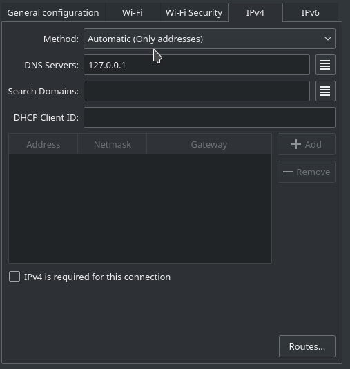

Seperti yang suda kita ketahui, MX Linux tidak menggunakan SystemD, melainkan menggunakan sysvinit. Hal ini berpengaruh juga terhadap pengaktifan
tools yang bekerja menyeluruh di sistemnya, misalnya DNSCrypt-proxy.

Alih-alih menggunakan `systemctl`, MX Linux justru hanya menggunakan `service`. Dan secara bawaan, file konfigurasi DNSCrypt harus kita ubah sedikit
supaya dapat berjalan di `service`.

## Download DNSCrypt-proxy
DNSCrypt-proxy2 sudah tersedia di repository Debian 10, sehingga kita bisa menginstallnya hanya dengan satu perintah sederhana ini :
```bash
sudo apt install dnscrypt-proxy
```

## Konfigurasi DNSCrypt-proxy
Setelah selesai install, silakan pindah directory ke dnscrypt-proxy. Lalu edit file `dnscrypt-proxy.toml`.
```bash
cd /etc/dnscrypt-proxy
sudo nano dnscrypt-proxy.toml
```

Isi bagian `listen_address = []` menjadi `listen_addresses = ['127.0.0.1:53', '[::1]:53']`.
Setelah itu simpan dengan menekan `ctrl + x`.

Lalu, masih di direktori `/etc/dnscrypt-proxy`, kita bisa install dnscrypt dengan konfigurasi yang baru kita edit.
```bash
$ sudo dnscrypt-proxy -service install
[2020-08-19 09:34:30] [WARNING] /var/cache/dnscrypt-proxy/public-resolvers.md: open /var/cache/dnscrypt-proxy/sf-2qmn7ru25se2qp4e.tmp: no such file or directory
[2020-08-19 09:34:30] [WARNING] /var/cache/dnscrypt-proxy/public-resolvers.md.minisig: open /var/cache/dnscrypt-proxy/sf-oj7ygp4kwnm7oyqu.tmp: no such file or directory
[2020-08-19 09:34:30] [NOTICE] Source [/var/cache/dnscrypt-proxy/public-resolvers.md] loaded
[2020-08-19 09:34:30] [NOTICE] dnscrypt-proxy 2.0.19
[2020-08-19 09:34:30] [NOTICE] Installed as a service. Use `-service start` to start
```

Jika muncul pesan error seperti `[WARNING] /var/cache/dnscrypt-proxy/public-resolvers.md: open /var/cache/dnscrypt-proxy/sf-2qmn7ru25se2qp4e.tmp: no such file or directory`, itu berarti file dnscrypt-proxy belum dibuat.
Maka, kita bisa membuatnya dengan perintah :
```bash
sudo mkdir /var/cache/dnscrypt-proxy
```

Setelah itu, kita bisa start dnscryptnya.
```bash
sudo dnscrypt-proxy -service start
```

## Konfigurasi Internet Adapter
Kita juga perlu mengubah konfigurasi IPv4nya, silakan ubah menjadi `Automatic (Only addresses)`, lalu isikan DNS Server `127.0.0.1`.



Seperti screenshot di atas.

Langkah terakhir adalah kita restart service network-managernya.

```bash
sudo service network-manager restart
```

## Buat autostart
Karena ini bukan `systemctl`, maka kita harus mengaktifkannya secara manual untuk menjalankan DNSCrypt.
Tapi kita bisa mengakali hal ini dengan menambahkan script ke `/etc/rc.local`.
```bash
# DNSCrypt
cd /etc/dnscrypt-proxy && dnscrypt-proxy -service start
```

#### Referensi
https://wiki.archlinux.org/index.php/Dnscrypt-proxy
