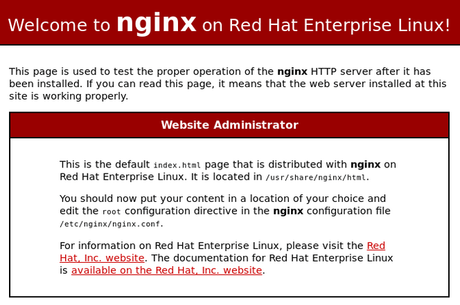
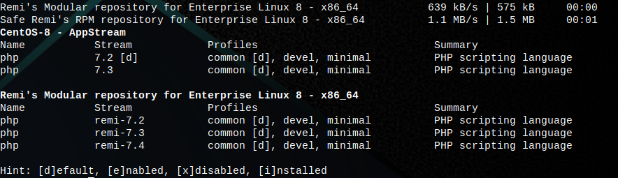

LEMP Stack adalah seperangkat perangkat lunak yang gratis dan open source yang berguna untuk membangun sebuah web server. LEMP merupakan singkatan dari **L**inux, **E**ngine X (NGINX), **M**ariaDB, dan **P**HP.
Semua perangkat lunak tersebut gratis dan sudah tersedia di distribusi linux CentOS 8. Berikut adalah tata cara instalasinya.

## Update
Seperti biasa, sebelum memasang paket, kita harus update dulu reponya. Di CentOS 8 kita menggunakan paket manager yang bernama `dnf`.

```bash
dnf update
```

## Install NGINX
Setelah update repo, kita bisa memasang `nginx` dengan perintah sederhana ini:

```bash
dnf install nginx
```

Kita juga bisa membuat NGINX berjalan secara otomatis saat boot atau saat komputer server dijalankan. Caranya adalah dengan mengaktifkannya melalui systemctl.

```bash
systemctl enable nginx
systemctl start nginx
```

Untuk mengecek server NGINX yang digunakan, bisa dengan perintah:

```bash
nginx -v
```

Outputnya akan mirip seperti ini:

```bash
[root@server ~]# nginx -v
nginx version: nginx/1.14.1
```

Terlihat di sana saya sedang menggunakan NGINX versi 1.14.1.

Untuk mengakses servernya, silakan buka browser lalu masukkan `alamat IP` dari server tersebut.



Letak directory rootnya ada di `/usr/share/nginx/html`, jadi jika ingin mengupload files seperti Wordpress, maka upload ke directory root tersebut.

## Install MariaDB
MariaDB adalah sebuah perangkat lunak gratis dan open source yang berguna untuk memanajemen database relasional yang dikembangkan dari MySQL.

Ada dua perangkat lunak yang harus dipasang, yaitu `mariadb` dan `mariadb-server`.

```bash
dnf install mariadb mariadb-server
```

Secara bawaan, semua orang bisa masuk ke MariaDB tanpa kredensial. Untuk membuat MariaDB aman, kita bisa menjalankan perintah ini:

```bash
mysql_secure_installation
```

Maka MariaDB akan mengarahkan hal-hal apa yang harus dilakukan, seperti mengganti password root, menghapus pengguna lain, dan lain sebagainya.

Untuk masuk ke MariaDB, cukup jalankan perintah ini:

```bash
mysql -u root -p
```

Setelah itu masukkan password yang sudah dibuat saat `secure installation`.

Untuk membuat MariaDB berjalan secara otomatis saat boot, maka kita juga harus mengaktifnya melalui systemctl.

```bash
systemctl enable mariadb
systemctl start mariadb
```

## Install PHP
Versi paling baru dari PHP saat ini adalah PHP 7.4. Namun di repository CentOS 8 belum tersedia. Untuk itu, kita bisa menambahkan repo Remi, yaitu repository gratis yang berisi software-software terbaru, termasuk PHP 7.4, ke CentOS 8.

Pertama-tama, kita harus menambahkan repository **EPEL** terlebih dahulu.

```bash
dnf install https://dl.fedoraproject.org/pub/epel/epel-release-latest-8.noarch.rpm
```

Kemudian, kita bisa menambahkan repo **Remi**.

```bash
dnf install dnf-utils http://rpms.remirepo.net/enterprise/remi-release-8.rpm
```

Untuk melihat module PHP apa saja yang tersedia, gunakan perintah ini:

```bash
dnf module list php
```



### Install PHP 7.4
Karena versi defaultnya bukan PHP 7.4, maka kita harus reset dulu modulenya.

```bash
dnf module reset php
```

Kemudian, kita bisa aktifkan module PHP 7.4 dari repo Remi.

```bash
dnf module enable php:remi-7.4
```

Kemudian, kita bisa memasanga PHP, PHP-FPM, dan module lainnya yang dibutuhkan.

```bash
dnf install php php-opcache php-gd php-curl php-mysqlnd
```

Kemudian kita bisa mengecek versi PHP yang sudah terpasang.

```bash
php -v
```

Outputnya akan mirip seperti ini:

```bash
[root@server ~]# php -v
PHP 7.4.8 (cli) (built: Jul  9 2020 08:57:23) ( NTS )
Copyright (c) The PHP Group
Zend Engine v3.4.0, Copyright (c) Zend Technologies
    with Zend OPcache v7.4.8, Copyright (c), by Zend Technologies
```

Supaya PHP dapat berjalan saat komputer boot, kita harus mengaktifkan `PHP-FPM` melalui systemctl.

```bash
systemctl enable php-fpm
systemctl start php-fpm
```

Secara bawaan, `PHP-FPM` dikonfigurasikan untuk web server **Apache**, karena kita pakai NGINX, maka ada hal yang harus diganti.

Silakan edit `www.conf`.

```bash
nano /etc/php-fpm.d/www.conf
```

Lalu cari kedua baris ini:

```bash
user = apache
group = apache
```

Ganti menjadi:

```bash
user = nginx
group = nginx
```

Lalu tekan `ctrl + x` untuk menyimpan.

Setelah disimpan, kita harus restart `NGINX` dan `PHP-FPM`.

```bash
service nginx restart
service php-fpm restart
```

## Kesimpulan
Memasang LEMP Stack di CentOS 8 hampir sama seperti dengan distribusi lain seperti Ubuntu atau Debian. Hanya berbeda pada paket managernya saja, jika Ubuntu pakai `apt`, sedangkan CentOS pakai `dnf`.

Dengan mengikuti langkah demi langkah pada artikel ini, seharusnya proses pemasangan LEMP Stack sudah berhasil.

Oke, sekian artikel kali ini 😁.

#### Referensi
https://www.tecmint.com/install-lemp-on-centos-8/

https://www.codepolitan.com/mengenal-mariadb
