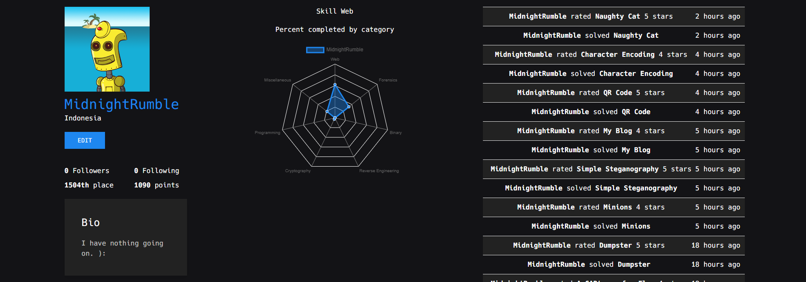

Halo semua! Apa kabar? Sudah lama saya tidak memposting artikel baru di blog ini wkwkwk

Okey, jadi kemarin hari Sabtu tanggal 11 Desember 2020 saya tidak sengaja melihat postingan di Instagram mengenai CTF atau _Capture The Flag_.

Karena saya penasaran, akhirnya saya cari deh tuh info-info tentang CTF.

Setelah saya menyelam di Google, saya jadi tertarik untuk mencoba CTF ini. Akhirnya saya mencoba mendaftar ke [CTFLearn.com](https://ctflearn.com). Masih di hari yang sama, saya langsung mencoba beberapa tantangan di situs tersebut, dan ternyata cukup seru lho, saya jadi ketagihan wkwkwk.

Nah, sebenernya apaan sih CTF ini?

## Apa itu CTF?
CTF (_Capture The Flag_) ini semacam kompetisi keamanan informasi yang mana konstentannya harus bisa nemuin sebuah flag. Nah, buat dapetin flag ini ada macam-macam caranya tergantung soal CTFnya, mulai dari nyari informasi aja dari internet, pemrograman dasar, sampe meretas suatu program untuk dapetin flagnya.

Karena saya baru mulai, yaa jadi ga ikutan kompetisi wkwkwkwk.

Oh iya, CTF ini ada banyak kategorinya:
1. Kriptografi (_Cryptography_): Biasanya yang berkaitan sama Enkripsi atau Dekripsi data.
2. Steganografi (_Steganography_): Membedah file atau gambar buat dapetin informasi atau flag.
3. Rekayasa Balik (_Reverse Engineering_): Biasanya buat mengeksploitasi biner, atau ya rekayasa balik suatu program.
4. Web: Nyari flag dari halaman web.
5. Pwn: Nyari flag dari server.

Cukup banyak, ya? Seru-seru semua lagi.

Sebenernya kita bisa pake sistem operasi apa aja pas main CTF ini, tapi saya mau menyarankan buat pake Sistem Operasi khusus untuk meretas saja, saya sendiri pake Kali Linux.

Karena sistem operasi khusus meretas biasanya pas diinstall itu sudah terinstall juga aplikasi-aplikasi pendukung, ada Forensik, Reverse Engeneering, dan sebagainya. Jadi ya kita tinggal pake aja.

Kalo mau belajar CTF juga, bisa dari link tadi yaitu [CTFLearn.com](https://ctflearn.com). Oh iya, ini akun saya:

Jangan lupa difollow yaaa wkwkwkwk.
