Pada artikel kali ini, saya akan mendokumentasikan tentang bagaimana cara saya membuat _Internet of Things_ (IoT) sederhana menggunakan Restful API Node.js sebagai backend dan Vue.js sebagai frontendnya.

Aplikasi yang akan dibuat cukup sederhana, yaitu hanya membuat tiga buah tombol untuk menyalakan dan mematikan LED.

Board yang saya gunakan adalah `WeMos D1 R2`, board ini kompatibel dengan Arduino IDE (berarti bisa diprogram selayaknya board Arduino) yang mana sudah ada WiFinya. Karena sebenarnya board ini basisnya adalah ESP8266, yaitu modul WiFi untuk Arduino. Jadi dengan board ini, saya sudah bisa langsung menghubungkannya ke WiFi.

Jadi jika teman-teman hanya memiliki board Arduino, teman-teman masih bisa mengikuti artikel ini dengan menambahkan modul ESP8266 di board Arduino teman-teman.

#### Daftar Isi
0. [Persiapan](#persiapan)
1. [Backend](#backend)
    - [Persiapan Database](#persiapan-database)
    - [Memasang Dependensi](#memasang-dependensi)
    - [Konfigurasi MySQL](#konfigurasi-mysql)
    - [Konfigurasi server](#konfigurasi-server)
    - [Controllers](#controllers)
        - [Create](#create)
        - [Read](#read)
        - [Update](#update)
        - [Delete](#delete)
    - [Routes](#routes)
    - [Test Backend](#test-backend)
2. [Frontend](#frontend)
    - [Persiapan Vue.js](#persiapan-vuejs)
    - [Menghubungkan ke RESTful API](#menghubungkan-ke-restful-api)
    - [Read dan Update Data](#read-dan-update-data)
3. [Mikrokontroler](#mikrokontroler)
    - [Membuat Skema Rangkaian](#membuat-skema-rangkaian)
    - [Import Board Manager](#import-board-manager)
    - [Install Library](#install-library)
    - [Memprogram](#memprogram)
4. [Penutup & Referensi](#penutup)

## Persiapan
0. WeMos D1 R2 **atau** Arduino + modul ESP8266.
1. Node.js dan Vue.js CLI sudah dipasang di komputer.
2. MySQL atau MariaDB server. (Kalau di Windows bisa pakai XAMPP sudah ada MySQLnya).
3. API Client seperti Postman atau Insomnia.
4. Memahami Javascript.
5. Memahami pemrograman Arduino dasar.

> Saya asumsikan board teman-teman sudah siap pakai, sehingga jika teman-teman pakai Arduino + ESP8266, pastikan sudah bisa terkoneksi ke WiFi.

Direktori yang saya gunakan bernama `WeMosIoT`, di sana tersedia dua direktori, yaitu `backend` sebagai tempat menyimpan Node.js dan `frontend` sebagai tempat menyimpan vue.js.

```
└── WeMosIoT
    ├── backend
    └── frontend
```

Cara kerja aplikasi yang akan kita buat adalah WeMos D1 R2 akan melakukan _read_ status di database MySQL kita dengan melakukan `HTTP GET` pada RESTful API Node.js kita, jika statusnya '1' maka LED menyala, jika status nya '0' maka LED mati. Nah, untuk bagian ganti-ganti status itu akan dilakukan di bagian frontend, yaitu saat menekan tombol. Masuk akal, kan? Oke lanjuuut.

## Backend
Pada bagian backend ini, kita akan membuat CRUD (_Create, Read, Update, Delete_) dari table "node_arduino" di MySQL yang nanti akan kita buat.

Buat teman-teman yang belum mengenal Node.js, saya sarankan untuk menonton vidio berikut: https://www.youtube.com/watch?v=ENrzD9HAZK4

### Persiapan Database
Kita akan membuat database di MySQL dengan nama "node_arduino", tetapi teman-teman juga bisa menggunakan nama yang berbeda, suka-suka saja.

Silakan buat database baru dengan MySQL Client favorit, misalnya PhpMyAdmin, Adminer, atau MySQL CLI. Saya pakai MySQL CLI. Perintah di terminalnya seperti ini:

```bash
$ mysql -u root -p
mysql > create database node_arduino;
mysql > exit;
```

Jika teman-teman menggunakan PhpMyAdmin, maka tinggal membuat database seperti biasa aja. Jika sudah membuat database, maka kita bisa lanjut ke langkah selanjutnya.

Iya, kita hanya membuat database dan nggak bikin tabel serta kolom di sini, karena nanti akan dibuatkan oleh Node.js-nya :D

### Memasang Dependensi
Sekarang kita akan ke bagian pemasangan Node.js-nya. Tapi sebelum itu, kita harus memasang beberapa dependensi yang kita butuhkan, diantaranya:

0. **express** (framework untuk membuat API).
1. **sequelize** (ORM -_Object-relational Mapping_- untuk MySQL).
2. **mysql2** (Supaya NodeJS bisa menggunakan MySQL).
3. **cors** (Untuk membatasi situs mana saja yang dapat menggunakan API).
4. **body-parser** (Untuk menerjemahkan _request body_ dari Client ke Server).

Silakan buka terminal, lalu arahkan ke direktori tempat di mana teman-teman mau menyimpan projeknya. Sebelum memasang, kita harus inisialisasi dulu npmnya.

```bash
npm init
```

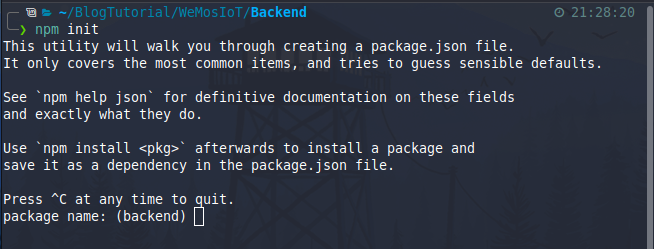

Nanti akan ditanyakan beberapa pertanyaan seputar projeknya. Teman-teman bisa jawab sesuka hati. Namun untuk bagian "entry point", ketik saja "server.js". Entry point adalah file di mana kita menuliskan kode untuk menjalankan servernya.

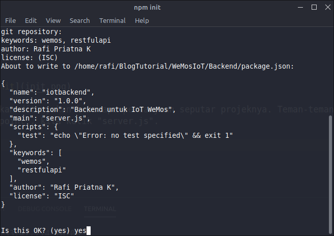

Selanjutnya, kita bisa langsung memasang dependensinya.

```bash
npm install --save express sequelize mysql2 cors body-parser
```

Jika sudah, maka akan ada direktori baru yaitu `node_modules` dan satu file baru yaitu `package-lock.json`. Direktori 'node_modules' ini isinya adalah dependensi yang sudah dipasang tadi, sedangkan file 'package-lock.json' adalah list nama-nama dependensi.

Sekarang, silakan buka direktori backend dengan teks editor favorit teman-teman. Kalau saya, pakai VSCode.

### Konfigurasi MySQL
Silakan buat satu direktori bernama `app`, lalu di dalamnya buat lagi tiga direktori, yaitu `config, models, controllers, dan routes`. Serta buat juga file bernama `server.js` di-root direktori (di luar direktori app).

Seperti ini susunannya:

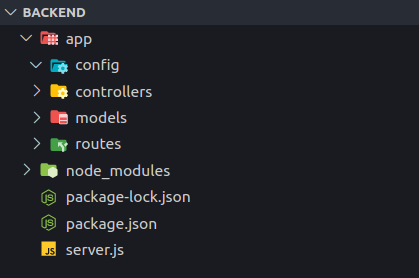

Buat file baru bernama `db.config.js` di dalam direktori app/config. Lalu, isikan kode berikut:

```javascript
module.exports = {
    HOST: "localhost", // Isikan hostnya, biasanya sih localhost.
    USER: "root", // Isikan usernya, biasanya root.
    PASS: "", // Biasanya nggak pake password, kalo pake ya tinggal diisi aja.
    DB: "node_arduino", // Ini nama databasenya.
    dialect: "mysql",
    pool: { // Opsinal untuk eksekusi query MySQL.
        max: 5, // Maksimal boleh ekskusi 5x.
        min: 0, // Minimal 0x.
        acquire: 30000, // Maksimal waktu untuk mencoba terkoneksi adalah 30 detik.
        idle: 10000, // Maksimal waktu untuk idle adalah 10 detik.
    },
};
```

Kode di atas adalah untuk menyimpan konfigurasi dari MySQL kita, isinya adalah host, user, pass, db, dan opsinya. Untuk bagian `pool` itu opsional, boleh diisi boleh juga tidak diisi.

Selanjutnya, kita bisa mengimplementasikan konfigurasi yang sudah kita buat tadi ke Sequelize. Silakan buat file baru bernama `index.js` di dalam direktori 'app/models'. Nah file ini akan digunakan sebagai acuan file model lain untuk terkoneksi ke MySQL kita.

Isi file index.js:

```javascript
const dbConfig  = require("../config/db.config"); // Import konfigurasi MySQL yang sudah dibuat.
const Sequelize = require("sequelize"); // Import dependensi sequelize.

// Konfigurasi Sequelize. Isinya berdasarkan konfigurasi MySQL yang sudah dibuat tadi.
const sequelize = new Sequelize(dbConfig.DB, dbConfig.USER, dbConfig.PASS, {
    host: dbConfig.HOST,
    dialect: dbConfig.dialect,
    operatorAliases: false,
    pool: {
        max: dbConfig.pool.max,
        min: dbConfig.pool.min,
        acquire: dbConfig.pool.acquire,
        idle: dbConfig.pool.idle
    }
});

const db = {}; // Bikin db sebagai object.

// Isikan Sequelize (dari import) dan sequelize (dari variabel const sequelize) ke object db.
db.Sequelize = Sequelize;
db.sequelize = sequelize;

// Import model button, ini belum dibuat. Nanti kita akan buat model buttonnya.
db.buttons = require("./button.model.js")(sequelize, Sequelize);

// Exports modulenya.
module.exports = db;
```

Sekarang kita bisa membuat model baru bernama `button.model.js` di direktori 'app/models'. Model ini isinya adalah nama tabel serta kolom dari tabel tersebut.

Saya akan membuat tabel bernama "button", lalu kolomnya ada id, name, pin, dan status. Maka, saya bisa menuliskan kode di button.model.js seperti ini:

```javascript
module.exports = (sequelize, Sequelize) => {
    // Konstanta Button yang isinya mendefinisikan sequleize dengan nama tabel button
    const Button = sequelize.define("button", {
        name: {
            type: Sequelize.STRING,
        },
        pin: {
            type: Sequelize.STRING
        },
        status: {
            type: Sequelize.BOOLEAN
        }
    });

    // Kembalikan konstanta Buttonnya, yang nanti akan diterima oleh index.js (app/model).
    return Button;
}
```

Saya tidak mendefinisikan kolom 'id', karena kolom tersebut akan dibuatkan otomatis nanti saat 'migrate' database.

Iya, di Node.js dengan Sequelize ini bisa migrate seperti framework Laravel atau Codeigniter 4 lho. Jadi saat server dijalankan, maka akan otomatis dibuatkan tabel jika belum ada tabelnya.

### Konfigurasi Server
Silakan buka file `server.js`, lalu import dependensinya:

```javascript
const express = require("express");
const bodyParser = require("body-parser");
const cors = require("cors");
```

Selanjutnya kita bisa membuat variabel konstanta baru yang mempresentasikan fungsi express. Fungsi express ini akan banyak digunakan, karena express merupakan framework untuk APInya. Untuk itulah pakai variabel supaya lebih mudah dibaca.

Lanjutkan buat variabel konstanta `app` yang berisi fungsi express:

```javascript
const app = express();
```

Selanjutnya kita bisa _import_ semua model yang tersedia, yaitu dengan _import_ direktori models:

```javascript
const db = require("./app/models");
```

Sekarang kita bisa mengkonfigurasi cors. Cors ini singkatnya buat melindungi API kita supaya nggak diakses oleh situs yang nggak kita inginkan. Pertama-tama buat dulu variabel list domain yang dibolehin akses ke API kita:

```javascript
let allowList = [
    'http://localhost:8081',
];
```

Di sana saya mengizinkan `localhost:8081` sebagai situs yang boleh mengakses API. Karena situs tersebut merupakan alamat frontent dari vue.js yang nanti akan kita buat.

Setelah itu buat opsi untuk corsnya:

```javascript
let corsOption = {
    origin: (origin, callback) => {
        if (allowList.indexOf(origin) !== -1 || !origin) {
            callback(null, true);
        } else {
            callback(new Error('Not allowed.'));
        }
    }
}
```

Opsi cors ini akan _throw_ error jika yang akses tidak termasuk ke list domain di variabel allowList.

Selanjutnya kita tinggal implementasikan ke express pengaturan cors kita:

```javascript
app.use(cors(corsOption));
```

Selanjutnya membuat Express bisa melakukan migrate table ke database kita dengan otomatis:

```javascript
db.sequelize.sync();
```

Jika tabel belum ada, maka akan dibuatkan. Jika tabel sudah ada, maka akan dilewati.

Jika sudah, kita bisa membuat rute dari APInya. Misalnya rute 'root (/)' yang akan menampilkan tulisan "Halo Dunia!":

```javascript
app.get("/", (req, res) => {
    res.json({
        message: "Halo Dunia!"
    });
});
```

Terakhir, kita tinggal buat perintah eksekusi supaya servernya bisa jalan:

```javascript
const PORT = process.env.PORT || 8080; // Akan mencari Port di env, jika tidak ada maka pakai port 8080
app.listen(PORT, () => {
    console.log(`Server udah jalan di http://localhost:${PORT}`);
});
```

Cukup panjang, ya? Berikut adalah versi lengkap dari file `server.js` untuk memastikan saja:

```javascript
const express = require("express");
const bodyParser = require("body-parser");
const cors = require("cors");

const app = express();

// Models
const db = require("./app/models");

// CORS
let allowList = [
    'http://localhost:8081',
];

let corsOption = {
    origin: (origin, callback) => {
        if (allowList.indexOf(origin) !== -1 || !origin) {
            callback(null, true);
        } else {
            callback(new Error('Not allowed.'));
        }
    }
}

app.use(cors(corsOption));

// Parse Request
app.use(bodyParser.json());
app.use(bodyParser.urlencoded({ extended: true }));

// Create DB Table from model
db.sequelize.sync();

// Routes
app.get("/", (req, res) => {
    res.json({
        message: "Halo Dunia!"
    });
});

// Server
const PORT = process.env.PORT || 8080;
app.listen(PORT, () => {
    console.log(`Server udah jalan di http://localhost:${PORT}`);
});
```

Kita sekarang bisa test apakah server sudah bisa jalan atau belum. Kita bisa menjalankan perintah:

```bash
node server.js
```

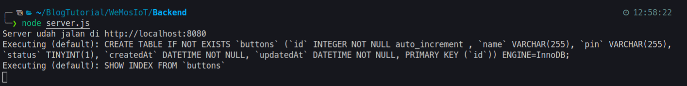

Bisa dilihat pada _screenshot_ di atas, Sequelize sudah otomatis melakukan "migrate". Juga, server Node kita sudah jalan. Untuk mengeceknya bisa dibuka di peramban atau menggunakan API Client. Saya akan coba pakai API Client `Insomnia`.

Berikut adalah hasil GET Request dengan Insomnia:

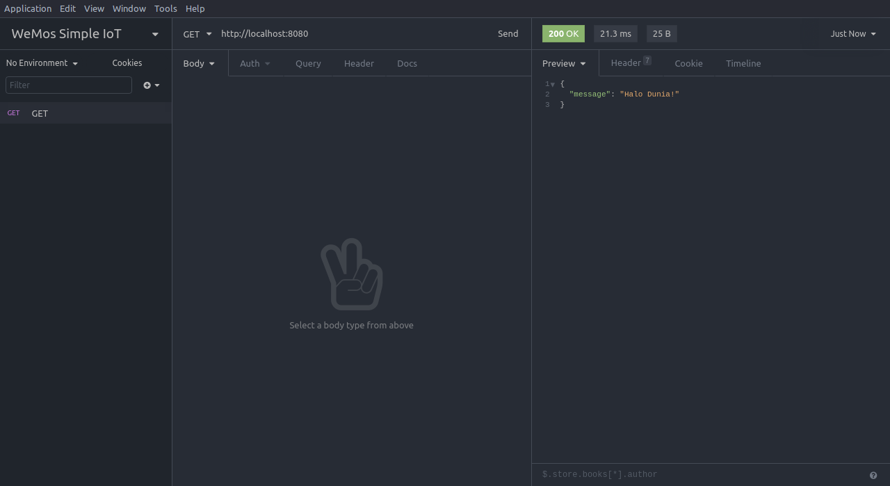

Pada _screenshot_ di atas, sudah terbukti bahwa API kita sudah jalan. Sudah bisa menampilkan "Halo Dunia!" yang ada di file `Server.js`.

Selanjutnya adalah mengimplementasikan _CRUD_ RESTful API.

Tetapi sebelum itu, kita bisa memberhentikan server yang sedang berjalan. Caranya dengan menekan kombinasi `CTRL + C` di terminal.

## Controllers
Tadi kita sudah membuat direktori `controllers` di dalam direktori 'app'. Nah, fungsi dari controllers adalah sebagai tempat logika serta penghubung antara request yang diterima dengan databasenya.

Karena kita hanya memiliki satu tabel, yaitu 'button', maka kita hanya akan membuat satu controller. Silakan buat file baru di direktori 'app/controllers' dengan nama `button.controller.js`. Di file ini, kita akan membuat _CRUD_-nya.

Tetapi sebelum itu, kita harus melakukan _import_ segala hal yang kita butuhkan:

```javascript
const db = require("../models"); // Import semua model
const op = db.Sequelize.Op; // Op ini adalah operasi dalam Sequelize, untuk membuat join, dsb.
const Button = db.buttons; // Nah ini nama modelnya, yaitu buttons.
```

Kita mendapatkan 'db.buttons' dari file 'index.js' pada direktori 'app/models'. Di sana kita mendeklarasikan 'db.buttons' ke arah model 'button'. Jadi di sini kita bisa langsung panggil.

### Create
Seperti biasa, kita akan membuat fungsi baru dengan nama `create`, yang mana memiliki parameter `req` untuk request, dan `res` untuk respond:

```javascript
exports.create = (req, res) => {
    // Kode di sini.
};
```

Sekarang, kita akan mengisi bagian logikanya.

Pertama-tama, kita akan melakukan validasi, karena ini merupakan bagian "_Insert_" ke database, maka kita perlu validasi. Validasi yang kita lakukan cukup sederana, yaitu memastikan semua datanya sudah diisi.

```javascript
if (!req.body) {
    res.status(400).send({
        message: "Data tidak boleh kosong!"
    });
    return
}
```

Kode di atas akan memeriksa kondisi, jika tidak ada `req.body` (berarti semua request body, body adalah elemen yang bisa diinput), maka langsung kembalikan dengan mengirim status kode `400` dengan pesan "Data tidak boleh kosong!".

Cukup masuk akal, bukan?

Terakhir, kita bisa menggunakan fungsi di Sequelize yaitu 'create' untuk memasukkan datanya ke database.

```javascript
// Insert data
Button.create(req.body).then(result => {
    // Jika berhasil, kirim respondnya
    res.send(result);
}).catch(err => {
    // Jika error, kirim pesan errornya
    res.status(500).send({
        message: err.message || "Error!"
    });
});
```

Secara keseluruhan, kodenya seperti ini :

```javascript
exports.create = (req, res) => {
    // Validate
    if (!req.body) {
        res.status(400).send({
            message: "Data tidak boleh kosong!"
        });
        return
    }

    Button.create(req.body).then(result => {
        res.send(result);
    }).catch(err => {
        res.status(500).send({
            message: err.message || "Error!"
        });
    });
};

```

Sampai sini, kita sudah selesai membuat fungsi 'create' saja, masih ada beberapa fungsi lagi yang harus dibuat.

### Read
Sekarang kita akan membuat sebuah fungsi yang dapat dimanfaatkan oleh Frontend dan Mikrokontroler untuk membaca data kita, yaitu data LEDnya.

Buat fungsi baru untuk mencari semua data, misalnya 'findAll':

```javascript
exports.findAll = (req, res) => {
    // Kode di sini
};
```

Isi kodenya dengan fungsi Sequelize findAll:

```javascript
exports.findAll = (req, res) => {
    Button.findAll().then(result => {
        res.send(result);
    }).catch(err => {
        res.status(500).send({
            message: err.message || "Error!"
        });
    });
};
```

Fungsi mencari semua data sudah selesai, sekarang kita akan membuat fungsi untuk mencari data berdasarkan ID nya, atau mencari satu data saja. Buat fungsi baru, misalnya 'findOne':

```javascript
exports.findOne = (req, res) => {
    // Kode di sini
};
```

Isi kodenya dengan fungsi Sequelize findOne:

```javascript
exports.findOne = (req, res) => {
    // Cari satu
    Button.findOne({
        // Di mana ID nya adalah parameter ID
        where: {
            id: req.params.id
        }
    }).then(result => {
        res.send(result);
    }).catch(err => {
        res.status(500).send({
            message: err.message || "Error!"
        });
    });
};
```

Kode di atas akan mencoba mencari data berdasarkan ID yang ID nya didapatkan dari parameter di URLnya. Untuk masalah parameter ini, akan kita atur di routenya.

### Update
Tentu saja kita butuh fungsi update, untuk memperbarui status LED kita. Untuk itu, silakan buat fungsi baru, misalnya 'update':

```javascript
exports.update = (req, res) => {
    // Kode di sini
}
```

Lalu gunakan fungsi Sequelize update, untuk memperbarui datanya:

```javascript
exports.update = (req, res) => {
    // Update data, dengan data terbaru diambil dari req.data
    // Jadi semua data akan digunakan (req.body)
    Button.update(req.body, {
        // Yang mana ID nya adalah parameter ID
        where: {
            id: req.params.id
        }
    }).then(result => {
        res.send(result);
    }).catch(err => {
        res.status(500).send({
            message: err.message || "Error!"
        });
    });
}
```

### Delete
Fungsi terakhir, delete. Fungsi ini akan menghapus satu data berdasarkan parameter id. Buat fungsi baru, misalnya 'delete':

```javascript
exports.delete = (req, res) => {
    // Kode di sini
};
```

Kita bisa menggunakan fungsi Sequelize Destroy untuk menghapus data:

```javascript
exports.delete = (req, res) => {
    Button.destroy({
        // Hapus data berdasarkan id, diambil dari parameter.
        where: {
            id: req.params.id
        }
    }).then(result => {
        // Jika berhasil menghapus data, kirim status kode 200 dengan pesan "Berhasil menghapus data!".
        res.status(200).send({
            message: "Berhasil menghapus data!"
        });
    }).catch(err => {
        res.status(500).send({
            message: err.message || "Error!"
        });
    });
};
```

Sampai sini kita sudah selesai membuat fungsi-fungsinya saja, kita belum membuat URL API atau routenya.

## Routes
Kita sebelumnya sudah membuat direktori 'app/routes', kan? Direktori tersebut tempat kita menyimpan rute.

Silakan buat file baru di direktori tersebut dengan nama `button.route.js`, lalu export dengan parameter express yaitu 'app':

```javascript
module.exports = app => {
    // Kode di sini
}
```

Setelah itu import controllersnya dan import fungsi Express Route:

```javascript
module.exports = app => {
    const buttons = require("../controllers/button.controller");
    let router = require("express").Router();
}
```

Selanjutnya adalah bagian _routing_ nya:

```javascript
module.exports = app => {
    const buttons = require("../controllers/button.controller");
    let router = require("express").Router();

    // Method post untuk insert data, diarahkan ke fungsi 'create' di controller.
    router.post("/", buttons.create);

    // Method get untuk mengambil semua data, diarahkan ke fungsi 'findAll' di controller.
    router.get("/", buttons.findAll);

    // Method get dengan parameter id, diarahkan ke fungsi 'findOne' di controller.
    router.get("/:id", buttons.findOne);

    // Method patch dengan parameter, diarahkan ke fungsi 'update' di controller.
    router.patch("/:id", buttons.update);
}
```

Terakhir, buat routenya. Di sini kita akan membuat URL APInya adalah `/api/buttons`. Jadi client akan mengakses `http://localhost:8080/api/buttons` supaya bisa melakukan berbagai method yang sudah kita tentukan di atas.

```javascript
module.exports = app => {
    const buttons = require("../controllers/button.controller");
    let router = require("express").Router();

    // Method post untuk insert data, diarahkan ke fungsi 'create' di controller.
    router.post("/", buttons.create);

    // Method get untuk mengambil semua data, diarahkan ke fungsi 'findAll' di controller.
    router.get("/", buttons.findAll);

    // Method get dengan parameter id, diarahkan ke fungsi 'findOne' di controller.
    router.get("/:id", buttons.findOne);

    // Method patch dengan parameter, diarahkan ke fungsi 'update' di controller.
    router.patch("/:id", buttons.update);

    // Method delete dengan parameter, diarahkan ke fungsi 'delete' di controller.
    router.delete("/:id", buttons.delete);

    app.use("/api/buttons", router);
}
```

Nah, sekarang tinggal masukin route yang udah kita buat barusan, ke file `server.js`, tambahkan kode berikut:

```javascript
require("./app/routes/button.route")(app);
```

Sehingga file `server.js`-nya menjadi seperti ini secara keseluruhan:

```javascript
const express = require("express");
const bodyParser = require("body-parser");
const cors = require("cors");
const app = express();

// Models
const db = require("./app/models");

// CORS
let allowList = [
    'http://localhost:8081',
];
let corsOption = {
    origin: (origin, callback) => {
        if (allowList.indexOf(origin) !== -1 || !origin) {
            callback(null, true);
        } else {
            callback(new Error('Not allowed.'));
        }
    }
}

app.use(cors(corsOption));

// Parse Request
app.use(bodyParser.json());
app.use(bodyParser.urlencoded({ extended: true }));

// Create DB Table from model
db.sequelize.sync();

// Routes
app.get("/", (req, res) => {
    res.json({
        message: "Halo Dunia!"
    });
});

// Import routes button
require("./app/routes/button.route")(app);

// Server
const PORT = process.env.PORT || 8080;
app.listen(PORT, () => {
    console.log(`Server udah jalan di http://localhost:${PORT}`);
});
```

## Test Backend
Proses terakhir nih, yaitu melakukan _testing_ apakah backend kita sudah berjalan dengan yang kita harapkan atau belum.

Silakan jalankan nodenya, oh iya kali ini jalankan dengan flag '--host' ya. Pastikan teman-teman tahu alamat ip lokalnya masing-masing. Di sini, alamat ip lokal saya adalah 192.168.0.74, maka saya bisa:

```bash
node server.js --host 192.168.0.74
```

Penggunaan host ini adalah supaya server Node.js kita bisa diakses diluar komputer kita, dalam hal ini adalah Mikrokontrollernya.

Setelah itu buka API Client kalian, kalau saya pakai Insomnia. Sekarang kita bisa coba satu-satu methodnya.

#### POST
Silakan lakukan POST, untuk bagian form nya diatur menjadi 'Form URL Encoded'.

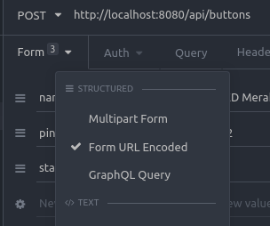

Isikan data-datanya sesuai dengan tabel di database, bebas aja. Untuk bagian 'pin', itu sesuaikan dengan pin di mikrokontroller ya, Karena saya pakai WeMos, maka pin saya dari D0 - D8 Saya mencoba mengirimkan data:

| name | pin | status |
|---|---|---|
| LED Merah | D2 | 0 |
| LED Kuning | D3 | 0 |
| LED Hijau | D4 | 1 |

Status 0 berarti mati, status 1 berarti menyala.

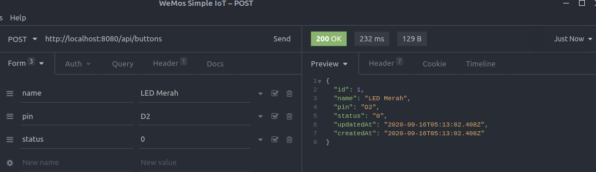

Dan berhasil, berarti method Post kita sudah bisa nih.

#### READ
Kita coba mengambil semua data:

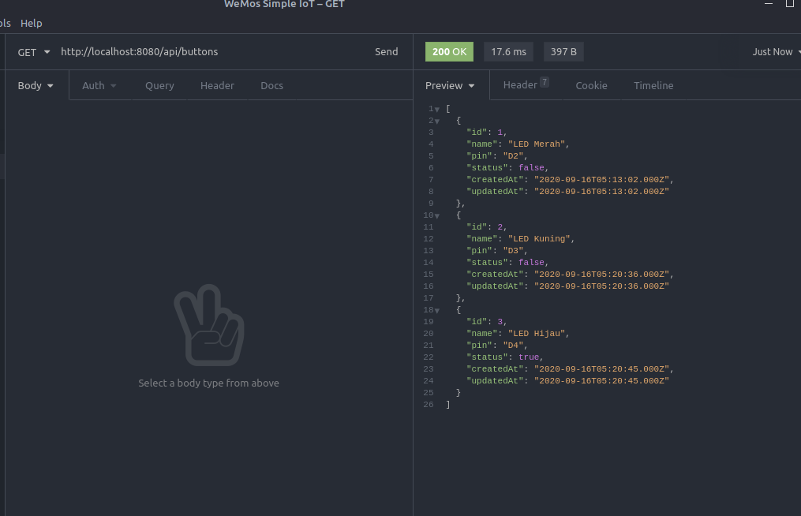

Berhasil, sekarang kita coba satu data berdasarkan ID:

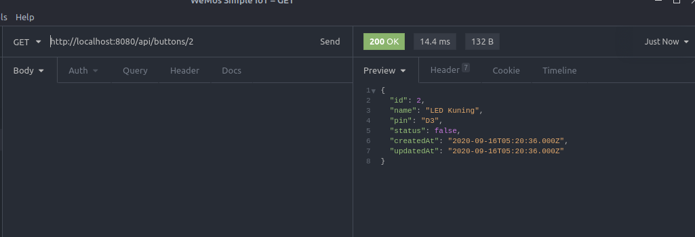

Juga berhasil!

#### UPDATE
Untuk API Update ini, kita pakai method PATCH. Saya akan coba update data yang ID nya 2.

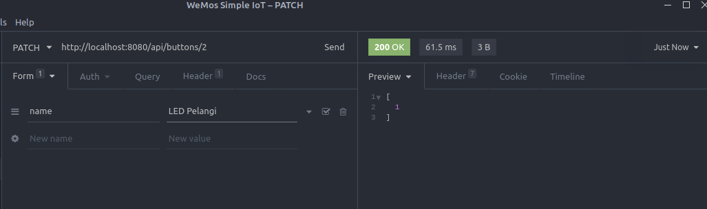

Menghasilkan output "1", berarti berhasil melakukan update data. Nah mungkin di sini perlu teman-teman ubah sendiri responsenya supaya lebih berguna, misalnya nampilin data yang diupdate gitu. Daripada hanya "1", sedikit ambigu wkwkwk.

#### DELETE
Untuk delete, gunakan method delete. Misalnya saya ingin menghapus data yang ID nya 1:

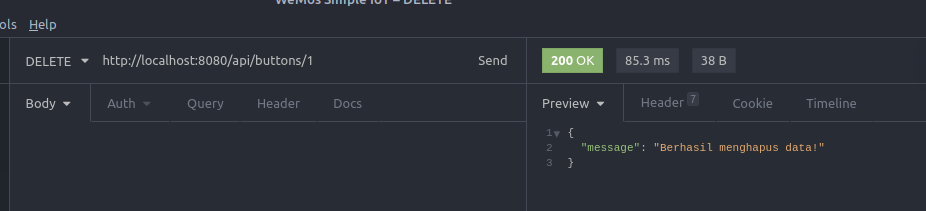

Nampaknya semua fungsi sudah berjalan dengan semestinya. RESTFul API kita sudah selesai. Sekarang kita bisa lanjut ke bagian Frontend.

## Frontend
Pada bagian frontend ini kita akan menggunakan framework javascript yaitu Vue.js. Karena framework ini salah satu framework yang mudah digunakan, apalagi untuk main API begini.

Buat teman-teman yang baru mengenal Vue.js, saya sarankan untuk menonton vidio berdurasi 100 detik ini, gunanya supaya kenalan dulu dengan Vue.js-nya :D https://www.youtube.com/watch?v=nhBVL41-_Cw

### Persiapan Vue.js
Sebelumnya kita sudah membuat diretori 'frontend', kan? Sekarang arahkan terminal ke direktori tersebut. Jika sudah, kita bisa langsung memasang Vue.js dengan Vue CLI. Oh iya, pastikan `direktori frontend hurufnya kecil semua` ya.

Karena kita sudah membuat direktori, maka untuk memasangnya cukup jalankan perintah:

```bash
vue create .
```

Nah ini ada konfirmasi, pilih "Y".

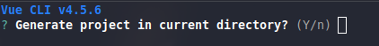

Lalu pilih yang `Default Vue 2`:

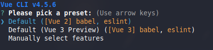

Setelah tunggu beberapa saat, lama proses mengunduhnya tergantung kecepatan internet.

Jika sudah selesai, silakan buka dengan teks editornya. Structure Vue kira-kira seperti ini:

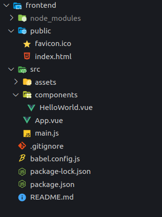

Saya tidak akan menjelaskan bagian Vue secara keseluruhan untuk kali ini. Akan tetapi kita hanya akan fokus dibagian komponen bawaannya saja yaitu `HelloWorld.vue`, kita akan ubah bagian di sana.

Saya juga akan menggunakan `Bootstrap` sebagai framework CSSnya. Jadi silakan teman-teman edit bagian `public/index.html` lalu tambahkan CSS serta JS dari Bootstrap.

Silakan baca dokumentas Bootstrap untuk mendapatkan CSS serta JSnya: https://getbootstrap.com/docs/4.5/getting-started/introduction/

File `public/index.html` akan menjadi seperti ini:

```html
<!DOCTYPE html>
<html lang="en">
  <head>
    <meta charset="utf-8">
    <meta http-equiv="X-UA-Compatible" content="IE=edge">
    <meta name="viewport" content="width=device-width,initial-scale=1.0">
    <link rel="icon" href="<%= BASE_URL %>favicon.ico">
    <!-- Bootstrap CSS -->
    <link rel="stylesheet" href="https://stackpath.bootstrapcdn.com/bootstrap/4.5.2/css/bootstrap.min.css" integrity="sha384-JcKb8q3iqJ61gNV9KGb8thSsNjpSL0n8PARn9HuZOnIxN0hoP+VmmDGMN5t9UJ0Z" crossorigin="anonymous">
    <title>Simple IoT</title>
  </head>
  <body>
    <noscript>
      <strong>We're sorry but <%= htmlWebpackPlugin.options.title %> doesn't work properly without JavaScript enabled. Please enable it to continue.</strong>
    </noscript>
    <div id="app"></div>
    <!-- built files will be auto injected -->
    <!-- Bootstrap JS -->
    <script src="https://code.jquery.com/jquery-3.5.1.slim.min.js" integrity="sha384-DfXdz2htPH0lsSSs5nCTpuj/zy4C+OGpamoFVy38MVBnE+IbbVYUew+OrCXaRkfj" crossorigin="anonymous"></script>
    <script src="https://cdn.jsdelivr.net/npm/popper.js@1.16.1/dist/umd/popper.min.js" integrity="sha384-9/reFTGAW83EW2RDu2S0VKaIzap3H66lZH81PoYlFhbGU+6BZp6G7niu735Sk7lN" crossorigin="anonymous"></script>
    <script src="https://stackpath.bootstrapcdn.com/bootstrap/4.5.2/js/bootstrap.min.js" integrity="sha384-B4gt1jrGC7Jh4AgTPSdUtOBvfO8shuf57BaghqFfPlYxofvL8/KUEfYiJOMMV+rV" crossorigin="anonymous"></script>
  </body>
</html>
```

### Menghubungkan ke RESTful API
Silakan buka file `src/components/HelloWorld.vue`. Hapus isi file `<template> ... </template>`, kira-kira menjadi seperti ini:

```html
<template>
  <div class="hello">
    <h1>{{ msg }}</h1>
  </div>
</template>
```

Jika sudah, teman-teman scroll ke bawah, maka akan menemukan script berikut:

```html
<script>
export default {
  name: 'HelloWorld',
  props: {
    msg: String
  }
}
</script>
```

Nah di script itu kita akan mengolah logikanya. Pertama-tama, kita akan membuat variabel konstanta yang isinya adalah alamat dari Node.jsnya. Ketik sebelum bagian exportya, tempatkan paling atas:

```javascript
const API_URL = 'http://192.168.0.74:8080/api/buttons/'
```

Jangan lupa portnya juga ditulis, yaitu 8080.

### Read dan Update Data

Selanjutnya, kita buat variabel baru yang isinya adalah data dari APInya. Letakkan kode berikut tepat di bawah bagian `props`:

```javascript
data: () => {
    return {
      buttons: []
    }
},
```

Sekarang waktunya mengambil data, kita bisa pakai fungsi bawaan Vue yaitu `created()`. Letakkan kodenya di bawah kode data:

```javascript
created() {
    fetch(API_URL)
    .then(response => response.json())
    .then(json => {
      this.buttons = json
    })
},
```

Secara keseluruhan, scriptnya menjadi seperti ini:

```html
<script>
const API_URL = 'http://192.168.0.74:8080/api/buttons/'
export default {
  name: 'HelloWorld',
  props: {
    msg: String
  },
  data: () => {
    return {
      buttons: []
    }
  },
  created() {
    fetch(API_URL)
    .then(response => response.json())
    .then(json => {
      this.buttons = json
    })
  },
}
</script>
```

Nah, sekarang scroll ke atas, edit bagian `<template>`-nya.

Menjadi seperti ini:

```html
<template>
  <div class="hello">
    <h1>{{ msg }}</h1>
    <h3>LED</h3>
    <ul>
      <li v-for="button in buttons" :key="button.id">
        {{ button.name }}
        <br/>
        {{ button.pin }}
        <br/>
        Status: {{ button.status }}
        <br/>
      </li>
    </ul>
  </div>
</template>
```

Kode di atas akan membuat looping `<li>` beradasarkan data `buttons[]` yang tadi kita isi dari data API. Lalu kita bisa keluarkan datanya dengan `{{ button.name }}` berarti mengeluarkan nama, dsb.

Setelah itu, teman-teman bisa jalankan Vue.js-nya:

```bash
npm run serve
```

Oh iya, pastikan Node.js-nya masih jalan ya.

Hasilnya:

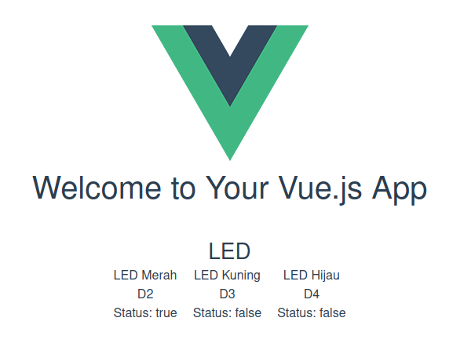

Datanya sudah terbaca, yay! Vue akan secara otomatis mengubah angka `1` menjadi `true` dan angka `0` menjadi `false`.

Sekarang, kita bisa bikin fungsi baru untuk mengubah data statusnya, dari 1 ke 0 atau sebaliknya. Silakan kembali lagi ke bagian script, lalu tambahkan method:

```javascript
 methods: {
    // Menangkap event
    buttonEvent: (e) => {
      // Ambil Idnya
      let id = e.target.id
      // Bikin variabel status
      // Kalo tombol checked maka 1, jika tidak maka 0
      let status = e.target.checked ? 1 : 0
      // Patch berdasarkan ID
      fetch(API_URL + id, {
        method: 'PATCH',
        body: JSON.stringify({
          id: e.target.id,
          status: status
        }),
        headers: {
          "content-type": "application/json"
        }
      })
    }
  }
```

Pada kode di atas, saya membuat fungsi baru yaitu `buttonEvent`, yang mana fungsi ini akan digunakan untuk mengubah data status ke database kita.

Saya akan menggunakan Bootstrap Switch alih-alih menggunakan tombol. Saya menambahkan kode berikut di template, di dalam loopingnya:

```html
<div class="custom-control custom-switch">
    <input type="checkbox" class="custom-control-input" v-model="button.status" v-bind:id="button.id" @change="buttonEvent($event)">
    <label class="custom-control-label" v-bind:for="button.id"></label>
</div>
```

Sehingga menjadi:

```html
<template>
  <div class="hello">
    <h1>{{ msg }}</h1>
    <h3>LED</h3>
    <ul>
      <li v-for="button in buttons" :key="button.id">
        {{ button.name }}
        <br/>
        {{ button.pin }}
        <br/>
        <div class="custom-control custom-switch">
          <input type="checkbox" class="custom-control-input" v-model="button.status" v-bind:id="button.id" @change="buttonEvent($event)">
          <label class="custom-control-label" v-bind:for="button.id"></label>
        </div>
      </li>
    </ul>
  </div>
</template>
```

Switch tadi akan mengambil data "status" dalam `v-model="button.status"`, dan secara ajaib Vue.js akan membacanya sendiri, jika didapatkan `1` maka switchnya _clicked_, jika tidak maka tidak _clicked_.

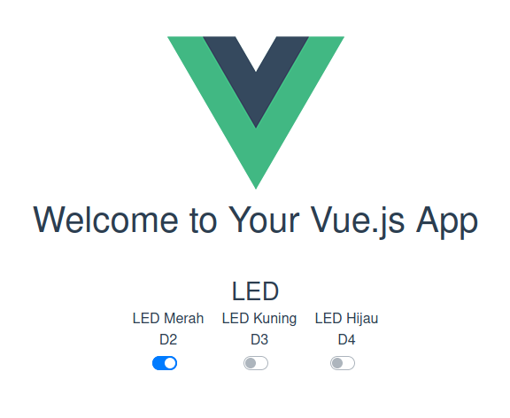

Dan selesai, sekarang Frontend kita sudah bisa ganti-ganti status dengan klik tombol nih :D


## Mikrokontroler
Kita sudah sampai tahap terakhir nih. Backend sudah siap, Frontend sudah siap, sekarang tinggal menghubungkannya ke Mikrokontroller `WeMos D1 R2`. Penampakan mikrokontroler saya seperti ini:

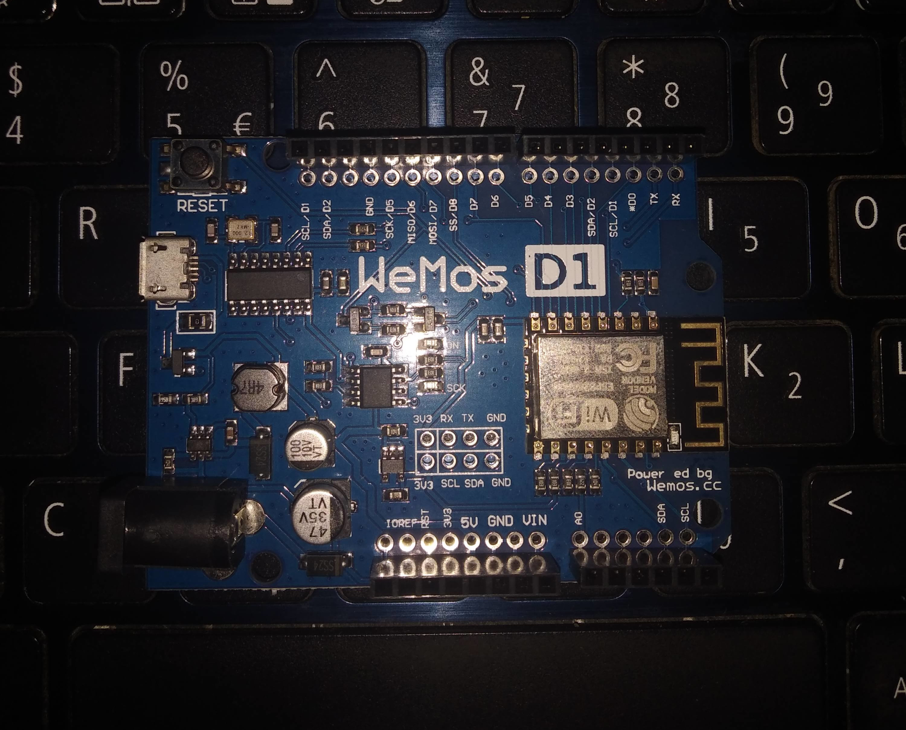

Apa saja yang dibutuhkan:

0. [7] Kabel Jumper Male.
1. [3] LED (Merah, Kuning, dan Hijau).
2. [3] Resistor 220 Ω.
3. [1] Breadboard.

### Membuat Skema Rangkaian
Saya menemukan part WeMos D1 R2 untuk Friting, akan tetapi masih versi 1 (WeMos D1 R2 v1), sedangkan punya saya versi 2 (WeMos D1 R2 v2). Jadi ada sedikit perbedaan, namun tak apa. Karena tidak banyak perbedaannya. Berikut adalah rangkaiannya:

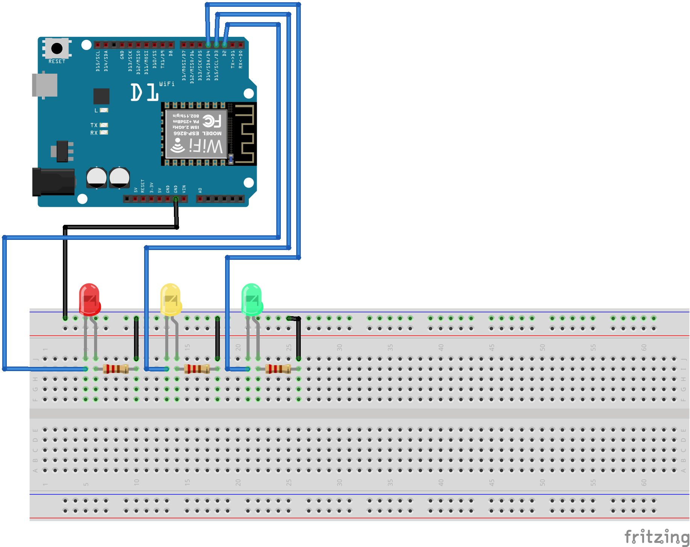

Silakan teman-teman rangkai sendiri ya.

Di sini, saya mencocokkan PINnya sesuai dengan yang ada di database, yaitu:

- D2 untuk LED Merah.
- D3 untuk LED Kuning.
- D4 untuk LED Hijau.

Rangkaian fisik yang sudah saya rangkai seperti ini:

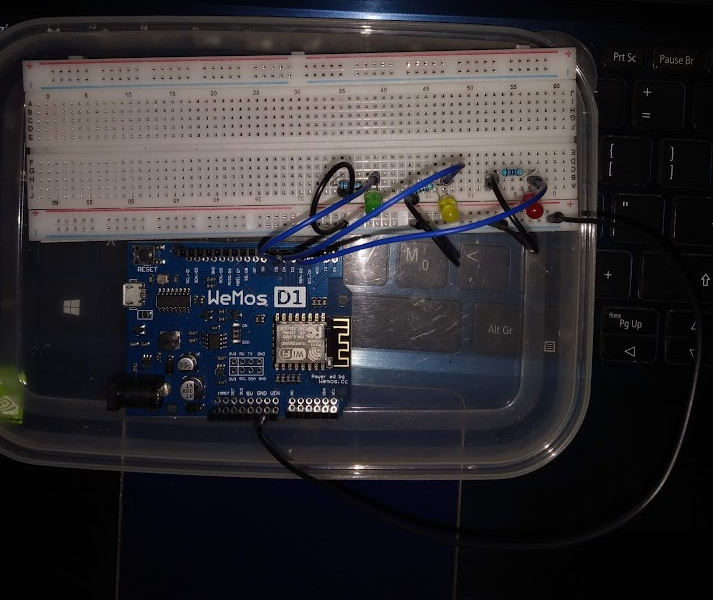

### Import Board Manager
Karena `ESP8266` tidak tersedia di Arduino IDE secara bawaan, maka kita perlu _import board manager_-nya. Silakan buka Arduino IDE-nya, lalu arahkan ke menu File > Preferences. Lalu pada bagian `Additional Board Manager URLs:` isikan berikut:

```
https://arduino.esp8266.com/stable/package_esp8266com_index.json
```

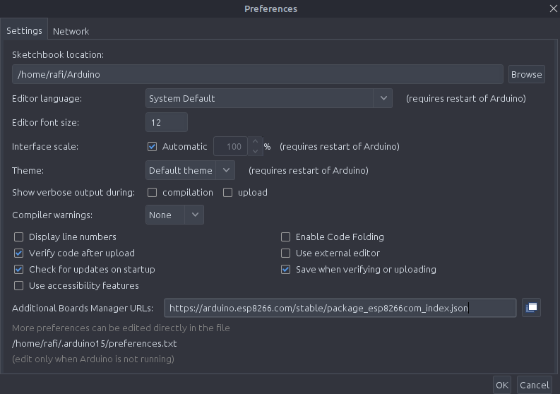

Setelah itu klik `OK`. Lalu klik menu Tools > Board > Boards Manager...

Cari 'ESP8266' lalu install.

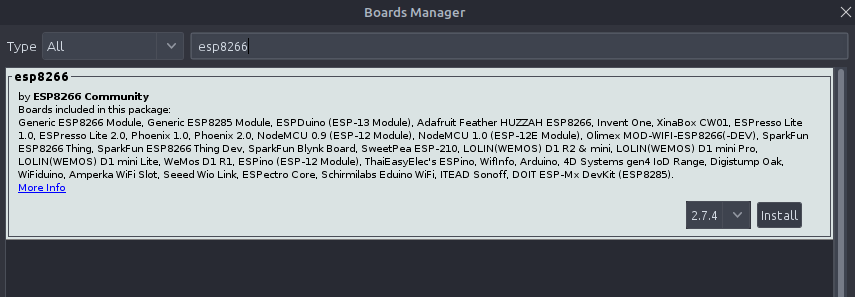

Jika sudah, kita bisa pilih boardnya ke ESP8266. Karena saya pakai WeMos, maka saya pilih yang LOLIN.

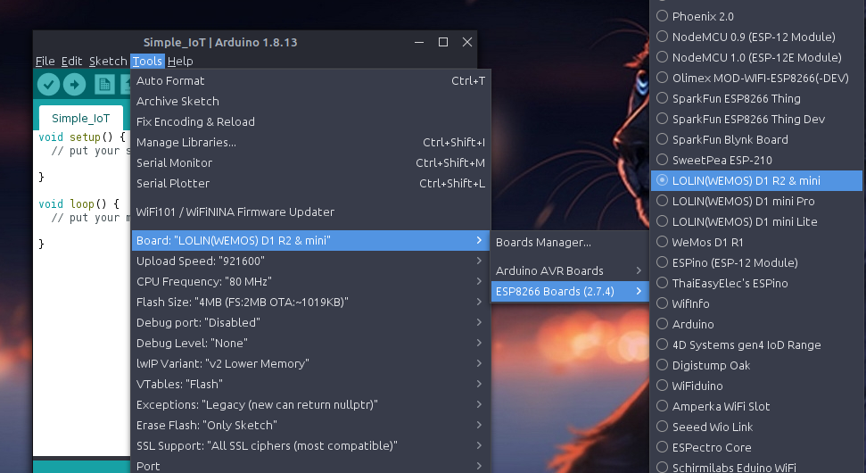

### Install Library
Karena kita pakai API yang bentuk keluarannya JSON, maka kita perlu library yang bernama `ArduinoJson`. Fungsinya supaya kita bisa menterjemahkan JSON dari server-nya.

Silakan ke Tools > Manage Libraries... > Lalu cari "ArduinoJson" dan install.

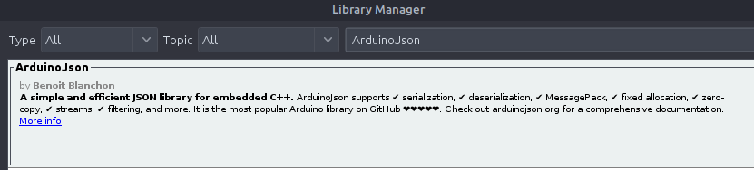

### Memprogram
Sekarang adalah saatnya memprogram Mikrokontrolernya.

Pertama-tama, kita harus import semua library yang dibutuhkan sertama membuat variabel konstanta yang berisi SSID (Nama WiFi), password WiFi, dan juga alamat servernya:

```c++
#include <ESP8266WiFi.h> // Untuk menghubungkan dengan WiFi.
#include <ESP8266HTTPClient.h> // Untuk melakukan HTTP Client (POST, GET, PATCH, dsb).
#include <WiFiClient.h>  // Supaya bisa terkoneksi ke alamat IP yang spesifik.
#include <ArduinoJson.h> // Untuk menterjemahkan JSON.

const char* SSID = "SSID"; // Nama WiFi.
const char* PASS = "PASSWORD"; // Password WiFi.

String serverName = "http://192.168.0.74:8080/api/buttons/"; // Silakan ganti sesuai alamat lokal ip kalian.

void setup() {

}

void loop() {

}
```

Selanjutnya, kita harus definisikan PIN yang digunakan. Untuk yang pakai WeMos, ini agak aneh. Karena di PIN WeMos itu antara D0 - D8, sedangkan kita harus mendefinisikannya dalam bentuk integer. Untuk itu, berikut adalah terjemahan PIN dari WeMos :

```bash
D0   = 16;
D1   = 5;
D2   = 4;
D3   = 0;
D4   = 2;
D5   = 14;
D6   = 12;
D7   = 13;
D8   = 15;
RX   = 3;
TX   = 1;
```

Karena saya pakai PIN D2 - D4, maka saya akan menggunakan 4, 0, dan 2 dalam `pinMode()`:

```c++
setup() {
    pinMode(4, OUTPUT);
    pinMode(0, OUTPUT);
    pinMode(2, OUTPUT);
}
```

Lalu koneksikan Arduino dengan WiFi:

```c++
setup() {
    pinMode(4, OUTPUT);
    pinMode(0, OUTPUT);
    pinMode(2, OUTPUT);

     // Connect to network
    Serial.begin(115200); // Buat Serial
    WiFi.begin(SSID, PASS); // Proses connect ke WiFi
    Serial.print("Connecting"); // Print Serial "Connecting".
    
    while(WiFi.status() != WL_CONNECTED) {
        // Selama belum connect, print di Serial "." lalu delay 0.5 detik.
        delay(500);
        Serial.print(".");
    }
    // Jika sudah connect, print di Serial "connected".
    Serial.println();
    Serial.println("Connected!");
}
```

Pada fungsi `loop()`, kita akan melakukan pengulangan pengambilan data (method GET) ke API kita. Saya juga membuat fungsi baru bernama `httpGetButtonRequest()` untuk melakukan GET Request, karena kodenya panjang jadi saya buat fungsi sendiri.

```c++
void loop() {
  if (WiFi.status() == WL_CONNECTED) {
    httpGetButtonRequest();
  }
  delay(500);
}
```

Sekarang saatnya memprogram fungsi `httpGetRequest`-nya, pertama-tama kita panggil dulu library yang kita butuhkan:

```c+++
String httpGetRequest(){
    WiFiClient client;
    HTTPClient http;
}
```

Selanjutnya adalah membuat looping, kita akan looping sebanyak pin yang digunakan (3). Kita looping di sini maksudnya untuk mengambil data berdasarkan ID. Karena ID yang ada di database itu udah pasti 1 - 3, maka kita hanya looping dari 1 - 3.

```c++
for (int i = 1; i <= 3; i++) {
    // Kode
}
```

Sekarang manipulasi URL APInya, yaitu dengan menambahkan angka di belakang URL:

```c++
    String serverNameSum = serverName;
    // serverNameSum = http://192.168.0.74:8080/api/buttons/

    serverNameSum += i;
    // serverNameSum = http://192.168.0.74:8080/api/buttons/1

    char * newServerName = &serverNameSum[0];
    // Simpan alamat API yang baru ke dalam variabel newServerName bertipe data char.
    // Hal ini dikarenakan, terdapat masalah penggunaan memori jika pakai String.

    http.begin(client, newServerName); // Mulai koneksi ke API dengan URL yang baru.

    Serial.println(newServerName); // Serial Print url.
    Serial.println(http.GET()); // Serial Print status kodenya.
```

Setelah itu buat kondisi, jika kita berhasil mendapatkan data, maka terjemahkan JSON-nya dan eksekusi ke PIN-nya:

```c++
if (http.GET() > 0) {
    // Terjemahkan JSON ke dalam variabel doc.
    // Variabel doc memiliki kapasitas 2048 bytes.
    DynamicJsonDocument doc(2048);
    DeserializationError error = deserializeJson(doc, http.getString());

    // Jika error
    if (error) {
        // Kirimkan print Serial
        Serial.println("deserializeJson() failed: ");
        Serial.println(error.c_str());
    }

    // Karena Pin arduino hanya membaca integer, maka kita perlu mengganti dari D2 ke int.
    uint8_t buttonPin; // Variabel tempat menyimpan pin yang baru.

    String buttonName = doc["name"]; // Ambil data nama dari API.
    int buttonStatus = doc["status"]; // Ambil data status dari API.

    // Pengecekan PIN
    if (doc["pin"] == "D2") {
        // Jika PIN D2, maka buttonPin = 4.
        buttonPin = 4;
    } else if (doc["pin"] == "D3") {
        // Jika PIN D3, maka buttonPin = 0.
        buttonPin = 0;
    } else if (doc["pin"] == "D4") {
        // Jika PIN D4, maka buttonPin = 2.
        buttonPin = 2;
    }

    // Control LED
    if (buttonStatus == 1) {
        // Jika statusnya 1, maka nyalakan LEDnya.
        digitalWrite(buttonPin, HIGH);
    } else {
        // Jika statusnya 0, maka matikan LEDnya.
        digitalWrite(buttonPin, LOW);
    }
    // Tutup koneksi ke API.
    http.end();
} else {
    // Jika gagal mendapatkan data, maka langsunt tutup koneksi ke API.
    http.end();
}
} // Ini penutup untuk for loop yang tadi.
```

Sehingga, secara keseluruhan, kode Arduinonya seperti ini:

```c++
#include <ESP8266WiFi.h>
#include <ESP8266HTTPClient.h>
#include <WiFiClient.h>
#include <ArduinoJson.h>

const char* SSID = "SSID"; // Nama WiFi.
const char* PASS = "PASSWORD"; // Password WiFi.

String serverName = "http://192.168.0.74:8080/api/buttons/"; // Silakan ganti sesuai alamat lokal ip kalian.

void setup() {
    pinMode(4, OUTPUT);
    pinMode(0, OUTPUT);
    pinMode(2, OUTPUT);

     // Connect to network
    Serial.begin(115200); // Buat Serial
    WiFi.begin(SSID, PASS); // Proses connect ke WiFi
    Serial.print("Connecting"); // Print Serial "Connecting".
    
    while(WiFi.status() != WL_CONNECTED) {
        // Selama belum connect, print di Serial "." lalu delay 0.5 detik.
        delay(500);
        Serial.print(".");
    }
    // Jika sudah connect, print di Serial "connected".
    Serial.println();
    Serial.println("Connected!");

}

void loop() {
  if (WiFi.status() == WL_CONNECTED) {
    httpGetButtonRequest();
  }
  delay(500);
}

String httpGetButtonRequest(){
  WiFiClient client;
  HTTPClient http;

  for (int i = 1; i <= 3; i++) {
    String serverNameSum = serverName;
    // serverNameSum = http://192.168.0.74:8080/api/buttons/

    serverNameSum += i;
    // serverNameSum = http://192.168.0.74:8080/api/buttons/1

    char * newServerName = &serverNameSum[0];
    // Simpan alamat API yang baru ke dalam variabel newServerName bertipe data char.
    // Hal ini dikarenakan, terdapat masalah penggunaan memori jika pakai String.

    http.begin(client, newServerName); // Mulai koneksi ke API dengan URL yang baru.

    Serial.println(newServerName); // Serial Print url.
    Serial.println(http.GET()); // Serial Print status kodenya.

    if (http.GET() > 0) {
        // Terjemahkan JSON ke dalam variabel doc.
        // Variabel doc memiliki kapasitas 2048 bytes.
        DynamicJsonDocument doc(2048);
        DeserializationError error = deserializeJson(doc, http.getString());
    
        // Jika error
        if (error) {
            // Kirimkan print Serial
            Serial.println("deserializeJson() failed: ");
            Serial.println(error.c_str());
        }
    
        // Karena Pin arduino hanya membaca integer, maka kita perlu mengganti dari D2 ke int.
        uint8_t buttonPin; // Variabel tempat menyimpan pin yang baru.
    
        String buttonName = doc["name"]; // Ambil data nama dari API.
        int buttonStatus = doc["status"]; // Ambil data status dari API.
    
        // Pengecekan PIN
        if (doc["pin"] == "D2") {
            // Jika PIN D2, maka buttonPin = 4.
            buttonPin = 4;
        } else if (doc["pin"] == "D3") {
            // Jika PIN D3, maka buttonPin = 0.
            buttonPin = 0;
        } else if (doc["pin"] == "D4") {
            // Jika PIN D4, maka buttonPin = 2.
            buttonPin = 2;
        }
    
        // Control LED
        if (buttonStatus == 1) {
            // Jika statusnya 1, maka nyalakan LEDnya.
            digitalWrite(buttonPin, HIGH);
        } else {
            // Jika statusnya 0, maka matikan LEDnya.
            digitalWrite(buttonPin, LOW);
        }
        // Tutup koneksi ke API.
        http.end();
    } else {
        // Jika gagal mendapatkan data, maka langsunt tutup koneksi ke API.
        http.end();
    }
  }
}

```

Dan sekarang teman-teman bisa mencobanya, silakan di-verify lalu upload :D

Pastikan Node.js sudah berjalan di port 8080 dan Vue.js sudah berjalan di port 8081 ya.

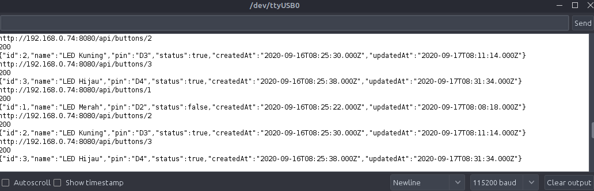

## Penutup
Selesai sudah latihan ini.

Meskipun masih ada beberapa kekurangan, semisalnya ada delay antara backend ke mikrokontroler, saya rasa ini wajar karena masih menggunakan RESTful API. Dan juga teman-teman mungkin perlu melakukan `refactor` kodenya supaya lebih optimal lagi. :D

** Sudah diuji di Linux Mint 20 dan Windows 10 Home 64 bit, dan masih bisa bekerja dengan baik.

** Source code dari artikel ini tersedia di [Github](https://github.com/rafipriatna/Microcontroller/tree/master/WeMos%20IoT/Traffic%20Light).


#### Referensi
0. https://sequelize.org/master/class/lib/sequelize.js~Sequelize.html
1. https://expressjs.com/en/api.html
2. https://www.npmjs.com/package/body-parser
3. https://github.com/esp8266/Arduino
4. https://arduinojson.org/v6/api/dynamicjsondocument/
