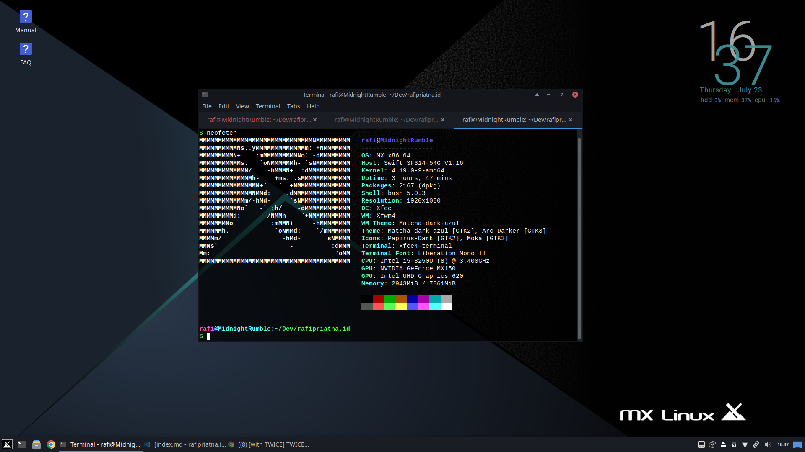
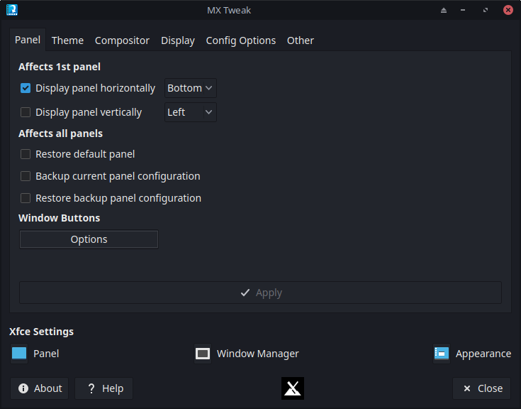

Pada hari Rabu malam tanggal 22 Juli 2020, saya memformat seluruh isi Harddisk (HDD) saya sebesar 1 TB.
Malam itu, saya mencoba memasang MX Linux di laptop saya, menggantikan Windows 10 Home.

Saya memutuskan untuk mempartisi ulang HDDnya, saya membagi ke empat bagian partisi, yaitu : 
1. Boot/efi 500 MB
2. ROOT 300 GB
3. SWAP 8 GB
4. Home 630.2 GB

MX Linux 19.2 ini cukup ringan, untuk kondisi baru dinyalakan hanya menggunakan RAM sekitar 700MB (setelah saya install beberapa aplikasi yang autostart).
Cukup disayangkan Intel Optane 16 GB saya tidak terpakai di sini, mungkin saya harus menggantinya dengan NVME SSD nanti.

Aplikasi-aplikasi yang tersedia di repositori MX Linux kebanyakan adalah paket-paket lama, karena berbasisnya Debian 10, tentu saja MX Linux lebih mengutamakan kestabilan. Untuk itu, jika ingin memasang tools atau paket terbaru, saya lebih suka langsung dicompile.

Misalnya jika ingin memasang Golang, saya bisa download source codenya, lalu dipasang manual. Karena saat ini paket Golang yang tersedia di repositori masih menggunakan versi 1.11, yang mana sekarang versi stabilnya sudah 1.14.

MX Linux juga tidak menggunakan SystemD, tetapi menggunakan init system (sysVinit). Berdasarkan pengalaman saya, penggunakan init system ini cukup membantu mempercepat proses booting dibandingkan SystemD.

Saya sudah melakukan modifikasi kecil, yang semuanya sudah tersedia. Seperti panel yang pada awalnya ada di kiri vertikal, saya ubah ke bawah horizontal. Lalu ikon, dan tema saya ganti ke tema dan ikon yang tersedia dengan MX Tweak.

MX Linux 19.2 juga sangat friendly kepada pengguna baru menurut saya, hal ini karena beberapa kali saya "dimanjakan" dengan informasi-informasi yang pada distribusi lain sepertinya tidak ada, misalnya tentang informasi saat install aplikasi melalui terminal, terkadang muncul pop-up, atau saat modifikasi dengan MX Tweak, sudah otomatis dibackup panelnya, dsb. Jadi sangat cocok untuk orang-orang yang baru mau mencoba linux.

Oke, sekian dulu artikel kali ini 😁.
