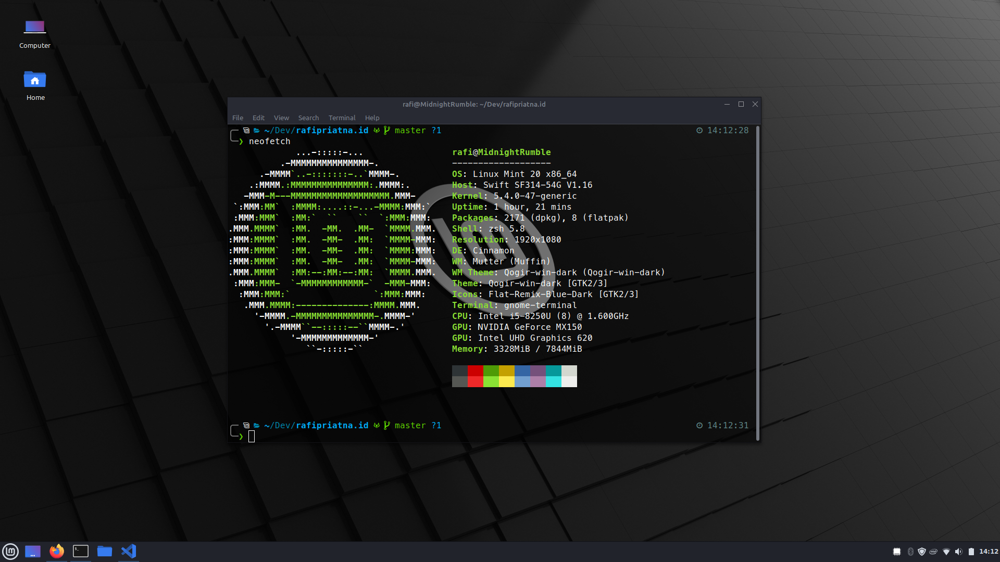

Saya... Ganti distro lagi.

Nggak, bukan karena MX Linux jelek atau apa. MX Linux itu distribusi yang sangat stabil dan keren bagi saya. Hanya saja, ada satu masalah yang terjadi di laptop saya. Yaitu saya tidak bisa masuk _UEFI Firmware Settings_ (atau mungkin orang-orang lebih suka menyebutnya BIOS). Saya baru menyadari ini ketika harus masuk ke UEFI Firmware Settings untuk mengatur NVME.

Masalah ini kebanyakan terjadi di laptop Acer (termasuk saya), menurut penelusuran saya. Jadi, saya sudah dikutuk untuk menggunakan distribusi Ubuntu dan turunannya. Karena hanya distribusi Ubuntu dan turunannya yang tidak bermasalah seperti ini. Sedangkan distribusi lain yang bukan Ubuntu, maka akan mendapatkan masalah ini.

Saya bingung, sudah bertanya ke forum namun tidak membuahkan hasil :(

Dan sekarang akhirnya saya pindah distribusi ke Linux Mint 20 Cinnamon.

Namun tetap saja rasanya sama aja haha. Karena memang mau apa aja distribusinya, pengaturannya ya itu-itu saja. Lagi pula, masih sama-sama turunan Debian. Jadi tidak terlalu berbeda sih.
