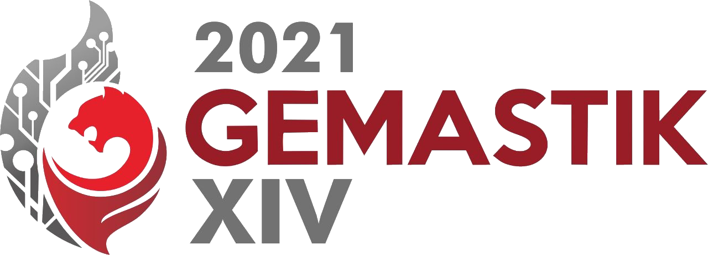

GEMASTIK atau Pagelaran Mahasiswa Nasional Bidang Teknologi Informasi dan Komunikasi pada tahun 2021 sudah dilaksanakan. Saya bersama tim Alakadarnya berkesempatan untuk ikut berkompetisi kategori Keamanan Siber mewakili Universitas Gunadarma. Ini adalah kalinya bagi tim Alakadarnya, khususnya bagi saya pribadi mengikuti kompetisi di GEMASTIK. Pada kesempatan kali ini, saya akan membagikan pengalaman saya saat mengikuti kompetisi GEMASTIK XIV kategori Keamanan Siber.

### Sekilas tentang kategori Keamanan Siber

Berdasarkan pedoman GEMASTIK 2021, keamanan siber dilaksanakan dalam dua tahap: Penyisihan dan Final. Pada penyisihan, dilaksanakan pada tanggal 07 Agustus 2021 jam 18:00 - 23:00 WIB dengan mode permainan Jeopardy. Sedangkan final dilaksanakan pada tanggal 06 Oktober 2021 jam 10:00 - 17:00 dengan mode permainan Attack and Defense.

## Penyisihan
Karena penyisihan ini akan bermain dengan mode permainan Jeopardy, maka kami hanya mengandalkan bermain CTF dari ctftime.org. Meskipun saya sendiri tidak begitu aktif bermain CTF di ctftime karena kesibukan kuliah ditambah sedang mengerjakan Penulisan Ilmiah. Sehingga setiap CTF-an ctftime saya hanya mengerjakan beberapa soal saja.

Hingga tiba waktu penyisihan, 07 Agustus 2021.

Sehabis magrib kami melaksanakan penyisihan dengan hasil akhir kami menyelesaikan total 3 _challenges_. Iya, hanya 3. Itu juga 1 diantara 3 hanya sanity check hahahaha.

Berikut adalah Writeup penyisihan GEMASTIK XIV kami:

<iframe src="https://drive.google.com/file/d/1yOCmJ7uW_sO3E5BEl5TMcgUEpMR_s4bT/preview" width="100%" height="480" allow="autoplay"></iframe>

### Pengumuman
Setelah melalui masa penyisihan tersebut, akhirnya tiba saatnya untuk menunggu hasil pengumuman pada tanggal 19 Agustus 2021. Yah, sebenarnya saya sendiri tidak berharap banyak dengan hasil pengumuman ini, karena saat penyisihan seperti yang sudah saya jelaskan di atas.

19 Agustus 2021

Setelah melihat pengumuman, alhamdulillah kami masuk final. Berada diurutan ke-15. Saya merasa cukup senang juga, karena pada akhirnya saya berkesempatan bermain Attack and Defense. Karena Attack and Defense ini adalah mode permainan yang belum pernah saya mainkan sebelumnya. Jadi ya, lumayan nambah pengalaman.

### Persiapan Attack and Defense
Untuk persiapan, kami hanya bermain di Hack The Box Machine karena saya tidak menemukan penyedia CTF yang menawarkan cara bermain Attack and Defense. Dan menurut saya pribadi, tantangan-tantangan di Hack The Box cukup sulit. Saya sendiri hanya mengerjakan satu tantangan level easy :(. Atas dasar hal itu, kami pada akhirnya hanya bermain CTF Jeopardy di ctftime.org. Yah, selama persiapan ini kami masih belum tahu bagaimana cara main Attack and Defense :(.

## Final
Hingga waktunya final tiba. Menurut jadwal, sehari sebelum pelaksanaan final akan ada pemanasan. Nah, pemanasan ini akan saya manfaatkan sebagai pengenalan bagaimana cara bermain Attack and Defense. Akan tetapi ada kendala teknis sehingga pemanasan akan dilakukan di hari pelaksaan final, lebih tepatnya tiga jam sebelum final yaitu jam 07:00 - 08:00.

Untuk pelaksaan kompetisi final ini, kami bermain di ruangan yang sama, yaitu di kampus F6 Universitas Gunadarma. Ini adalah kali pertamanya saya bertemu secara langsung dengan tim Alakadarnya 🤣. Kampus ini berada di Depok, dan perjalanan dari rumah saya ke kampus F6 memakan waktu sekitar 2 jam. Karena kami bertiga sama-sama menggunakan KRL, jadi kami berencana ketemuan di stasiun Pondok Cina untuk berangkat bareng ke kampus F6.

Singkat cerita kami sampai di kampus F6 sekitar jam 08:15 WIB alias tidak kebagian ikutan pemanasan :). Jadi ya sudah, kami berkompetisi tanpa tahu bagaimana cara mainnya. Yang kami tahu hanya scan port saja menggunakan NMAP 🤣.

Saat berkompetisi, kami harus join ke Zoom Meet untuk diawasi oleh LO. Dan waktu pelaksaan kompetisi dibagi menjadi 4: Untuk 3 jam pertama yaitu jam 10:00 - 12:00 kami melakukan Defense. Untuk 1 jam berikutnya yaitu jam 12:00 - 13:00 itu ISOMA. Dan 3 jam ketiga yaitu 13:00 - 16:00 kami melakukan Attack. Dan sisa waktu yaitu 16:00 untuk membuat Writeup.

### Defense
Satu jam pertama masih bingung harus ngapain. Lalu dua jam terakhir baru terpikirkan harus ngapain. Yang kami lakukan adalah menonaktifkan fungsi sudo pada user biasa, memperbaiki permission berkas-berkas, dan memperbaiki service web karena di sana ada vuln-nya. Salah satu vuln-nya yaitu RCE PHP 8.1.0-dev. Vuln yang masih fresh sekali. Sebearnya ada tiga vuln, tapi sayang sekali kami hanya menyadari satu saat kompetisi 😥.

### Attack
Berdasarkan bug PHP yang kami temukan saat defense, kami melakukan eksploitasi ke server peserta lain untuk mendapatkan flag menggunakan public exploit. Hingga kompetisi berakhir kami tidak berhasil menempati top 4 :(. Tapi sejujurnya, permainan ini sangat seru. Meskipun kami belum menang, tapi saya sangat menikmati kompetisinya.

## Penutup
Yah sekian cerita-cerita dari saya. Ini adalah salah satu pengalaman yang sangat berkesan bagi saya. Terima kasih untuk segala pihak yang ikut berkontribusi dalam Keamanan Siber GEMASTIK XIV. Tantangan atau _Challenges_ yang ada sangat seru, dan saya banyak belajar hal baru selama berkompetisi. Dan satu lagi, bermain CTF di tempat yang sama asik juga ternyata 😁.
