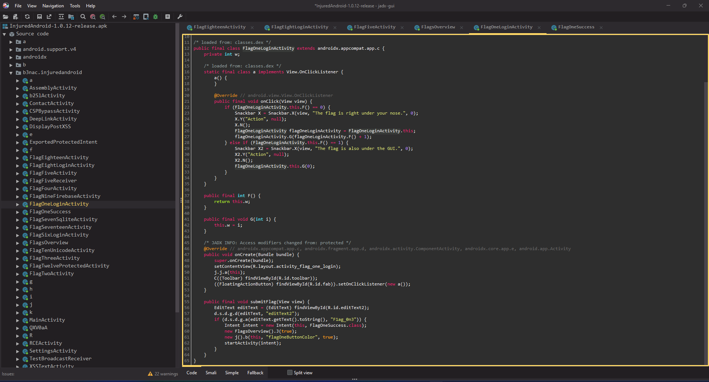

Pada artikel ini kita akan belajar mengenai teknik _Android Peneteration Testing_ dasar, harapannya kita jadi bisa meningkatkan _security_-nya.

Saya menulis artikel ini berdasarkan informasi yang saya dapat di internet, dan juga pengalaman saya sebagai _Penetration Tester_.

Pertama-tama, kita harus menyiapkan _environment_-nya terlebih dahulu sebelum memulai pengujian penetrasi, selanjutnya menyiapkan _tools_ yang berguna untuk pentesting.


## Apa itu Android Pentesting?
Sebagai sistem operasi sumber terbuka, Android memiliki _market share_ sebanyak 69.64% di dunia per 2023.[^1] Terlebih sekarang Android tidak hanya digunakan untuk perangkat _smartphone_, tetapi sudah meluas ke perangkat lain seperti _EDC_, _Tablet_, _TV_, _Car Dashboard_ dan lain sebagainya.

Beberapa aplikasi Android modern mengusung fungsi dan tujuan yang sangat penting, seperti untuk tujuan komersil, _banking_, _healtcare_, pembelajaran, dan sebagainya.

Hal ini membuat peranan Android Pentesting sangat penting di sini, dengan tujuan untuk mendeteksi kerentanan keamanan dan memastikan aplikasi Android tidak rentan terhadap serangan.

## Android Package (APK)
Android Package atau APK, adalah sebuah berkas arsip (_archive_) dengan ekstensi `.apk` dan berisi semua file yang diperlukan supaya aplikasi Android dapat berjalan.

Isi dari berkas ini biasanya adalah:

- **_Library_:** Berisi pustaka _native_ dengan kode yang dikompilasi, untuk arsitektur perangkat yang berbeda.
- **_Assets_:** Berisi informasi verifikasi yang dihasilkan ketika aplikasi di-_signing_.
- **META-INF:** Berisi _Certificate_ atau _Signature_.
- **Res:** Berisi _resource_ dari aplikasi, seperti file XML yang menentukan daftar warna, _layout UI_, font, _values_, dll.
- **_AndroidManifest.xml_:** Berisi informasi dari aplikasi. Berkas ini juga menjelaskan nama paket aplikasi, _activity_, _resource_, versi, dll.
- **_Classes.dex_:** Berisi kode java yang sudah dikompilasi (_compiled_). Ekstensi `.dex` sendiri merupakan format berkas dex (Dalvik Executable), untuk dieksekusi oleh Android Runtime.
- **_Resources.arsc_:** Berisi _resources_ yang telah dikompilasi sebelumnya. Memuat informasi yang akan menautkan kode ke _resources_.

## Tools untuk Android Pentesting
Berikut ini adalah daftar _tools_ atau alat untuk melakukan uji penetrasi pada Android. Beberapa adalah tools pengujian otomatis dan lainnya adalah manual.

Pengujian otomatis berguna untuk melakukan _scanning_ kerentanan _common_, karena pengujian otomatis berjalan cepat, dan dapat mengumpulkan informasi yang lebih mendalam dibandingkan jika melakukan pengujian manual.

### Tools Otomatis
#### Mobile Security Framework (MobSF)
> Mobile Security Framework (MobSF) is an automated, all-in-one mobile application (Android/iOS/Windows) pen-testing, malware analysis and security assessment framework capable of performing static and dynamic analysis. MobSF supports mobile app binaries (APK, XAPK, IPA & APPX) along with zipped source code and provides REST APIs for seamless integration with your CI/CD or DevSecOps pipeline.The Dynamic Analyzer helps you to perform runtime security assessment and interactive instrumented testing. [^2]

MobSF dapat melakukan pengujian secara statis ataupun dinamis untuk perangkat Android,iOS, maupun Windows. Sangat direkomendasikan memasang _tool_ ini pada _Docker_. Karena dependensinya banyak banget wkwkw. 😅

### Tools Manual
#### Android Debug Bridge (ADB)
Untuk menghubungkan komputer ke perangkat Android atau emulator Android, kita membutuhkan ADB. Cara termudah untuk memasang ADB pada perangkat komputer adalah dengan memasang [Android Studio](https://developer.android.com/studio?hl=id). ADB adalah _tools_  yang wajib ada pada komputer sebelum melakukan pentesting Android.

#### JADX
Compiler DEX ke Java. Dengan [JADX](https://github.com/skylot/jadx), kita jadi bisa sedikit membaca kode Java yang sudah dikompilasi. Termasuk _decode_ `AndroidManifest.xml`, dan _deobfuscator_. Meskipun JADX tidak selalu 100% bisa melakukan _decompile_, tapi _tools_ ini cukup membantu kita untuk membaca logika cara kerja aplikasi.

#### Apktool
Salah satu _tools_ untuk melakukan _Reverse Engineering_ aplikasi Android. Dengan Apktool, kita bisa melakukan _decompile_, lalu memodifikasi _source code_-nya, kemudian melakukan _compile_ ulang. Ikuti [panduan berikut](https://apktool.org/docs/install) untuk memasang Apktool.

#### Frida
Salah satu _tools_ untuk melakukan analisis dinamis, dan juga _Reverse Engineering_ aplikasi Mobile (Android/iOS). Untuk memasang _tool_ ini, kita perlu memasang **Python 3**  terlebih dahulu. Jika sudah memasang, kita bisa langsung memasang _frida_ menggunakan `pip`.

```python
pip3 install frida-tools
```

#### Objection
_Runtime_ yang berguna untuk melakukan eksplorasi aplikasi mobile, tanpa memerlukan _jailbreak_. _Objection_ ini membutuhkan _frida_ agar dapat berjalan. Jadi, pastikan sudah memasang _frida_. Untuk memasang _objection_, kita cukup menggunakan `pip`, sama halnya seperti _frida_.

```python
pip3 install objection
```

#### Ghidra
Salah satu _tool_ untuk _Reverse Engineering_, tapi ditujukan khusus untuk menganalisis _native library_. Terkadang, aplikasi Android yang kita pentest menggunakan _native library_ khusus, kita dapat menggunakan [Ghidra](https://ghidra-sre.org/) untuk menganalisis _library_ tersebut.

## Menyiapkan Lingkungan Untuk Android Pentesting
Karena kita akan melakukan _pentest_ aplikasi Android, maka kita butuh Android. Jika kalian punya _smartphone_ Android fisik, itu bagus. Baiknya kita punya perangkat sendiri, tapi jika tidak punya, kita bisa menggunakan emulator Android yang disedikan oleh Android Studio (_Android Virtual Device_/AVD).


Dengan AVD ini, kita bisa memilih banyak tipe Android, mulai dari Android _Nougat_ yang udah jadul, sampai Android _UpsideDownCake_ yang terbaru.

Secara umum, terdapat dua versi sistem operasi yang bisa kita pilih, yaitu:\

- PlayStore: Ada Google PlayStore, tapi belum _rooted_.
- Non PlayStore: Tidak ada Google PlayStore, dan aplikasi Google lainnya, tapi sudah _rooted_.

Untuk tujuan pentest, ada baiknya kita memilih yang sudah _rooted_. Karena Android yang sudah _rooted_ itu sangat membantu kita dalam melakukan analisis terhadap aplikasi Android.

### Mengaktifkan ADB Debugging
Secara bawaan, ADB Debugging belum aktif. Untuk itu, kita harus mengaktifkannya terlebih dahulu. Caranya sangat mudah:

- Buka Android (emulator/perangkat).
- Ke **Settings** > **About Device** > _Tap_ beberapa kali pada bagian "Build Number" hingga muncul _tooltip_ "You are now a developer!".


- Kembali ke menu **Settings** > **System**, maka akan muncul menu baru yaitu "Developer Options".


- Selanjutnya aktifkan **USB debugging**.


Sejauh ini udah cukup baik, mari kita coba jalankan di terminal `adb devices`

```powershell
$ adb devices
List of devices attached
emulator-5554   device
```

Kebetulan lagi pake emulator, jadi terbaca `emulator-5554`. Jika sudah muncul _device_ nya, maka sudah berhasil.

## Bedah isi APK
Terkadang, melakukan _Reverse Engineering_ APK dapat membantu kita untuk selangkah lebih maju melewati pemeriksaan keamanan. Misalnya, dengan melakukan _reverse_ APK, kita jadi tahu bahwa di APK tersebut terdapat pemeriksaan perangkat _Jailbreak_. Sehingga, kita bisa menghapus blok kode pemeriksaan tersebut supaya APK dapat dijalankan pada perangkat _rooted_.

### Ambil APK Online
Setidaknya kita harus memiliki file `.apk` dari aplikasi yang ingin kita uji, bukan? Saat kita melakukan _penetration testing_ Android, biasanya kita diberikan berkas `.apk` dari aplikasi yang akan diuji. Hanya saja, terkadang kita tidak diberikan karena aplikasi sudah ada di Google PlayStore. Karena kita nggak bisa langsung dapetin APK dari Google PlayStore, maka kita butuh pihak ketiga untuk mendapatkannya.

Ada beberapa situs web tempat mengunduh APK yang biasa saya gunakan:

- [APKPure](https://m.apkpure.com/id/)
- [APKCombo](https://apkcombo.com/)

### Decompile APK
Sebagai contoh, di sini saya punya APK yang _vulnerable_, [InjuredAndroid](https://github.com/B3nac/InjuredAndroid). Silakan di-unduh, kemudian kita coba untuk decompile APK tersebut menggunakan `apktool`.

```powershell
$ apktool d InjuredAndroid-1.0.12-release.apk
I: Using Apktool 2.9.0 on InjuredAndroid-1.0.12-release.apk
I: Loading resource table...
I: Decoding file-resources...
I: Loading resource table from file: C:\Users\Extops\AppData\Local\apktool\framework\1.apk
I: Decoding values */* XMLs...
I: Decoding AndroidManifest.xml with resources...
I: Regular manifest package...
I: Baksmaling classes.dex...
I: Copying assets and libs...
I: Copying unknown files...
I: Copying original files...
I: Copying META-INF/services directory
Press any key to continue . . .
```

Kemudian akan dibuatkan direktori oleh `apktool` berisi _decompiled_ nya. Mari kita buka pake teks editor favorit kalian, di sini saya membukanya menggunakan Visual Studio Code.


Seperti yang terlihat, terdapat banyak direktori dan berkasnya, mari kita lihat berkas yang memuat banyak informasi, `AndroidManifest.xml`.


Karena ini adalah APK yang dibuat dengan gaya CTF, maka ada flag yang bisa kita lihat. Sebagai contoh, mari kita lihat ke direktori **smali** > **b3nac** > **injuredandroid** > **FlagOneLoginActivity.smali**.

Di sana terdapat flag pertama:

```smali
.method public final submitFlag(Landroid/view/View;)V
    .locals 3

    const p1, 0x7f0800a7

    invoke-virtual {p0, p1}, Landroidx/appcompat/app/c;->findViewById(I)Landroid/view/View;

    move-result-object p1

    check-cast p1, Landroid/widget/EditText;

    const-string v0, "editText2"

    invoke-static {p1, v0}, Ld/s/d/g;->d(Ljava/lang/Object;Ljava/lang/String;)V

    invoke-virtual {p1}, Landroid/widget/EditText;->getText()Landroid/text/Editable;

    move-result-object p1

    invoke-virtual {p1}, Ljava/lang/Object;->toString()Ljava/lang/String;

    move-result-object p1

    const-string v0, "F1ag_0n3"

    invoke-static {p1, v0}, Ld/s/d/g;->a(Ljava/lang/Object;Ljava/lang/Object;)Z

    move-result p1

    if-eqz p1, :cond_0

    new-instance p1, Landroid/content/Intent;
```

> Smali adalah berkas representasi dari bahasa assembly bytecode Dalvik (DEX) yang berjalan di aplikasi Android.


### Membaca Source Code APK
Sebenarnya, dengan melakukan _decompile_ dengan `apktool` yang sudah kita lakukan sebelumnya, kita sudah bisa membaca _source code_ dari APK, yaitu dengan membaca kode `smali`-nya.

Bagaimanapun, kode `smali` meskipun bisa dibaca, tapi masih agak sulit untuk dipahami. Untuk itu, kita bisa gunakan _tools_ **JADX GUI**. Caranya adalah dengan membuka aplikasinya, lalu pilih APK-nya.



Terlihat pada class yang sama seperti sebelumnya, `FlagOneLoginActivity.class` dan pada _method_ `submitFlag`, kita dapat kode yang secara alur sama persis seperti `smali` tadi.

```java
public final void submitFlag(View view) {
    EditText editText = (EditText) findViewById(R.id.editText2);
    d.s.d.g.d(editText, "editText2");
    if (d.s.d.g.a(editText.getText().toString(), "F1ag_0n3")) {
        Intent intent = new Intent(this, FlagOneSuccess.class);
        new FlagsOverview().J(true);
        new j().b(this, "flagOneButtonColor", true);
        startActivity(intent);
    }
}
```

### Recompile APK
Jika _decompile_ itu meng-ekstrak file `.apk` menjadi _source code_, maka _recompile_ adalah mengembalikan kembali dari _source code_ hasil _decompile_ menjadi APK.

Tapi sebelumnya, mari kita _install_ APK tadi di Android kita.


Sebagai contoh _recompile_, mari kita ubah judul dari aplikasi "InjuredAndroid" menjadi "InjuredAndroid2". Untuk melakukannya, mari kita ke hasil _decompile_ tadi, lalu cari _string_ tersebut.


Seperti yang terlihat pada _screenshot_ di atas, _string_ "InjuredAndroid" terdapat pada file **res** > **values** > **strings.xml** di bagian "app_name". Mari ubah _string_ tersebut.

```xml
    <string name="action_settings">Settings</string>
    <string name="activity_bypass_info">There is a way to bypass the main activity and invoke other activities that are exported.</string>
    <string name="app_name">InjuredAndroid2</string>
    <string name="appbar_scrolling_view_behavior">com.google.android.material.appbar.AppBarLayout$ScrollingViewBehavior</string>
    <string name="assemblytextview">AssemblyTextView</string>
```

Selanjutnya, lakukan _recompile_ dengan `apktool`.

```powershell
$ apktool b .\InjuredAndroid-1.0.12-release\ -o InjuredAndroid2.apk
I: Using Apktool 2.9.0
I: Checking whether sources has changed...
I: Smaling smali folder into classes.dex...
I: Checking whether resources has changed...
I: Building resources...
I: Copying libs... (/lib)
I: Copying libs... (/kotlin)
I: Copying libs... (/META-INF/services)
I: Building apk file...
I: Copying unknown files/dir...
I: Built apk into: InjuredAndroid2.apk
Press any key to continue . . .
```

Keterangan:
- **b:** artinya _build_.
- **.\InjuredAndroid-1.0.12-release\:** nama direktori hasil _decompile_ sebelumnya.
- **-o InjuredAndroid2.apk:** nama file APK baru.

Setelah berhasil melakukan _recompile_, selanjutnya adalah melakukan _signing_ supaya APK dapat di-_install_ kembali.

### Signing APK
Setidaknya ada dua cara yang dapat kita lakukan untuk melakukan _signing_, cara pertama adalah menggunakan [uber-apk-signer](https://github.com/patrickfav/uber-apk-signer), dan yang kedua menggunakan [Objection](https://github.com/sensepost/objection).

#### uber-apk-signer
Pertama-tama, kita unduh dulu _binary_ nya di [sini](https://github.com/patrickfav/uber-apk-signer/releases), kita akan mendapatkan file bernama `uber-apk-signer-1.3.0.jar`, kemudian bisa langsung digunakan dengan cara:

```powershell
$ java -jar uber-apk-signer-1.3.0.jar --apks /ke/direktori/tempat/apk
```

Kalian juga bisa menambahkan _keystore_, atau _zipalign_. Untuk selengkapnya, silakan baca [example uber-apk-signer](https://github.com/patrickfav/uber-apk-signer#examples).

#### Objection
Pakai `objection` cenderung lebih mudah, tapi pertama-tama pastikan _binary_ dari **build-tools** AndroidStudio sudah terdaftar pada `Environment` kalian, ya.

Selanjutnya, kalian bisa langsung _signing_ APK.

```powershell
$ objection signapk .\InjuredAndroid2.apk
Checking for a newer version of objection...
Performing zipalign
`Zipalign completed`
Signing new APK.
Signed the new APK
Copying final apk from C:\Users\Extops\AppData\Local\Temp\tmp6v5alfm1.apktemp.aligned.objection.apk to .\InjuredAndroid2.objection.apk in current directory...
Cleaning up temp files...
```

Akan dibuatkan APK baru dengan nama `InjuredAndroid2.objection.apk`, mari kita _install_ lagi APK yang baru.


Dapat dilihat pada _screenshot_ di atas, nama aplikasi berhasil diubah. 😁

## Penutup
Sampai sini, kita sudah belajar banyak, nih. Mulai dari menyiapkan lingkungan, _tools_, dan dasar-dasar membedah APK. Masih banyak hal yang dapat diulik lagi tentang aplikasi Android ini, misalnya melakukan _intercept_ HTTP, _bypass layer_ keamanan, _inject code_, dan sebagainya. Itu akan kita pelajar pada artikel-artikel berikutnya. 😊

[^1]: https://gs.statcounter.com/os-market-share/mobile/worldwide
[^2]: https://github.com/MobSF/Mobile-Security-Framework-MobSF#mobile-security-framework-mobsf