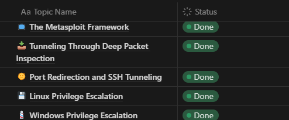

Pada tanggal 18 Januari 2024 kemarin, saya sudah resmi menerima sertifikat Offensive Security Certified Professional (OSCP) yang dikeluarkan oleh Offsec. Hal ini berarti, saya sudah dinyatakan lulus OSCP Exam! So happy. 😁

Saya mengikuti sertifikasi ini karena diberikan kesempatan dan disponsori oleh kantor saya, dan saya akan berbagi cerita pengalaman saya mengikuti sertifikasi ini yang sangat seru dan penuh tantangan.

## Perkenalan
Kembali ke bulan Agustus 2023, saya diberikan kesempatan oleh kantor saya untuk mengikuti pelatihan/trainin PWK/PEN-200 dari Offsec. Isi dari PEN-200 ini sangat lengkap. Benar-benar lengkap. Mulai dari non teknis seperti gimana cara belajar yang efisien, gimana cara mencatat hal teknis, lalu hal teknis seperti _Information Gathering_ pakai _NMAP_, hingga pembuatan _report penetration testing_.

Jadi menurut saya, kalo kamu punya _skills_ dasar cara pakai Linux, atau Networking, langsung ambil PEN-200 ini nggak akan jadi masalah. Karena materinya diajarkan dari dasar juga.

Kebetulan, kantor saya beli PEN-200 paket 3 bulan, yang berarti saya cuma bisa akses materinya hingga bulan Oktober. Menurut saya, cara penyampaian materinya juga cukup lengkap, ada versi teks, video, lab untuk praktik, hingga labs try harder.

### Teks
Seperti namanya, materi ini disajikan dalam bentuk teks, dan bisa didownload dalam bentuk PDF yang sangat banyak halamannya.

### Video
Video ini isinya semacam tutorial dari teks-nya. Jadi kalimat yang disampaikan sama persis seperti di teks. Tapi saya jarang nonton videonya sih, lebih suka teks karena lebih _sat set sat set_. Video juga bisa didownload.

### Lab Praktik
Tiap-tiap modul ada labnya, semacam _exercises_ gitu. Jadi abis baca materi, langsung praktik.

### Lab Try Harder
Seperti namanya, _Try Harder_, berarti lab ini mendorong kami untuk mencoba lebih keras lagi buat dapetin _flag_ _local.txt_ dan _proof.txt_. Bener-bener tanpa arahan, cuma dikasih IP mesin, dan kita harus bisa enumerasi, ngumpulin informasi, dan eksploit. Secara umum, ada 6 labs di sini: 3 Labs AD (_Active Directory_) dan 3 Labs non AD (GNU/Linux or Windows OS). Meskipun total cuma 6, tapi tiap Labs bisa berisi lebih dari 1 IP. 😁

### Exam Bonus Points
Ada bonus point Exam sebesar 10 jika kamu berhasil meraih [^1]:
- 80% Lab Praktik
- 30 _proof.txt_ dari Lab Try Harder

## Strategi Belajar
Karena saya memiliki kesibukan bekerja, maka saya harus bisa mengatur waktu untuk belajar dan bekerja. Jadi, begini strategi saya.

### Waktu untuk belajar
> Saya bekerja _9 to 6_, berarti saya bekerja dari jam 09 Pagi sampai jam 18 Malam. Alias, saya bekerja 8 jam sehari, dan istirahat sejam. Jarak tempuh dari rumah saya ke tempat kerja sekitar 1 jam.

Jadi, saya memiliki waktu sekitar 2 jam sehari untuk belajar di hari kerja, dan 8 jam sehari di _weekend_. Ditambah curi-curi waktu sewaktu pentesting, karena ada kalanya project pentest tidak berjalan mulus, kadang ada eror, _on hold_, dan sebagainya. 

### Menulis Catatan
Saya menggunakan [Notion](https://notion.so) sebagai media mencatat saya. Jadi, apa yang saya catat?
- Rangkuman materi/konsep
- Perintah-perintah dari _tools_
- WriteUp dari lab praktik/lab try harder

Selama saya menggunakan Notion ini, saya memiliki beberapa hal yang cukup mengganggu. Misalnya, Notion ini butuh Internet. Jadi, ketika saya membuka aplikasi Notion (di Windows), kadang lemot banget. Juga, aplikasi masih suka buggy. Mungkin kalian bisa menggunakan alternative lain seperti **Anytype** atau **Joplin**. Saya sendiri, di akhir masa belajar saya, saya ganti catatan ke Joplin. Juga sewaktu Exam, saya mencatat nya di Joplin.

### Menyelesaikan Semua _Exercises_
Tiap-tiap module _exercises_ nya atau lab praktik-nya saya selesaikan. Minimal 80% _exercises_ yang ada di tiap modul saya selesaikan. Menurut saya, adanya _exercise_ ini membantu saya untuk lebih memahami modul yang telah dipelajari. Karena kita langsung praktik. Untuk itu, sangat penting untuk mengerjakan _exercise_.

### Lab Try Harder
Lab ini sangat sulit, nggak ada _writeup_ nya di internet, dan juga Offsec tidak menyediakan _official writeup_-nya, jadi kita dituntut untuk _Try Harder_. Dari total sekitar 50-an lab, saya mengerjakan 28 lab. Yes, kurang sedikit lagi untuk mendapatkan bonus points exam :)

Setidaknya, saya mengerjakan dua lab AD, dan satu lab non AD. Karena ini _Try Harder_, maka kita dituntut untuk bisa _searching_ di internet, dan juga bertanya ke instruktur Offsec di Discord mereka. Instruktur nya sangat _friendly_, bisa bertanya apa saja.

## Strategi OSCP Exam
Setelah belajar selama 3 bulan, akhirnya tiba waktunya ujian. Di sini, saya mengambil ujian pada awal bulan November 2023. OSCP Exam ini akan diberikan 3 mesin satu set AD, dan 3 standalone. Dimana, pada satu set AD akan diberikan skor 40 jika berhasil mendapatkan DC dan mensubmit 3 _proof.txt_, sedangkan standalone akan mendapatkan 10 point untuk tiap _local.txt_ dan _proof.txt_.

### Strategi Ujian Pertama
Karena saya tidak berhasil mendapatkan bonus point, maka strategi saya adalah mengerjakan satu set AD, dan dua standalone berarti saya akan mendapatkan 80 point atau 70 point.

Ujian pertama berjalan sangat _greedy_. Dan berakhir saya tidak lulus ujian. Kok, bisa?

Menurut saya, pada ujian pertama ini saya terlalu berambisi untuk menyelesaikan mesin yang diberikan. Bayangkan, pada ujian ini saya jarang istirahat dan tidak tidur satu menit pun. Amazing :D

Satu jam pertama, saya berhasil mendapatkan point 40 dari satu set AD. Tiga jam berikutnya, saya berhasil mendapatkan _local.txt_ dan _proof.txt_ dari satu standalone. Berarti, saya sudah dapet 60 points dan waktu ujian tersisa 19 jam. Seharusnya, 19 jam adalah waktu yang cukup untuk menyelesaikan dua mesin lagi. Tapi nyatanya tidak selesai.

Satu jam terakhir sebelum ujian selesai, saya baru menemukan pintu masuk _initial access_ dari mesinnya, yang mana waktunya tidak cukup bagi saya untuk melakukan eksploitasi. Akhirnya, waktunya habis dan saya hanya mendapatkan poin 60. Frustasi sekali menerima fakta hanya mendapatkan 60 point :(

### Strategi Ujian Kedua (Retake)
Ujian kedua dilaksanakan pada tanggal 15 Januari 2024, sebelum ujian dimulai, saya dikasih rentang waktu sekitar > 6 minggu untuk mempersiapkan diri. Jadi apa yang saya persiapkan?

#### Push Rank Lab
Saya mengerjakan mesin-mesin berikut, saya lebih berfokus ke mesin berbasis Windows, supaya saya lebih familiar dengan perintah-perintah-nya.

Berikut adalah mesin HackTheBox yang saya kerjakan:
- Monteverde
- Cascade
- Optimum
- Devel
- Legacy
- Forest
- Bashed

Berikut adalah mesin HackTrace yang saya kerjakan:
- River
- Exodus
- Cornflix
- TraverseMode
- Atulieer
- NebulaMQ
- DevilGod

#### Exam
Sewaktu ujian, saya mengubah strategi saya dari yang tadinya _greedy_, menjadi lebih kalem. Lebih kalem berarti, dikit-dikit rebahan wkwkw

Tiap satu atau dua jam, jika nggak dapet ide apa-apa, langsung _break_, rebahan. Intinya, saya membuat _mindset_ saya untuk santuy, seolah-olah sedang tidak ujian dan tidak dibatasi waktu. Dengan begini, saya bisa sedikit melonggarkan pikiran saya, sehingga saya bisa mengerjakan lab ujian dengan maksimal.

Alhamdulillah, 7 jam pertama saya sudah mendapatkan 70 point. Yang berarti, saya sudah mengerjakan satu set AD, satu standalone, dan mendapatkan _local.txt_ pada satu mesin standalone. Saya pikir, strategi yang saya terapkan ini sudah tepat. :D

Satu jam berikutnya, saya berhasil mendapatkan 80 point. Namun, sayang sekali dengan 16 jam waktu yang tersisa, saya belum berhasil mendapatkan 100 point :(

## Penulisan Laporan
Saya rasa, selain dengan mengerjakan lab ujian, penulisan laporan juga harus rinci dan jelas. Karena, laporan yang kurang jelas mengakibatkan berkurangnya poin. Jadi, gimana cara saya menulis laporan?

- Mencatat perintah-perintah yang saya gunakan di Joplin.
- Membuat _screenshot_ tiap perintah yang saya jalankan.
- Menggunakan [DeepL](https://deepl.com) untuk menerjemahkan ke bahasa Inggris.
- Menggunakan [Offsec template laporan](https://help.offsec.com/hc/en-us/articles/360046787731-PEN-200-Reporting-Requirements).
- To The Point: Maksudnya alih-alih menjelaskan "Feroxbuster adalah ...." tapi lebih ke "Melakukan _directory search_ menggunakan `feroxbuster`, mendapatkan ini ini dan ini".
- BACA laporannya berkali-kali, pastikan jelas dan tidak ada salah ketik.
- Pastikan `md5hash` dari PDF yang di-_generate_ itu sesuai dengan yang seharusnya sebelum di-_upload_.

## Kesimpulan
Beberapa kesimpulan yang mungkin bisa teman-teman terapkan supaya bisa lulus sekali _take exam_.
- Time Managemen adalah kunci. Perlu diingat, ada satu set AD dan tiga standalone yang harus diselesaikan dalam 24 jam. Jadi, siapkan mental dan time managemen nya.
- Merasa nyaman dengan Kali Linux. Tahu banyak soal Kali ini adalah hal wajib. Pasti akan ada waktu dimana sesuatu itu _break_ saat kamu sedang menggunakan Kali. Jadi, pastikan kamu tahu harus bagaimana xixixi.
- Enumerasi, enumerasi, dan enumerarsi. Lakukan enumerasi dengan benar dan teliti.
- _Keep it Simple_. Jangan _overthinking_, karena ini "hanya" ujian, bukan pentest sungguhan.
- _Stay hydrated_, harus sedia botol minum di meja.
- Selalu istirahat jika sudah merasa pusing wkwkwk
- Bawa banyak jajanan di meja. Hindari jajanan yang ada gula-nya, nanti kamu ngantuk dan lemas.

[^1]: https://help.offsec.com/hc/en-us/articles/4412170923924-OSCP-Exam-FAQ#h_01FP8BXRYRTQM6QKB9FPH2FQM7
