Sudah beberapa hari ini saya mempelajari tentang mikrokontroler Arduino, khususnya Arduino Uno. Artikel ini akan merangkum hal-hal yang sudah saya pelajari tentang Arduino. Mulai dari Board hingga pemrograman dasarnya. Saya juga menyertakan link referensi (ada di akhir artikel) dari artikel ini yang bisa dibaca jika ingin mendapatkan versi lengkapnya.

#### Daftar Isi
0. [Apa itu Mikrokontroler](#apa-itu-mikrokontroler)
1. [Apa itu Arduino](#apa-itu-arduino)
    - [Boards](#boards)
    - [Breadboard](#breadboard)
    - [Arduino IDE](#arduino-ide)
    - [Menghubungkan Arduino ke Komputer](#menghubungkan-arduino-ke-komputer)
    - [Membuat Skema Rangkaian](#membuat-skema-rangkaian)
2. [Pemrograman Dasar Arduino](#pemrograman-dasar-arduino)
    - [Library](#library)
    - [Komentar](#komentar)
    - [Variabel Dasar](#variabel-dasar)
    - [Fungsi Dasar](#fungsi-dasar)
    - [Program Pertama](#program-pertama)
    - [Blink LED BUILTIN](#blink-led-builtin)
    - [Blink LED dengan Breadboard](#blink-led-dengan-breadboard)
3. [Penutup & Referensi](#penutup)

## Apa itu Mikrokontroler?
Mikrokontroler singkatnya adalah sebuah komputer berukuran mikro yang hanya memiliki sebuah sirkuit terintegrasi yang gunanya untuk menjalankan satu tugas atau menjalankan satu aplikasi tertentu.

Mikrokontroler berisi memori, dan periferal masukan / keluaran yang dapat diprogram selayaknya prosesor. Mikrokontroler kebanyakan dirancang untuk aplikasi tanam yang membutuhkan otomatisasi, misalnya mesin cuci, ponsel, kamera, oven, robot, dsb.

## Apa itu Arduino?
Arduino adalah salah satu mikrokontroler yang sering digunakan. Arduino ini bersumber terbuka (_open source_) mulai dari perangkat kerasnya hingga perangkat lunaknya. Sehingga ada orang atau komunitas yang memanfaatkan ini untuk membuat perangkat keras versi mereka yang kompatibel dengan Arduino IDE.

### Boards
Arduino Boards adalah perangkat kerasnya Arduino. Secara garis besar, ada tiga:

1. Arduino Uno (sering digunakan)
2. Arduino Mega
3. Arduino Nano

Sebenarnya, boardsnya masih ada banyak. Lebih lengkapnya silakan baca di: https://www.arduino.cc/en/Main/Boards

Kebetulan, boards yang saya miliki adalah Arduino Uno. Seperti ini penampakannya:

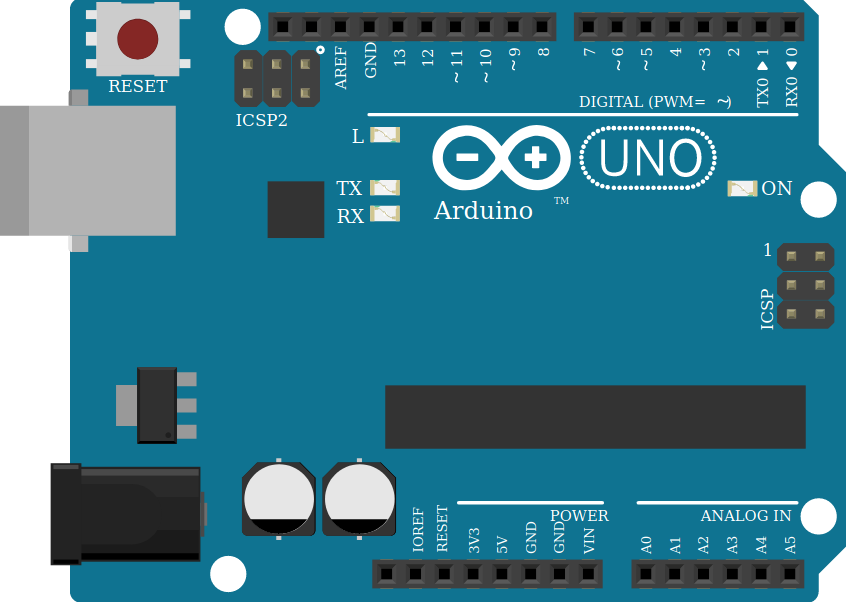

Nah, di board Arduino Uno terdapat berbagai macam pin yang bisa digunakan. Ada pin digital, power, dan analog in.

#### Pin Digital
Pin ini letaknya ada di bagian atas (lihat gambar Arduino Uno di atas), fungsinya untuk mengendalikan modul elektronik yang sifatnya digital. Misalnya LED atau Strevo.

Khusus pin nomor 0 dan 1, pin-pin tersebut tidak dapat digunakan untuk `digitalWrite` dan `digitalRead` jika kita juga menggunakan komunikasi Serial. Apa itu digitalWrite, digitalRead, dan apa itu komunikasi Serial? Nanti dibahas dibagian pemrograman.

Sedangkan pin nomor 2 - 13 adalah pin yang dapat digunakan seperti biasa, meskipun menggunakan komunikasi Serial.

Ada juga pin GND, fungsinya untuk ground atau mengaliri listrik ke modul elektroniknya. Ada juga pin AREF yang fungsinya mereferensikan voltase tambahan dari luar Arduino.

#### Pin Power
Pin ini terletak ada di bagian kiri bawah (lihat gambar Arduino Uno di atas), fungsinya sebagai pemberi listrik ke modul elektronik.

- VIN: Sebagai listrik eksternal untuk board Arduinonya.
- GND: Pin ground untuk mengaliri listrik ke modul elektronik.
- 5V: Sama seperti GND, hanya saja tegangannya 5 Volt.
- 3V3: Sama seperti GND, hanya saja tegangannya 3,3 Volt.
- Reset: Pin yang digunakan untuk me-reset board Arduino (mematikan power lalu dinyalakan lagi).
- IOREF: Pin yang memiliki tengangan voltase sama seperti board.

#### Pin Analog In
Pin ini letaknya ada di bagian kanan bawah (lihat gambar Arduino Uno di atas), fungsinya untuk mengendalikan modul elektronik yang sifatnya analog. Misalnya analog joystick, atau sensor magnetik.

### Breadboard
Jika teman-teman perhatikan, pin yang disematkan di board Arduino terlalu sedikit. Pin digital hanya ada 14, pin analog hanya ada 6, dan power hanya ada 5. Untuk itulah ada yang namanya Breadboard. Penampakannya seperti ini:

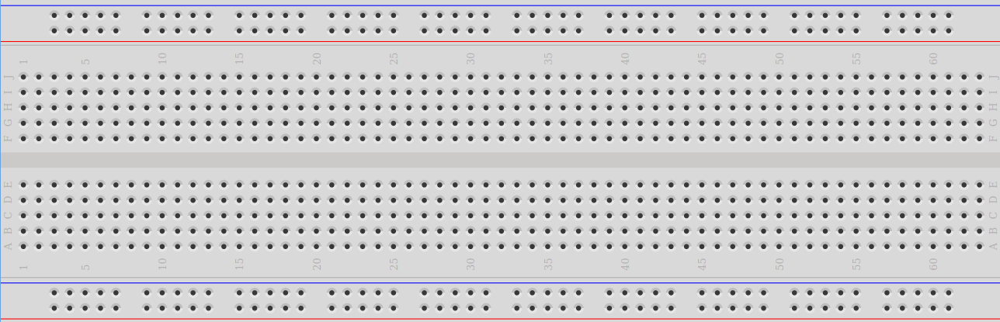

Singkatnya, Breadboard ini fungsinya untuk menambahkan pin baru untuk Arduino. Jika diperhatikan, di bagian atas dan bawahnya ada dua garis. Garis yang berwarna biru berarti minus (-) biasanya untuk ground sedangkan garis yang berwarna merah berarti plus (+) biasanya untuk power. Akan tetapi dalam praktiknya, tidak ada perbedaan secara fisik. Garis itu hanya sebagai pembantu saja. Jadi, jika dibolak balik, maka akan sama aja.

#### Cara kerja Breadboard

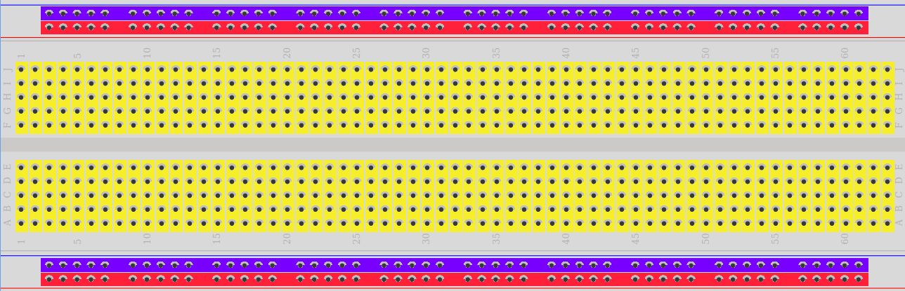
Cara kerjanya cukup sederhana, yang warna biru dan merah itu jika kita memasukkan pin dari arduino ke salah satu pin di breadboard, maka secara horizontal akan memiliki fungsi yang sama. Misalnya saya menghubungkan pin GND Arduino ke bagian atas yang warna biru, maka keseluruhan warna biru di bagian atas akan berfungsi sebagai GND.

Dan untuk yang warna kuning, itu berfungsinya secara vertikal. Misalnya kita memasangkan pin digital ke salah satu pin di breadboard yang warna kuning, maka keseluruhan warna kuning ke bawah (vertikal) akan menerima atau mengirim dengan pin digitalnya.

Untuk lebih jelasnya, bisa dilihat rangkaian sederhana berikut ini:

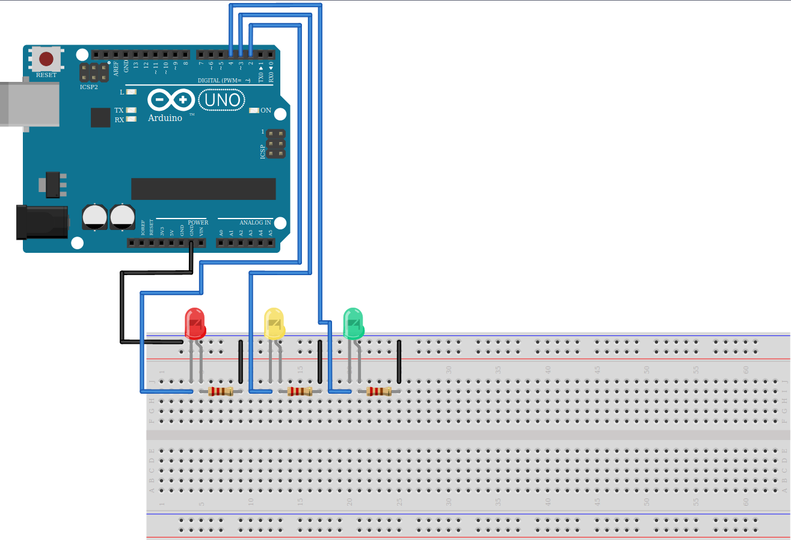

Rangkaian di atas, saya mencoba menghubungkan tiga LED ke Arduino dengan Breadboard. Di sana terlihat bahwa pin breadboard yang atas dihubungkan dengan GND di Arduino, maka seluruh pin breadboard yang atas secara horizontal akan memiliki GND (aliran listrik).

Begitu juga LEDnya, alih-alih langsung menghubungkan LED ke kabel dari pin Arduino, dengan Breadboard, kita bisa menghubungkan rangkaian dengan mudah dan rapih. Sehingga, kita tidak perlu menghubungkan GND langsung ke Arduinonya, cukup ke bagian breadboard yang dialiri GND.

Semoga teman-teman paham nih, karena memang harus praktik supaya lebih jelas lagi hehe.

### Arduino IDE
Arduino IDE (_Integrated Development Environment_) adalah perangkat lunak yang digunakan untuk memprogram masukan / inputan di Arduino, sehingga Arduinonya bisa digunakan. Arduino IDE ini tersedia untuk berbagai sistem operasi komputer.

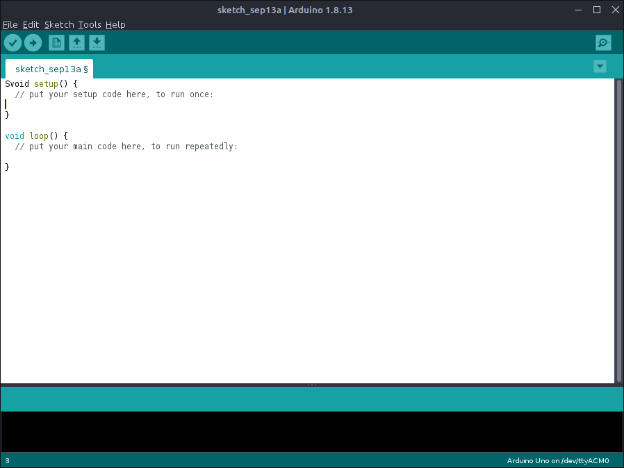

Untuk mengunduh Arduino UNO, ada dua cara cara:
- Langsung dari situs resminya (Windows, MacOS, Linux): https://www.arduino.cc/en/Main/Software
- Windows 10: Microsoft Store

### Menghubungkan Arduino ke Komputer
Untuk menghubungkan Arduino ke komputer/PC atau Laptop, caranya cukup hubungkan kabel Arduino (biasanya sudah _include_ dalam pembelian Arduino) ke USB di komputernya.

Setelah itu, buka kembali Arduino IDE dan pastikan bahwa bagian Serial Port-nya sudah terbaca. Karena jika belum, maka komputer teman-teman belum berhasil memasang drivernya. Biasanya sih driver sudah terpasang otomatis saat memasang Arduino IDE.

Contoh jika sudah terbaca, maka akan ada nama portnya:

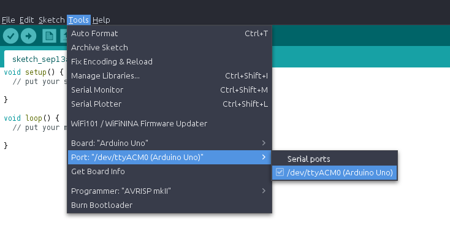

Lalu, pastikan juga bagian `Board`, dipilih nama Board dari Arduino. Karena saya pakai Arduino Uno, maka saya milih `Arduino Uno`:

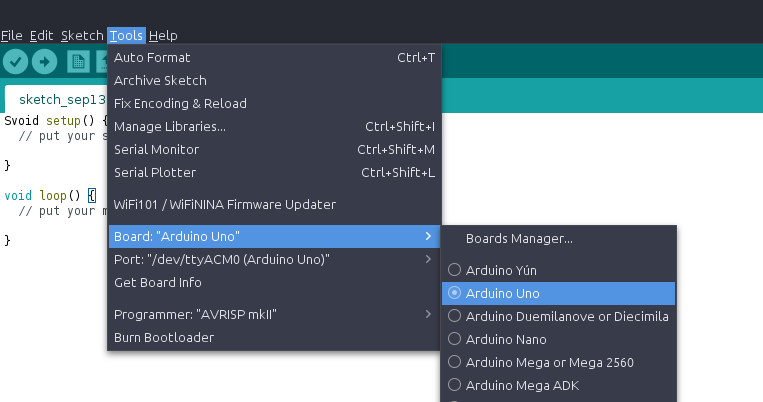

Untuk mengirimkan kode yang ditulis ke perangkat keras Arduino, kita harus memverifikasi dulu kodenya untuk memastikan tidak ada yang error. Jika sudah tidak ada error, maka kita bisa kirim ke Arduino dengan tombol "_Upload_".

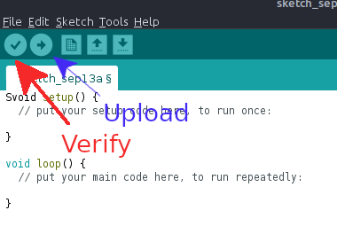

### Membuat Skema Rangkaian
Ini opsional saja, tapi biasanya saya merancang skemanya dulu sebelum dirangkai ke Arduino fisiknya, untuk mempermudah hidup saja. Perangkat lunak yang akan digunakan untuk membuat skema rangkaian ini namanya adalah `Fritzing`. Perangkat lunak ini sebenarnya sumber terbuka dan gratis, namun pada versi ke 0.9.4 sayangnya kita harus membayar untuk dapat menggunakan aplikasi ini.

Namun tenang saja, karena versi sebelumnya, yaitu 0.9.3b, masih dapat diunduh secara gratis.

- Windows: https://www.npackd.org/p/fritzing64/0.9.3.2
- Linux: Silakan unduh melalui Software Center dari distribusi masing-masing.
- MacOS: Saya belum nemu :(

Atau bisa cari-cari di reponya: https://github.com/fritzing/fritzing-app

Tampilan dari Fritzing seperti ini:

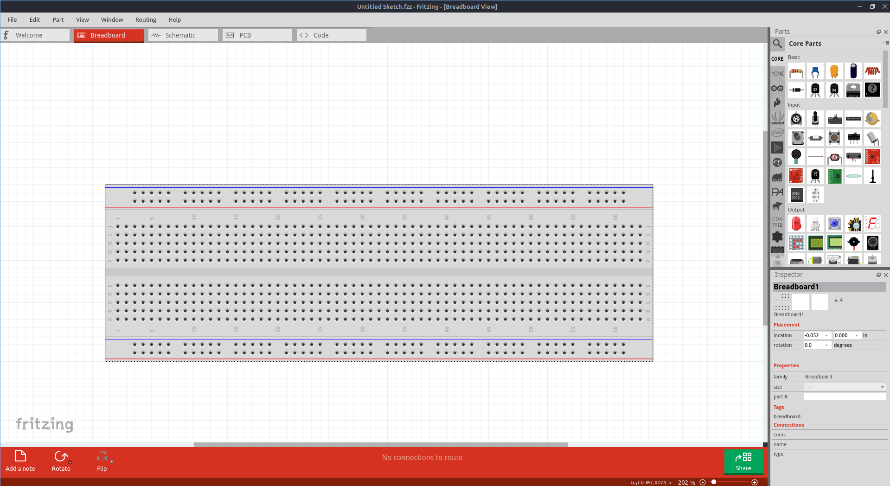

Bisa dilihat di sana ada Breadboard, lalu ada berbagai macam _parts_ elektronik yang siap digunakan. Intinya seperti merangkai sungguhan, karena ada penjelasan juga tiap pinnya, maka proses merangkainya jadi tidak terlalu membingungkan.

## Pemrograman Dasar Arduino
Bahasa pemrograman yang digunakan oleh Arduino adalah bahasa pemrograman cpp dengan beberapa tambahan fungsi khusus, yang akan dibahas nanti. Di Arduino, _sketch_ (sebutan untuk file kode Arduino) akan dikompilasi ke bahasa mesin, sehingga perangkat keras Arduino dapat bekerja sesuai dengan kode yang ditulis.

Perlu diingat, bahwa pemrograman Arduino ini **_case sensitive_** yang artinya huruf besar dan huruf kecil bisa dibaca berbeda. Misal kamu ngetik `pinmode` pasti akan salah, karena yang benar `pinMode`.

Secara bawaan, pemrograman Arduino mempunyai dua _function_ atau fungsi, yaitu `setup()`, dan `loop()`. Kedua fungsi ini harus ada, supaya Arduinonya dapat digunakan tentunya.

```cpp
setup() {
    
}

loop() {

}
```

#### setup()
Fungsi ini adalah tempat di mana kita men-setting Arduinonya. Setiap Arduino harus memiliki fungsi ini, karena fungsi ini yang akan memberi tahu Arduino apa saja yang akan dipakai saat dinyalakan.

Berikut adalah beberapa hal yang bisa diketik di sini:
- Pin yang akan digunakan.
- Mengkoneksikan ke internet.
- Logika kode.
- Inisialisasi variabel dan class.
- Kalibrasi sensor.

#### loop()
Seperti namanya, fungsi ini digunakan untuk melakukan hal yang berulang-ulang. Tulis kode logika utama teman-teman di sini. Misalnya, jika teman-teman mau membuat program LED blink, maka kodenya ditulis di sini.

### Library
Ada kalanya kita menggunakan komponen atau modul baru, maka kita membutuhkan library untuk bisa menggunakan modul itu. Misalnya, jika teman-teman mau mengkoneksikan Arduino secara wireless dengan WiFi, maka membutuhkan modul yang bernama `ESP8266`, nah untuk bisa menggunakan modul tersebut maka butuh library.

Teman-teman bisa mengunduh library dari Arduino IDEnya langsung, yaitu di menu **Tools -> Manage Libraries..**

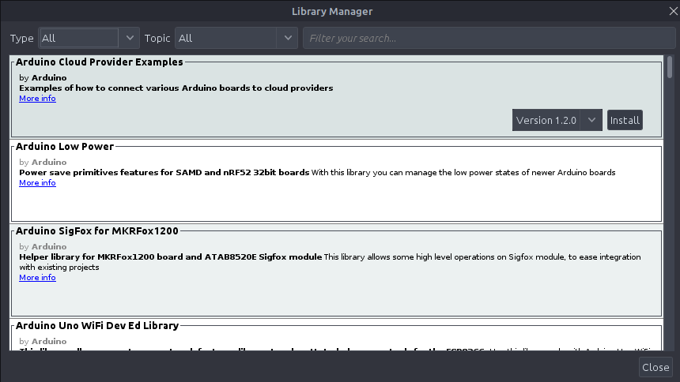

#### Import Library
Unduh library saja belum cukup, teman-teman juga harus meng-import librarynya. Library biasanya menggunakan ekstensi `.h` saat diimport. Nama library saat import terkadang suka berbeda, untuk itu teman-teman harus klik url `More info`. Silakan lihat lagi screenshot library di atas.

Contoh kode saat import seperti ini:

```cpp
#include <Library.h>
#include <Library_lain.h>

setup() {
    
}

loop() {

}
```

### Komentar
Dalam pemrograman kita bisa memberikan komentar pada kode kita, komentar ini tidak akan dijalankan oleh _compiler_ sehingga tidak merusak kodenya. Komentar ini biasanya digunakan untuk memberikan keterangan atau menonaktifkan kode.

Contoh:

```cpp
#include <Library.h>
#include <Library_lain.h>

setup() {
    // Ini komentar baris namanya.
    /*
     Ini komentar block.
     Bisa panjang gini komentarnya.

     Tapi nggak bakal dieksekusi sama kompiler kok.
    */
}

loop() {

}
```

### Variabel Dasar
Ada beberapa variabel dasar yang harus teman-teman ketahui nih, diantaranya:
- `HIGH`:  Berarti Arduino akan memberikan tegangan voltase hingga 2.0V atau 3.0V (tergantung GNDnya) ke pin tersebut. Intinya variabel ini akan memberikan aliran listrik yang tinggi hingga modul yang terhubung pada pin tersebut dapat menyala.
- `LOW`: Kebalikann dari HIGH, variabel ini akan membuat modul yang terhubung dengan pin tersebut memiliki tegangan voltase kurang 1.0V atau 1.5V, sehingga modul tidak menyala karena kurang listrik.
- `INPUT`: Untuk memberi tahu bahwa modul pada pin ini modenya akan menerima masukan atau input.
- `OUTPUT`: Untuk memberi tahu bahwa modul pada pin ini modenya akan mengeluarkan keluaran atau output.
- `LED_BUILTIN`: Ini adalah variabel yang mengacu pada LED yang sudah tertanam di Arduinonya. Sehingga jika teman-teman mau mencoba menyalakan LED namun tidak memiliki komponen LED, maka bisa memakai ini.

Untuk dasar-dasarnya itu saja, jika ingin lebih lengkap bisa dibaca di sini: https://www.arduino.cc/reference/en/

### Fungsi Dasar
Untuk mengendalikan Arduino, kita bisa menggunakan fungsi-fungsi berikut:

#### Komunikasi
#### `Serial`
Serial digunakan untuk menampilkan output dari kode ke Serial Monitor. Biasanya saya menggunakan Serial ini untuk melakukan Debugging jika kodenya nggak jalan haha.

Jadi, di Arduino IDE itu ada fitur yang namanya Serial Monitor, nah di sana akan ditampilkan apa yang dikeluarkan oleh Serial.

Contoh penggunaannya:

```cpp
setup () {
    // Kita harus begin dulu
    Serial.begin();
}

loop () {
    Serial.print("Halo, saya Rafi");
}
```

#### Digital I/O
#### `pinMode()`
Sebelum kita bisa menggunakan pin pada Arduino, kita harus memberi tahu Arduino dulu, bahwa pin ini akan menjadi Input atau Output. Caranya adalah dengan menggunakan pinMode(). Misalnya, saya ingin pin nomor 3 sebagai output dan pin 4 sebagai input, maka saya menulisnya seperti ini:

```cpp
setup() {
    pinMode(3, OUTPUT);
    pinMode(4, INPUT);
}

loop() {

}
```

#### `digitalRead()`
Untuk membaca pin digital yang spesifik. Fungsi ini digunakan untuk mengetahui apakah modul pada pin ini statusnya `HIGH` atau `LOW`. Oleh sebab itu, kembalian atau _return_ nya bisa antara HIGH atau LOW. Sebelumnya, kita sudah mengetahui pin-pin di Arduino, kan? Pin digital yang ada 14 itu, bisa kita gunakan di sini. Contohnya saya mau membaca pin nomor 4, maka saya bisa menulisnya begini:

```cpp
setup() {
    pinMode(3, OUTPUT);
    pinMode(4, INPUT);
}

loop() {
    digitalRead(4);
}
```

#### `digitalWrite()`
Kebalikannya dari digitalRead ini, fungsi digitalWrite() digunakan untuk membuat modul pada pin menyala atau tidak. Cara penulisannya `digitalWrite(pin, isi)`. Contohya saya mau menyalakan pin nomor 3, maka:

```cpp
setup() {
    pinMode(3, OUTPUT);
    pinMode(4, INPUT);
}

loop() {
    digitalWrite(3, HIGH);
}
```

#### Times
#### `delay()`
Seperti namanya, fungsi ini digunakan untuk membuat jeda waktu untuk melanjutkan ke kode di bawahnya. Format waktu yang digunakan adalah _millisecond_. Contoh penggunaannya:

```cpp
delay(1000); // Delay 1 detik.
```

#### `millis()`
Digunakan untuk mengambil waktu saat ini, format waktunya masih sama yaitu _millisecond_. Contoh penggunannya:

```cpp
Serial.print(millis()); // Akan membuat output waktu saat ini di Serial.
```

Karena fungsi dan kode-kode khusus ada banyak sekali, teman-teman bisa membacanya di sini https://www.arduino.cc/reference/en/

Arduino sudah merangkum semuanya di sana.

### Program Pertama
Untuk program pertama ini, kita akan coba menyalakan `LED_BUILTIN` atau LED yang sudah tertanam di Arduino.

```cpp
setup() {
    // Deklarasi dulu bahwa LED_BUILTIN mau dipakai sebagai output.
    pinMode(LED_BUILTIN, OUTPUT);
}

loop() {
    // Nyalakan LED_BUILTIN
    digitalWrite(LED_BUILTIN, HIGH);
}
```

Klik tombol `verify` pada Arduino IDE untuk memastikan kodenya benar, jika benar tidak ada error lalu klik tombol `Upload`. Dan lihat hasilnya.

### Blink LED BUILTIN
```cpp
setup() {
    // Deklarasi dulu bahwa LED_BUILTIN mau dipakai sebagai output.
    pinMode(LED_BUILTIN, OUTPUT);
}

loop() {
    // Nyalakan LED_BUILTIN
    digitalWrite(LED_BUILTIN, HIGH);
    // Kasih delay
    delay(1000); // Delay 1 detik
    // Lalu matikan LEDnya
    digitalWrite(LED_BUILTIN, LOW);
    // Kasih delay lagi
    delay(1000);
}
```

Klik tombol `verify` pada Arduino IDE untuk memastikan kodenya benar, jika benar tidak ada error lalu klik tombol `Upload`. Dan lihat hasilnya.

### Blink LED dengan Breadboard
Jika teman-teman sudah berhasil menjalankan LED_BUILTINnya, sekarang saatnya praktik dengan Breadboard. Ada beberapa hal yang perlu disiapkan tentunya, namun jika teman-teman memiliki `Arduino Starter Kit`, biasanya semuanya sudah ada dipaket penjualannya. Berikut adalah komponen yang harus disiapkan:

0. Arduino Uno.
1. Kabel Jumper Male.
2. LED.
3. Breadboard.
4. Resistor 220 Ω

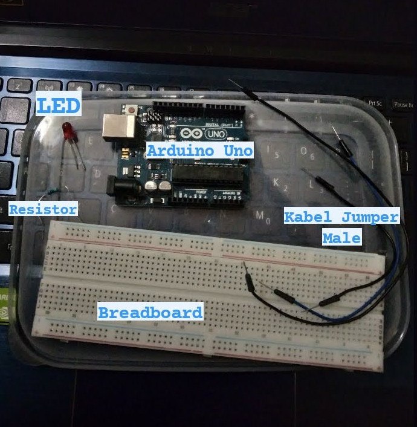

Kita membutuhkan resistor ini untuk membatasi aliran listrik ke LEDnya, karena kalo kelebihan listrik bisa rusak nanti.

Okey, selanjutnya adalah merangkai. Buat rangkaian seperti ini:

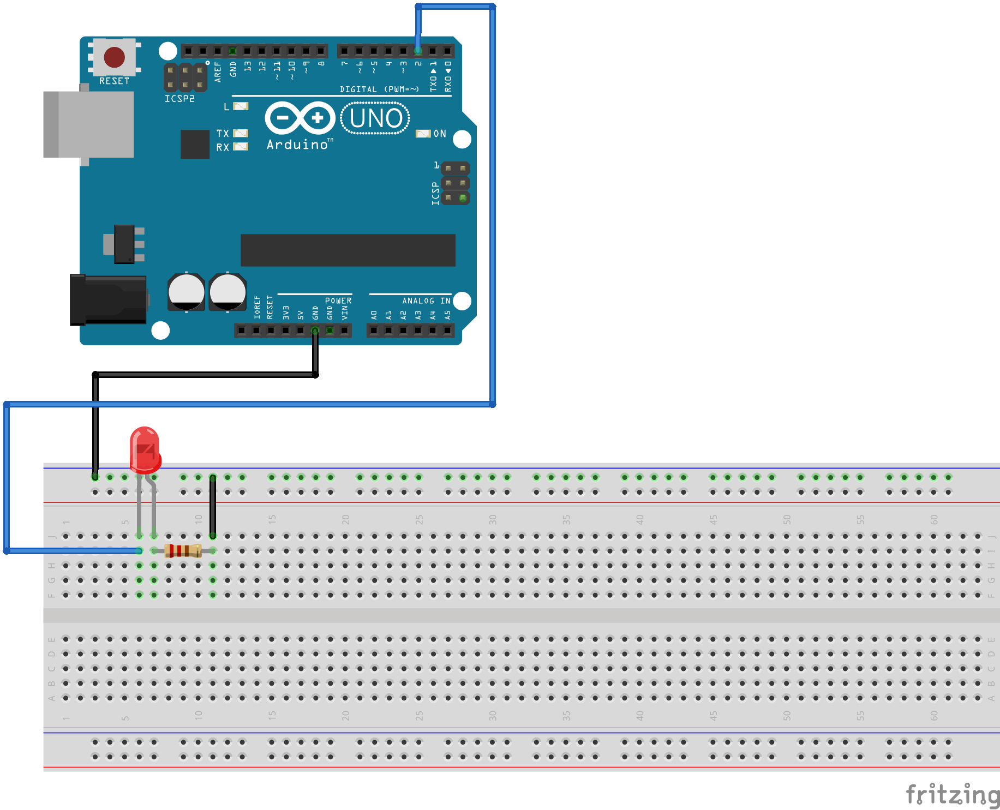

Berdasarkan rangkaian di atas, saya mencoba menghubungkan LED dengan pin nomor dua, lalu saya juga menghubungkan GND ke Breadboardnya. Oh iya, biasanya kalau dalam rangkaian gini pemilihan warna pada kabel dapat membantu kita. Biasanya untuk yang berhubungan dengan ground kabelnya warna hitam, sedangkan yang berhubungan denga digital pinnya warna biru. Meskipun dalam praktiknya bisa bebas, tapi ya untuk mempermudah aja sih.

Jika teman-teman perhatikan di LED nya, terdapat perbedaan panjang kawatnya, kan? Nah, kawat yang panjang itu `katoda`, bagian katoda ini yang dihubungkan dengan pin, sedangkan kawat yang pendek namanya `anoda`, bagian anoda dihubungkan ke listrik / ground.

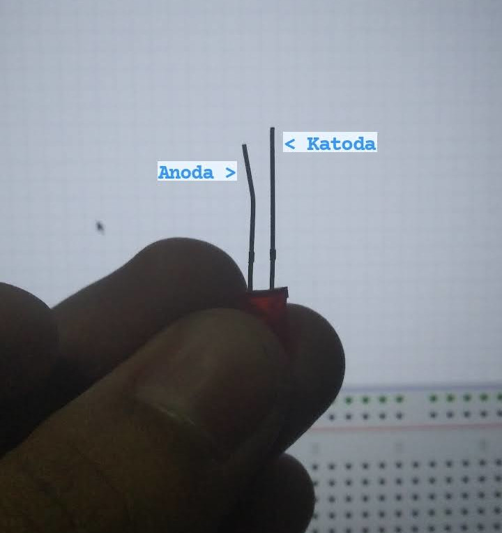

Jangan sampai terbalik ya. Untuk resistor meskipun ada kawatnya juga, akan tetapi tidak masalah jika dibalik, karena sama aja.

Rangkaian versi fisiknya seperti ini:

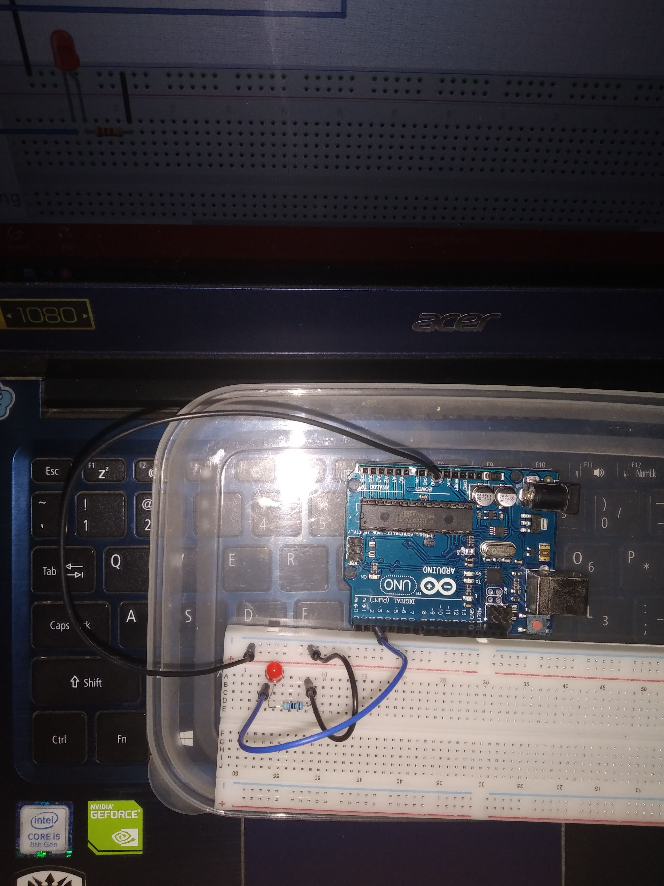

Jika sudah dirangkai, selanjutnya adalah memprogramnya. Sama aja sih seperti memprogram LED_BUILTIN sebelumnya.

```cpp
void setup() {
    // Deklarasi LEDnya di pin 2 mau dipakai output
    pinMode(2, OUTPUT);
}

void loop() {
    // Logika blinknya

    // Nyalakan LED
    digitalWrite(2, HIGH);
    delay(1000); // Delay 1 detik

    // Matikan LED
    digitalWrite(2, LOW);
    delay(1000); // Delay 1 detik
}
```

Klik tombol `verify` pada Arduino IDE untuk memastikan kodenya benar, jika benar tidak ada error lalu klik tombol `Upload`. Dan lihat hasilnya.


## Penutup
Selamat, teman-teman sudah berkenalan dengan Arduino. Sudah tau dasar-dasarnya, dan memprogram sederhana. Silakan buka url referensi di bawah ini untuk memperdalam lagi, karena artikel ini hanya rangkuman.

Oh iya, saya juga suka mempublish source code belajar Arduino saya di Github: https://github.com/rafipriatna/Microcontroller

#### Referensi
0. https://www.techopedia.com/definition/3641/microcontroller
1. https://www.arduino.cc/en/reference/board
2. https://www.arduino.cc/en/tutorial/AnalogInput
3. https://arduino.stackexchange.com/questions/132/what-are-the-aref-ioref-and-the-unlabeled-pin-next-to-ioref-on-the-uno-r3
4. https://www.sciencebuddies.org/science-fair-projects/references/how-to-use-a-breadboard
5. https://www.circuito.io/blog/arduino-code/
6. https://www.arduino.cc/reference/en/