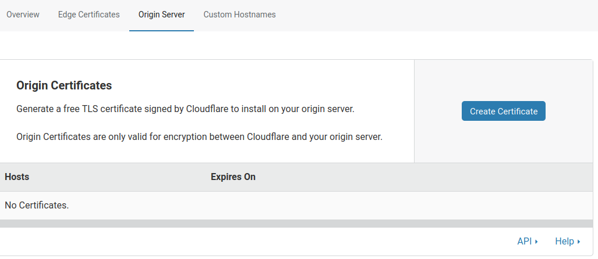
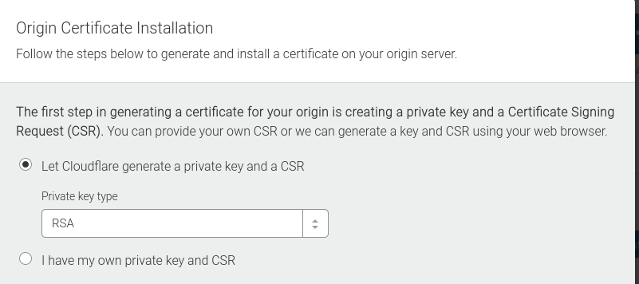
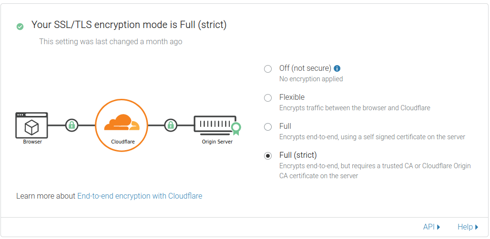

Setelah berhasil memasang LEMP Stack di GNU/Linux, tutorial [cara pasang LEMP Stack di CentOS 8 bisa dibaca di sini](/cara-install-lemp-stack-centos-8). Sekarang, saatnya kita memasang SSL di NGINX tersebut. Sebelumnya, apa itu SSL? Dan kenapa kita harus pasang SSL?

## SSL Cloudflare
SSL merupakan singkatan dari _Secure Socket Layer_, yang mana fungsinya untuk mengenkripsi protokol yang dari browser ke website yang dituju. Singkatnya, website yang sudah menggunakan SSL maka website tersebut akan menggunakan **HTTPS**, contohnya blog saya, https://rafipriatna.id

Jadi, alasan kita untuk memasang SSL adalah supaya pengunjung jadi lebih aman saat menjelajah di website kita. Sebenarnya, sudah tersedia SSL gratis yang bisa dipasang di NGINX, yaitu Let's Encrypt.

Tetapi, pada artikel kali ini, saya akan mencoba memasang SSL dari Cloudflare (yang masih gratis), selain supaya website memiliki SSL, alasan lain adalah supaya website saya memiliki CDN. Karena Cloudflare menyediakan CDN yang gratis juga. Jadi, sekali pasang SSL juga bisa mendapatkan CDN.

> CDN adalah singkatan dari _Content Delivery Network_, yang fungsinya untuk mencerminkan atau 'memantulkan' file-file statis dari website kita seperti HTML, CSS, Gambar, Vidio, dsb ke server yang tersebar di seluruh dunia. Sehingga, jika ada pengunjung yang lokasinya jauh dari website kita, maka pengunjung tersebut akan mengakses website kita menjadi lebih cepat karena menggunakan server CDN terdekat.

Oke, itu tadi penjelasan singkat tentang SSL Cloudflare. Nah, sekarang gimana cara pasangnya di NGINX?

## Pasang SSL Cloudflare di NGINX
Saya asumsikan kamu sudah menghubungkan servernya dengan Cloudflare, jika belum, maka tinggal memasukkan IP servernya saja ke DNS Cloudflare, isikan TYPEnya 'A' arahkan '@' dan 'www' ke alamat IP server.

Cara pasang SSL Cloudflare cukup mudah. 

1. Silakan login ke [Cloudflare.com](https://cloudflare.com)
2. Klik bagian "SSL/TLS".
3. Ke bagian "Origin Server".
4. Lalu klik "Create Certificate".

5. Pada bagian "Private Key", pilih "RSA".

6. Maka nanti akan ada ada key untuk public key dan private key. Silakan copy key tersebut ke tempat ssl disimpan, misalnya di `/etc/ssl/`.
7. Berarti copy public key ke `/etc/ssl/certs/domain.com.pem` dan copy private keynya ke `/etc/ssl/private/domain.com.key`.
8. Sekarang edit konfigurasi NGINXnya untuk memasukkan sertifikat yang sudah dicopy tadi.
9. Kasus kali ini, file konfigurasi situs saya ada di `/etc/nginx/sites-available/domain.com`, maka saya mengedit file tersebut. Perlu diperhatikan, file konfigurasi saya dengan kamu mungkin berbeda, jadi saya akan memperlihatkan file konfigurasi NGINX saya sebelum dan sesudah diedit.

Sebelum diedit :
```
server {
    listen 80;

    server_name domain.com www.domain.com;
    root /var/www/domain.com;

    index index.html index.htm index.php;

    location / {
        try_files $uri $uri/ /index.php?q=$uri&$args;
    }

    location ~ \.php$ {
        include snippets/fastcgi-php.conf;
        fastcgi_pass unix:/var/run/php/php7.4-fpm.sock;
     }

    location ~ /\.ht {
        deny all;
    }

}
```
Sesudah diedit :
```
server {
    listen 80;
    listen 443 ssl;

    ssl_certificate /etc/ssl/certs/domain.com.pem;
    ssl_certificate_key /etc/ssl/private/domain.com.key;

    server_name domain.com www.domain.com;
    root /var/www/domain.com;

    index index.html index.htm index.php;

    location / {
        try_files $uri $uri/ /index.php?q=$uri&$args;
    }

    location ~ \.php$ {
        include snippets/fastcgi-php.conf;
        fastcgi_pass unix:/var/run/php/php7.4-fpm.sock;
     }

    location ~ /\.ht {
        deny all;
    }

}
```
10. Setelah itu simpan, dan jangan lupa jalankan perintah `nginx -t` untuk memastikan konfigurasinya sudah benar.
11. Jika sudah benar, maka tinggal restart NGINXnya. `sudo service nginx restart`.

Jangan lupa, edit mode SSL Encryptionnya ke "Full (Strict)". Ada di bagian Cloudflare > SSL/TLS > Overview.


Sampai sini, seharusnya websitenya sudah berjalan dengan SSL dari Cloudflare :)
