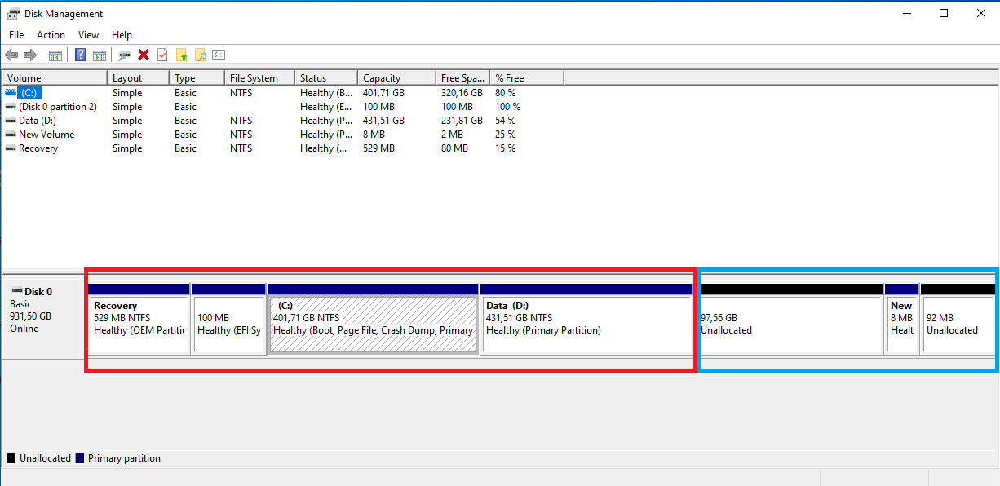

--- 
date: 2020-01-26T11:27:14+07:00
title: "Dual boot Windows 10 dan Ubuntu dengan Intel Optane"
slug: "dual-boot-windows-dan-ubuntu-dengan-intel-optane"
tags: [
    "linux",
    "windows-10",
    "dual boot"
]
description: "Cara dual boot windows 10 dan ubuntu dengan Intel Optane"
---
Laptop saya menggunakan Intel Optane sebagai media untuk akselerasi HDD saya. Dengan Intel Optane, HDD saya berubah menjadi SSHD. Namun sayangnya, Intel Optane hanya bekerja untuk Windows 10 dan ditambah lagi saya jadi tidak bisa melakukan dual boot dengan kondisi Intel Optane yang aktif alias saya harus menonaktifkan Intel Optane supaya bisa dual boot.

Sekarang tidak perlu khawatir, karena faktanya kita masih bisa dual boot Windows 10 + Ubuntu (atau distribusi linux lainnya) serta masih bisa menggunakan Intel Optane untuk mengakselerasi Windows 10. Yap benar sekali, Intel Optane hanya bisa digunakan untuk sistem operasi Windows 10 saja. Kalo dipikir lagi, itu masih lebih baik daripada Intel Optanenya tidak dapat digunakan, kan?

Sebelum memulai, saya asumsikan kamu sudah memiliki bootable distribusi linux di Flahsidisk, kamu sudah paham bagaimana cara mempartisi HDD di Windows 10, dan kamu sudah paham bagaimana cara masuk ke BIOS.

### Partisi
Pertama-tama siapkan dulu partisinya, silakan buka Disk Management di Windows 10. Lalu buat partisi dengan pengaturan seperti ini :
[Recovery] [Boot] [Windows 10] [Partisi untuk Linux] [Partisi pembatas] [Partisi kosong]

Kurang paham? Silakan lihat screenshot di bawah ini :

Kolom merah merupakan partisi yang ada di Windows, sedangkan kolom biru merupakan partisi yang baru dibuat. Dengan `97.58GB` adalah partisi untuk distribusi linux, `8MB` adalah partisi untuk pemisah, dan `92MB` adalah partisi kosong supaya bisa menggunakan Intel Optane untuk Windows 10 nanti.

### Nonaktifkan Intel Optane
Setelah berhasil membuat partisi, selanjutnya adalah menonaktifkan atau mendisable Intel Optanenya. Silakan buka aplikasi Intel Optane Memory, lalu pilih menu `Setup` dan klik `disable`.


Setelah berhasil menonaktifkan Intel Optane, silakan direstart.

### Pengaturan BIOS
Setelah selesai restart, silakan matikan kembali komputer / laptopnya, lalu masuk ke menu BIOS.
Di BIOS ada beberapa fungsi yang harus diubah, yaitu : Secure boot harus dimatikan, dan SATA MODE RST diganti ke HCI.

SATA Mode AHCI :

Secure Boot :


### Install Ubuntu
Setelah selesai melakukan pengaturan BIOS, sekarang waktunya install Ubuntu atau distribusi linux lainnya. Silakan boot ke Flashdisk Bootable Ubuntunya.
Lalu, lakukan installasi seperti biasa.

Saya tidak akan menjelaskan cara menginstall distribusi linux di sini, silakan cari tutorial di Internet.

### Setelah sukses install Ubuntu
Setelah sukses install Ubuntu, silakan reboot dan masuk lagi ke BIOS untuk mengganti SATA Mode ke RST lagi, dan perbaiki boot priority ordernya, letakkan Windows Boot Manager ke paling atas.

SATA Mode RST :

Boot Priority Order :

Setelah itu silakan simpan dan restart komputernya. Maka akan secara otomatis masuk ke Windows 10.

### Aktifkan Intel Optane
Di Windows 10, silakan buka aplikasi Intel Optane, dan aktifkan kembali Intel Optanenya.

Setelah berhasil, lalu restart.
Dan Intel Optane sukses diaktifkan!


Bagaimana cara masuk ke Ubuntunya? Berhubung kita menyeting Windows sebagai boot utama, sehingga kita tidak akan masuk ke GRUB nya Ubuntu. Nah, untuk masuk ke Ubuntu, kita tinggal masuk ke Boot Menu di BIOS, biasanya dengan menekan tombol `F12` atau `Esc` (tergantung manufakturnya) Lalu pilih `Ubuntu`


Jadi begitulah cara menggunakan Intel Optane untuk dual boot Windows 10 dan Ubuntu.

### Tambahan
Ada masalah perbedaan waktu jika kita dual boot Windows 10 dan Ubuntu, yaitu di Ubuntu waktu yang ditampilkan sesuai dengan semestinya, sedangkan di Windows 10 waktu yang ditampilkan berbeda beberapa jam. Untuk mengatasi ini, kita bisa mengubah pengaturan waktu di Ubuntu menjadi `local time`.
```bash
timedatectl set-local-rtc 1 --adjust-system-clock
```
Setelah itu, lakukan sync time di Windows 10. Klik `Sync now`.

Selesai, sekarang waktu antara Windows 10 dan Ubuntu sudah sesuai :)

###### Referensi
1. [How to dualboot Ubuntu with Intel Optane/SSD in Windows](https://www.youtube.com/watch?v=2uXgbF3P2F8)
2. [How to Fix Windows and Linux Showing Different Times When Dual Booting](https://www.howtogeek.com/323390/how-to-fix-windows-and-linux-showing-different-times-when-dual-booting/)