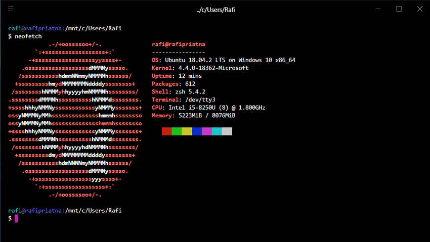

Saya pengguna Windows 10 (untuk saat ini) dan windows 10 saya sudah dipersiapkan supaya bisa digunakan untuk pengembangan web. Dan pada artikel ini, saya akan mengajak kalian bagaimana saya mempersiapkan Windows 10 saya untuk pengembangan web :D

## Pasang GNU / Linux di Windows
Karena saya terbiasa menggunakan terminal di distribusi linux, maka saya memasang linux di windows. Windows 10 mempunyai fitur `Windows Subsystem for Linux` di mana fitur ini berguna supaya kita bisa menggunakan perintah bash linux di windows.

Pertama-tama aktifkan dulu WSL di windows, caranya buka Powershell sebagai Administrator. Lalu jalankan perintah berikut 

``` 
Enable-WindowsOptionalFeature -Online -FeatureName Microsoft-Windows-Subsystem-Linux
```
Setelah itu, ketik 'Y' maka komputernya akan restart otomatis dan siap dipasang distribusi linux.

Jika komputernya sudah nyala, sekarang saatnya memasang distribusi linux favorit melalui Microsoft Store. Di sini saya memilih Ubuntu.


Setelah dipasang, silakan buka Ubuntunya dan isikan username beserta password sesuai keinginan.

Saya juga memasang beberapa aplikasi yang sering saya gunakan di ubuntu

``` bash
sudo apt install nodejs
sudo apt install npm
```

Selain itu, saya juga mengganti shell `bash` dengan `zsh` disertai dengan `oh-my-zsh` supaya lebih cantik lagi tampilan terminalnya :D

``` bash
sudo apt install zsh
chsh -s /usr/bin/zsh
```

Untuk tutorial pemasangan oh-my-zsh bisa dibaca [di sini](https://github.com/robbyrussell/oh-my-zsh/).

## Terminal


Saya tidak suka dengan tampilan Command Prompt, Powershell, maupun aplikasi Ubuntunya. Jadi saya menggunakan `Hyper` sebagai terminal. Silakan download Hyper [di sini](https://hyper.is).
Untuk mengubah shell default menjadi Ubuntu, silakan klik 3 bar di pojok kiri atas > Edit > Preferences...
Lalu ubah `shell` dan `shellArgs` menjadi seperti ini :

```
shell: 'C:\\Windows\\System32\\wsl.exe',
shellArgs: [],
```
Simpan, dan muat ulang hypernya.

## Text Editor
Text editor favorit saya adalah Microsoft Visual Studio Code, karena simpel dan punya banyak plugin. Silakan download VSCode [di sini](https://code.visualstudio.com). Setelah dipasang, VSCode akan secara otomatis mendeteksi WSL dan akan merekomendasikan memasang plugin WSL di VSCode. Silakan pasang plugin tersebut supaya antara text editor dan linux subsystem dapat terintegrasi.
Jika VSCode tidak mendeteksi WSL, kita juga bisa memasang plugin `Remote-WSL` secara manual.

Ganti juga terminal di Visual Studio Code ke WSL. Caranya buka `settings.json` di VSCode lalu tambahkan ini :
```
"terminal.integrated.shell.windows": "C:\\Windows\\System32\\wsl.exe"
```
Jika kalian menggunakan zsh seperti saya, tambahkan ini :
```
 "terminal.integrated.shell.windows": "C:\\Windows\\System32\\wsl.exe",
    "terminal.integrated.shellArgs.windows": [
        "-c",
        "zsh"
    ],
```

## Penutup
Selama beberapa hari saya coba saya belum menemukan masalah. Hanya saja membuka ubuntu terasa lama, butuh waktu 1 hingga 3 detik supaya terminal ubuntu nya muncul. Mungkin upgrade ke SSD bisa menyelesaikan masalah ini (?). Jika ada pertanyaan, silakan komentar di artikel ini :D