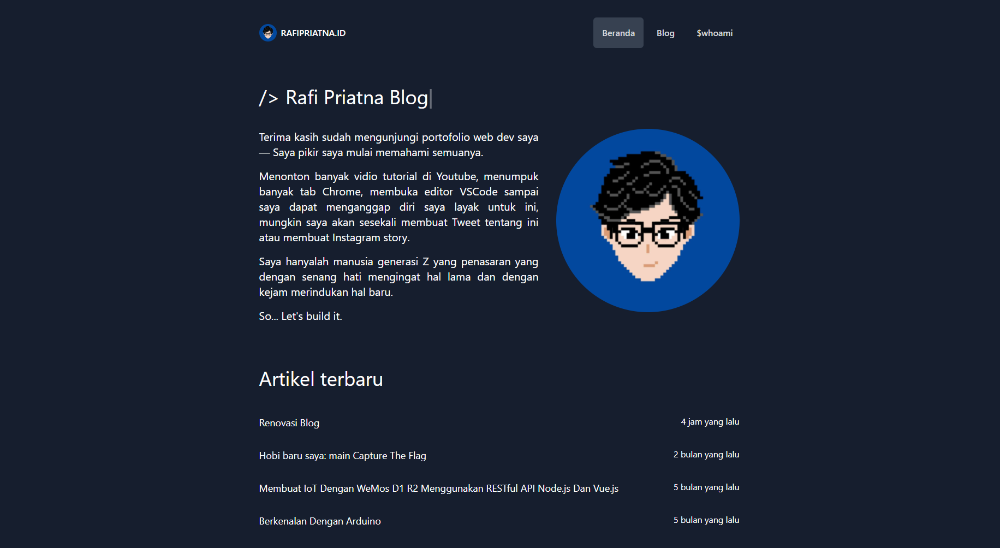

Tercatat sudah 17 hari saya menggunakan blog ini sejak tanggal 28 Januari 2021 saya memutuskan untuk mengganti engine blog saya yang sebelumnya menggunakan Hugo sekarang menggunakan Gatsby.js.

Alasannya cukup sederhana:
> Saya ingin menciptakan blog saya sendiri.

Dengan Gatsby.js saya merasakan bahwa saya memiliki banyak kebebasan di sini dan tentu saja saya banyak belajar selama membangun blog ini.

Meskipun, blog ini belum 100% selesai.

Gatsby.js sendiri sebenarnya bukan blog engine seperti Hugo. Di Hugo, kita sudah bisa langsung memposting sesuatu tinggal pilih tema saja. Sementara itu di Gatsby.js, kita harus membuatnya dari awal: Membuat sistem bloggingnya.

Ya meskipun ada Gatsby-starter untuk blog, namun saya rasa dengan menggunakan starter itu tidak membuat saya belajar.

Saya pertama kali mengenal Gatsby pada tahun 2019 akhir. Saat itu saya tidak sengaja melihat blog milik [Tania Rascia](http://taniarascia.com/) saat mencari tutorial pemrograman. Namun saya lupa artikelnya yang mana.

Saat itu saya melihat mbak Tania ini menyisipkan link Githubnya di blognya yang ternyata terdapat source code blognya. Sejak saat itu saya mencoba _clone_ repo tersebut dan saya jadikan blog saya.

Nah di sinilah masalahnya, saat itu saya belum paham sama sekali dengan Javascript. Pada akhirnya saya hanya bingung sendiri bagaimana cara mengubah blognya. Lalu pada tahun 2020 saya berpindah ke Hugo, artikelnya bisa dibaca [di sini](/migrasi-blog-ke-hugo/).

Masih di tahun yang sama, 2020, kebetulan sekali ada mata kuliah yang mengharuskan membuat projek. Lalu saya nekat membuat projek dengan Full Stack Javascript. Yaitu dengan Node.js dan vue.js.
Sejak saat itu, saya baru memahami bagaimana Javascript bekerja, terlebih vue.js yang menurut saya lebih mudah dipahami daripada React.

Dan tahun ini, berbekal apa yang sudah saya pelajari tahun lalu saya mencoba membuat blog saya sendiri, menggunakan Gatsby.js. Meskipun yang saya pelajari adalah vue.js akan tetapi saya merasa alurnya masih sama. Masih sama-sama menggunakan komponen, dan lain sebagainya.

Sebagai pelengkap, saya menggunakan TailwindCSS. Satu-satunya alasan saya menggunakan TailwindCSS adalah karena penasaran. Karena banyak orang di forum-forum yang menggunakan framework CSS ini.

Memang pada awalnya saya bingung saat menggunakan TailwindCSS. Namun pada akhirnya, saya mulai mengerti. Bagi saya, TailwindCSS ini memberikan kebebasan bagi pengguna. Kita bisa bikin komponen UI sendiri. Tidak seperti Bootstrap yang sudah "mempatenkan" desainnya. Ketika ingin membuat komponen _card_, maka desainnya sesuai dengan yang dibuat pengembang Bootstrap.

Sementara itu di TailwindCSS, kita bisa membuat komponen _card_ versi kita sendiri. Bagi saya ini adalah sebuah keuntungan. Jadi saya bisa membangun sebuah layout tanpa harus mengikuti desain pemilik framework.

Yaah, cukup sekian artikel renovasi blog ini. Oh iya, source code blog ini juga tersedia di [Github](https://github.com/rafipriatna/rafipriatna.id) saya.
