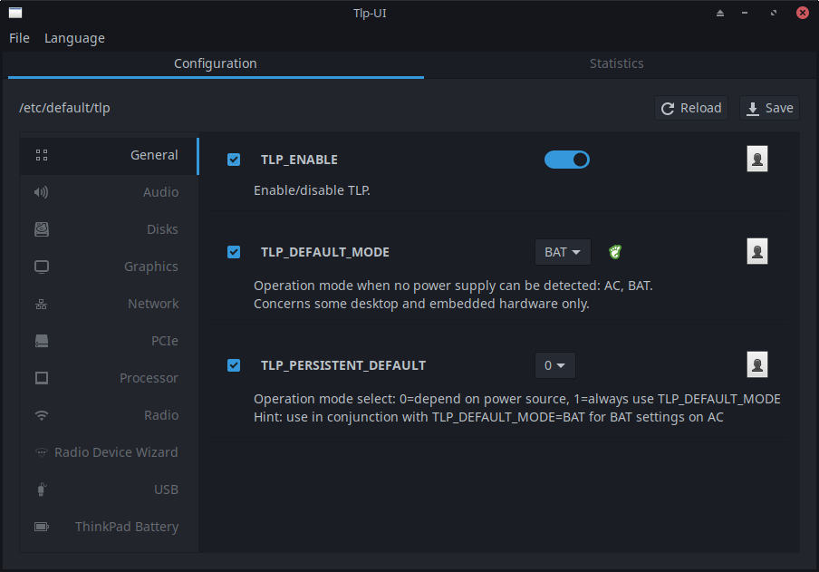
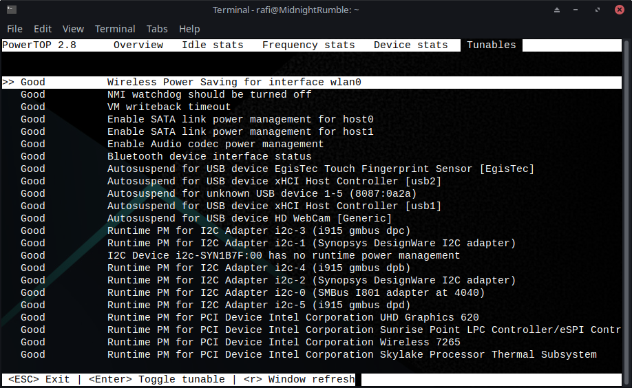
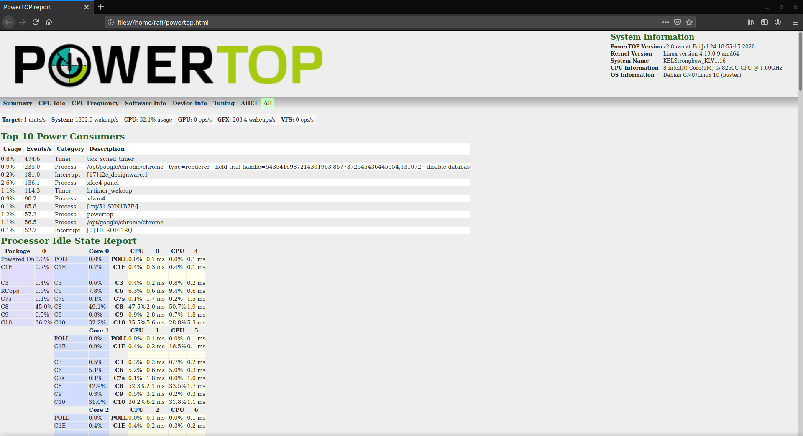
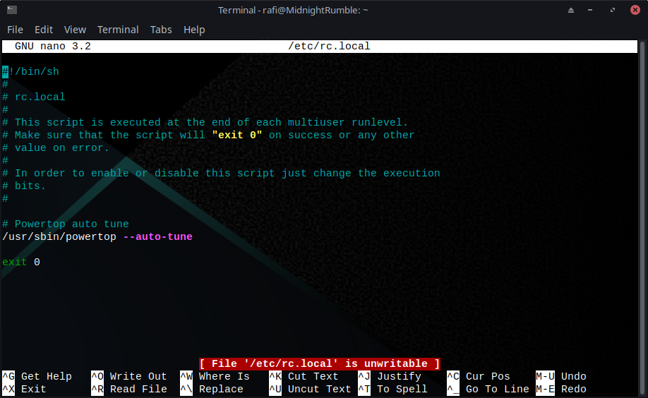

Seperti yang sudah saya tulis di artikel sebelumnya, saya baru saja bermigrasi ke MX Linux 19.2 (artikelnya bisa dibaca di [sini](/migrasi-ke-mx-linux)). Karena saya sering menggunakan laptop tanpa di _charger_, maka saya membutuhkan daya tahan baterai yang kuat. Pada artikel kali ini, saya akan menjabarkan hal-hal apa saja yang harus dilakukan supaya daya tahan baterai laptop menjadi lebih kuat. Meskipun saya pakai MX Linux, tetapi tenang saja, karena MX Linux merupakan turunan dari Debian, begitu juga Ubuntu yang turunan dari Debian. Jadi seharusnya, cara yang dijabarkan di sini dapat dipraktikkan pada kedua distribusi linux tersebut.

## Pasang TLP
TLP adalah salah satu _power management_ di linux yang tersedia secara gratis dan bersumber terbuka tentunya. Berbeda dengan _power management_ lainnya, TLP menawarkan fitur-fitur yang lebih lengkap yang berguna untuk mengoptimasi konsumsi baterai.

Di MX Linux, secara bawaan sudah terpasang TLP. Untuk mengecek apakah sudah terpasang TLP atau belum, bisa menjalankan perintah `sudo tlp-stat`.
Jika output dari perintah tersebut adalah _command not found_, maka dapat dipastikan TLP belum terpasang.

Karena TLP sudah tersedia di repositori Debian, maka untuk memasang TLP cukup dengan menjalankan perintah `sudo apt install tlp`. Untuk mejalankan TLP, cukup jalankan perintah `sudo tlp start`. Untuk melihat status, jalankan perintah `sudo tlp-stat`. Kita juga bisa mengatur TLPnya sesuai kebutuhan, untuk mempermudah kita bisa menggunakan TLPUI.

### TLPUI
TLPUI adalah GUI (_Graphical User Interface_) dari TLP. Dengan TLP ini, kita bisa mengatur-atur hal-hal yang ingin kita kustom sesuai dengan keinginan kita sendiri dan kebutuhan. Sayangnya, TLPUI tidak tersedia di repository, sehingga kita harus menggunakan cara manual. Cara manual ini cukup download source code, lalu tinggal dijalankan dengan python3.

#### Menjalankan TLPUI
Pertama-tama, kita harus download source code dari TLPUI terlebih dahulu.

```bash
git clone https://github.com/d4nj1/TLPUI
```

Setelah itu, kita bisa pindah ke directory TLPUI, dan jalankan tlpui.

```bash
cd TLPUI
python3 -m tlpui
```

Maka akan TLPUI akan berjalan, seperti ini :



Sampai sini, kamu bisa ubah-ubah settingan sesuai dengan keinginanmu.

## Pasang Powertop
TLP saja tidak cukup menurut saya, pasang juga powertop.

Jadi sebenarnya, apa itu powertop?

Powertop adala alat yang disediakan oleh Intel yang berguna untuk mengkatifkan berbagai mode untuk menghemat daya seperti menonaktifkan beberapa fungsi di perangkat keras yang tidak digunakan atau meng_idle_ perangkat-perangkat yang sedang tidak digunakan. Powertop juga bisa digunakan untuk memantau proses-proses yang sedang berjalan.

Nah, powertop ini sudah tersedia di repositori. Jadi untung memasang powertop, cukup jalankan perintah `sudo apt install powertop`.

Setelah dipasang, kita bisa menjalankan powertop dengan perintah `sudo powertop`, maka akan terlihat service-service apa saja yang sedang berjalan. Lalu di bagian tuneables, kita bisa melihat apa saja yang bisa dioptimalkan.



Pada screenshot di atas, terlihat semuanya adalah `Good` yang berarti sudah dioptimasi, jika masih `Bad` berarti belum dioptimasi.

Kamu bisa mengoptimasi satu-persatu dengan menekan tombol Enter, atau kamu bisa menggunakan fitur auto-tune milik powertop untuk mengoptimasi semuanya. Caranya menggunakan auto-tune adalah dengan menjalankan perintah `sudo powertop --auto-tune`.

Jika dirasa tampilan dari powertop dalam bentuk CLI kurang nyaman dan sulit untuk dilihat, maka kita bisa meminta powertop untuk membuat laporan dalam bentuk HTML. Caranya adalah dengan menjalankan perintah `sudo powertop --html`, powertop akan membuatkan laporan dalam bentuk HTML yang akan disimpan di direktori di mana kita menjalankan perintah tersebut, misalnya menjalankan di directory home, maka akan disimpan di home.



Screenshot di atas adalah contoh dari laporan powertop dalam bentuk HTML.

### Jalankan powertop --auto-tune saat boot
Optimasi powertop tidak disimpan secara permanen, jadi kita harus menjalankan perintah auto-tune jika ingin mengoptimasi powertop. Untuk menangani masalah ini, kita bisa memodifikasi file `/etc/rc.local` lalu sisipkan `/usr/sbin/powertop --auto-tune`.

Pastikan `#!/bin/sh -e` diubah menjadi `#!/bin/sh`, karena `-e` adalah perintah untuk menghentikan proses jika terjadi error, hal ini membuat optimasi menjadi tidak optimal.

File `/etc/rc.local` saya seperti ini :



Pastikan juga file `rc.local` sudah _executable_ ya.

## Penutup
Meningkatkan daya tahan baterai di Debian/Ubuntu memanglah membutuhkan beberapa alat seperti TLP dan Powertop. Di mana dengan menjalankan service dari TLP dan Powertop, daya tahan baterai jadi lebih lama. Artikel kali ini cukup sampai sini saja 😁.
