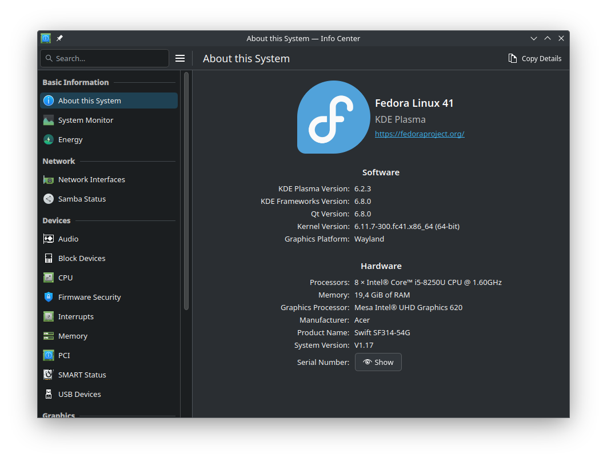
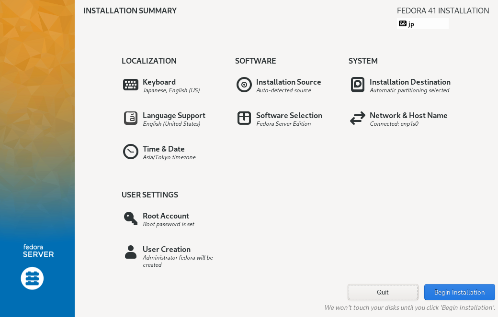
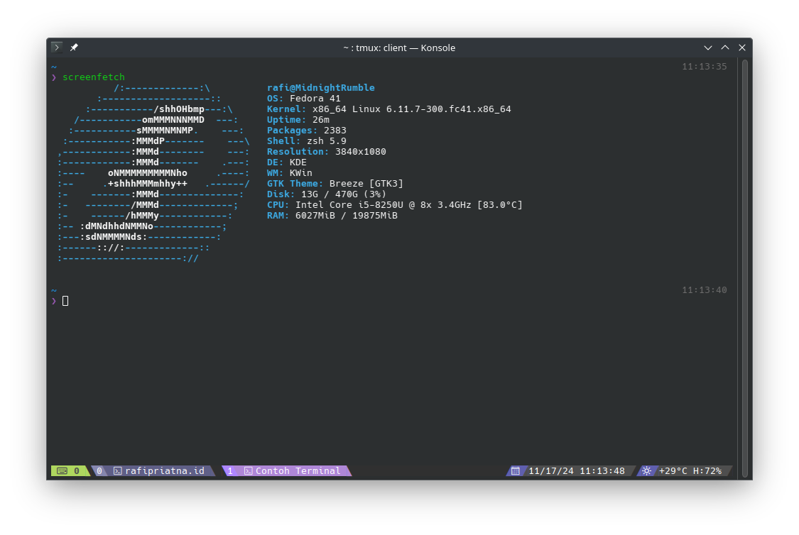

import Callout from "@/components/Callout.astro";

---

Akhir oktober kemarin, Fedora 41 akhirnya dirilis. Dengan ditenagai dengan Linux Kernal 6.11 dan juga menggunakan DNF5. Kaena saya penasaran, jadi saya ingin mencoba Fedora 41 _single boot_ di laptop saya, menggantikan Windows 11.

Hari ini, saya melakukan _fresh install_ Fedora 41 di laptop lama saya. Dan inilah tanggapan saya.

## Spesifikasi Laptop
Sebelum lanjut, saya ingin memberi tahu spesifikasi laptop apa yang saya gunakan.



Kurang lebih seperti yang ada pada _screenshot_ di atas dengan tambahan NVIDIA MX150.

## Desktop: KDE
_Yes_, saya menggunakan Fedora 41 KDE Spin. Kenapa?

Dulu, saya berpikir bahwa desain dari KDE itu unik, beda dari Desktop lain yang gitu-gitu aja, dan cenderung jadul. Di KDE, lebih terkesan modern dan banyak aplikasi bawaan yang membuat desain antar aplikasinya itu sinkron.

Jadi atas dasar itu, saya memiliki KDE Plasma. Dan setelah _menginstall_-nya, saya sangat takjub. Banyak sekali perubahaannya semenjak terakhir saya pakai KDE Plasma, mungkin sekitar tahun 2016 atau 2017 yang lalu.

Jujur aja, dulu saya ngga suka KDE Plasma, karena satu: suka ngebug. Yes, saya serius.

Dulu itu, sewaktu klik-klik panel sering _buggy_, geser-geser Window sering _lag_, apalagi _System Tray_-nya kada suka ga bisa dipencet. Mending pake GNOME atau XFCE deh sekalian, walaupun keliatan jadul, tapi bisa dikustomisasi biar bagus.

Tapi sekarang beda. Sekarang udah sangat-sangat lebih baik, udah mulus animasinya. Pokoknya tinggal pake aja, deh.

> Tepuk tangan untuk Komunitas KDE yang selalu bekerja keras membangun KDE Plasma. 👏🏻

Oh iya, ada satu fitur bawaan di KDE yang cukup berguna: "Kursor mouse membesar kalo digerakin cepet". Ini ngebantu banget kalo lupa "posisi kursor ada dimana". 😬


## Instalasi Mudah
_Asli, install Fedora 41 itu gampang banget!_

Aduh, saya ngga punya _screenshot_-nya lagi, tapi beneran gampang banget. Tinggal masukin nama akun pengguna (root ataupun lokal), konfigurasi _storage_-nya, _hostname_, udah tinggal mulai. Dan kita tinggal nunggu aja. Bahkan menurut saya, ini lebih mudah daripada install Ubuntu ataupun Windows.



<small>*Screenshot ngambil dari Google.</small>

## Driver NVIDIA Burik
Kalo ditanya,

> Hal apa yang paling nyebelin kalo pake GNU/Linux?

Pasti akan saya jawab "Install NVIDIA Driver".

Serius, bre. Burik seada-adanya.


> So, NVIDIA, F**K YOU! -Linus Torvalds

Secara bawaan, Fedora cuma ngasih _driver_ _free_ dan _open source_. Otomatis, kalo kita pake NVIDIA, maka akan dipasang Driver `nouveau`. Yang mana, _driver_ ini burik.

Masa pas pake _driver_ ini, Laptop jadi ga bisa ke mode _sleep_. Udah masuk mode _sleep_, eh ga bisa bangun lagi. Kan ngeselin, yak.

Jadi, saya coba _install driver_ NVIDIA dari _Official_-nya alias _Propertiary_.

Caranya, pertama-tama pasang dulu `kernel-devel` dan `akmods`.

```shell
sudo dnf install kernel kernel-devel akmods
```

Setelah itu, ke situs resmi NVIDIA, lalu cari _Driver_-nya sesuai yang ada di laptop. Misalnya MX150.

Kemudian, pergi ke TTY, misal dengan menekan kombinasi _keyboard_ <kbd>CTRL</kbd> + <kbd>ALT</kbd> + <kbd>F2</kbd> atau <kbd>F3</kbd>

Kenapa harus ke TTY? Karena proses installasi _driver_-nya bisa bikin bentrok X Server. Jadi, ya, begitulah.

Kalo udah masuk TTY, tinggal jalanin aja bash-nya. Seperti ini:

```shell
sudo sh NVIDIA-Linux-x86_64-550.127.05.run
```

<Callout>
**Opsi Lain:** Bisa juga _install driver_ lewat repo RPM Fusion.
</Callout>

## Ganti SHELL
Saya ganti SHELL ke ZSH. Kenapa? Menurut saya, zsh itu...

1. Mudah dikustomisasi.
2. Banyak `plugin` yang berguna, seperti `zsh-autocompletion`, `zsh-autosuggestions`, dan sebagainya.
3. Tampilannya bagus, temanya banyaaaakkk.

Ini terminal saya yang sudah pakai `zsh`, `oh-my-zsh` dan `tmux` xixixi.



## Penutup
Sekian _curcol_ saya soal awal mula pakai Fedora 41. Sejauh ini, sistem ini sangat mulus dan ngebut. Sangat suka sangat suka. 🫰🏻
