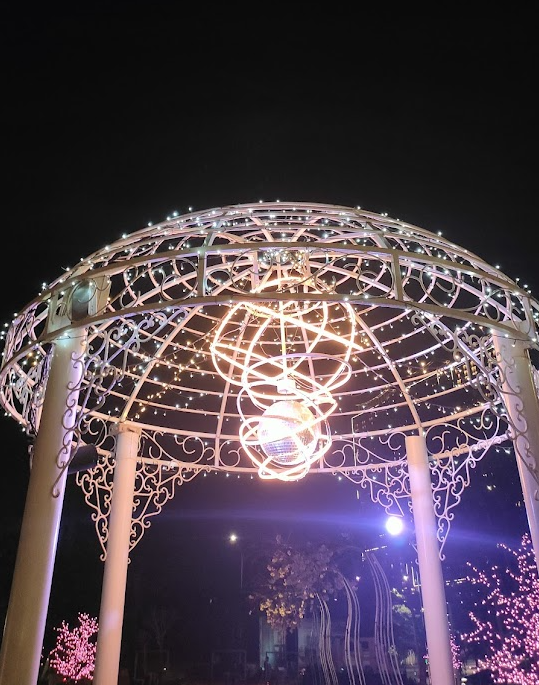

Selamat tahun baru semuanya! Saatnya untuk menulisan _review_ selama satu tahun. Ini adalah artikel pertama saya terkait _review_ tahunan saya. 😁

Saya memiliki harapan yang sangat tinggi buat tahun 2024! Awal tahun ini, saya ambil cuti di tempat saya bekerja. Lumayan liburan awal tahun hehe.

## Pekerjaan Baru
Sebenernya, ini jatuhnya ke dua tahun lalu sih. Lebih tepatnya akhir tahun 2022. Tapi gapapa, saya tulis di sini, karena baru terasanya pas memasuki tahun 2023.

Pada tanggal 01 Desember 2022, saya akhirnya mendapatkan pekerjaan baru dan pekerjaan pertama saya sebagai Junior Penetration Tester atau Cyber Security Engineer.

Selama setahun ini, saya selalu mendapatkan hal baru tiap kali mengerjakan projek _Security Assessment_. Awal tahun, baru masuk sebulan, saya sudah dihajar projek-projek Mobile Pentesting. Dari sana, saya berkenalan dengan banyak _tools_ baru, seperti: _frida_, _objection_, _JD GUI_, _JADX Gui_, dan sebagainya.

Selain itu, saya juga belajar lebih dalam tentang Web Pentesting, karena sewaktu saya kuliah dulu saya sering ikut CTF dan main di kategori Web Exploitation. Jadi, ya kurang lebih lebih apa yang saya lakukan saat kuliah masih nyambung di pekerjaan baru saya ini.

Awal-awal bekerja, ada banyak kesalahan yang saya lakukan wkwkw. Misalnya, saya izin karna wisuda (saya wisuda di bulan Desember 2022 btw), baru bilang ke Project Manager itu H-1 tanggal wisuda wkwkwk. Untung Project Manager saya ngizinin.

### Onsite Pertama
Saya juga masih deg-degan waktu dapet projek onsite, bulan Februari (dua bulan setelah saya bekerja), saya dapat dapat onsite ke Kuningan. Untung ditemenin oleh senior, jadi agak santai sedikit. Meskipun tetep deg-degan, karena saya belum pernah melakukan pekerjaan VAPT (Vulnerability Assessment & Penetration Testing).

VAPT pertama saya itu, saya belajar banyak hal lagi. Misalnya, setelah melakukan _scanning_ jaringan, jika ditemukan kerentanan, maka harus diverifikasi dulu apakah kerentanan tersebut valid atau tidak, menggunakan NMAP. Lalu, coba lakukan eksploit jika bisa, itu bisa berpengaruh ke skor kerentanannya. Misalnya jika ditemukan kerentanan _critical_ waktu dilakukan _scanning_, namun saat dilakukan percobaan _exploit_ tidak berhasil, bisa saja skor kerentanannya bisa turun dari _critical_ menjadi _high_ atau _medium_.

_Client_ pertama saya untuk onsite ini cukup _friendly_. Saya sering dikasih es kopi atau makan siang gratis. Merasa sangat bersyukur :)

## Film yang saya tonton
Beberapa film yang saya tonton baik itu di bioskop maupun di media layanan _streaming_.
|Judul Film|Production House|Rating Pribadi|🎬|
|---|---|---|---|
|Ant-Man and the Wasp: Quantumania|Marvel Studios|⭐9/10|XXI|
|Guardians of the Galaxy Vol. 3|Marvel Studios|⭐9/10|XXI|
|Transformers: Rise of the Beasts|Paramount Pictures|⭐8,5/10|XXI|
|Ketika Berhenti di Sini|Sinemaku Pictures|⭐8/10|XXI|
|172 Days|StarVision Plus|⭐8/10|XXI|
|The Marvels|Marvel Studios|⭐8/10|XXI|
|Aquaman and the Lost Kingdom|Warner Bros|⭐8/10|XXI|
|Loki Season 2|Marvel Studios|⭐8/10|Streaming Disney+|
|WandaVision|Marvel Studios|⭐7/10|Streaming Disney+|

## Tempat yang saya kunjungi
Selama 2023 ini, saya banyak mengunjungi tempat-tempat yang dulu sangat ingin saya kunjungi. Saya ngga bisa banyak membuat kata-kata, ini saya kasih foto-fotonya saja. 😁

## Tempat kerja baru (di rumah)
Kamar saya sudah direnovasi, sekarang saya punya meja kerja sendiri. Ya, meskpun masih sangat sederhana, tapi lumayan lah daripada lesehan wkwkw.

## Apa yang sudah saya pelajari
Beberapa topik _Cyber Security_ yang saya pelajari selama setetahun:
- Linux PrivEsc
- Windows PrivEsc
- Social Engineering
- Information Gathering
- Antivirus Evasion
- Active Directory

## Apa yang ingin saya raih (Resolusi 2024?)
Beberapa topik yang ingin saya raih atau setidaknya saya pelajari selama 2024:
- Menulis _report penertation_ dengan baik dan benar. Termasuk perjelas penulisan _Proof of Concept_ dan sebagainya.
- Perdalam topik PrivEsc.
- Lulus OSCP.
- Lebih bisa memanajemen waktu.
- Lebih banyak membaca.
- Perdalam _softskills_.
- Menulis banyak artikel di blog ini, terutama tentang _Cyber Security_.
- Membuat jurnal harian.

## Kesimpulan
Tahun ini saya banyak sekali belajar hal baru, terutama di dunia _Cyber Security_. Terlepas karena tuntutan pekerjaan, dari diri saya sendiri pun ada keinginan untuk mempelajari hal itu, jadi saya merasa _fun_. Saya juga mengujungi banyak tempat-tempat menarik, ya meskipun nggak jauh-jauh, tapi saya merasa senang, apalagi ditemenin sama _my lovely girlfie_. 🫰

Saya juga menonton banyak film-film seru, wah, tahun 2023 banyak film seru dari Marvel. Meskipun rada pusing nontonnya karena temanya _Multiverse_, tapi tetep seru menurutku.

Harapannya di tahun ini, 2024, saya dapat berkembang lebih baik daripada tahun kemarin. Saya bisa menguasai _softskills_, lebih bisa memanajemen waktu, lebih banyak membaca, dan lebih banyak topik _cybersec_ yang saya pelajari.

Sekian, terima gaji.
