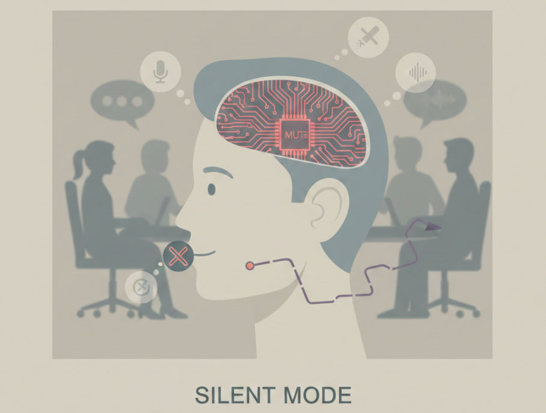

Tidak ada momen dramatis. Tidak ada keputusan besar yang diumumkan. Hanya penyesuaian kecil yang terjadi pelan-pelan. Sedikit menahan ide. Sedikit mengurangi opini. Sedikit berpikir dua kali sebelum berbicara.

Awalnya terlihat seperti kedewasaan. Adaptif. Profesional. Mampu membaca situasi. Namun sebenarnya, itu adalah mekanisme bertahan.

## Adaptasi yang Tidak Pernah Disadari

Ketika setiap gagasan terasa seperti potensi kesalahan, ketika setiap kalimat berisiko dipelintir, ketika setiap perbedaan sudut pandang berujung pada koreksi yang melelahkan, tubuh dan pikiran mulai mencari cara paling aman untuk selamat.

Caranya sederhana: kurangi suara.

Tugas tetap selesai. Target tetap tercapai. Secara kasat mata, semuanya stabil. Tidak ada konflik. Tidak ada perdebatan. Tidak ada kesalahpahaman baru.

Namun stabilitas yang lahir dari keheningan bukanlah kesehatan. Itu hanya sistem yang menurunkan performa agar tidak crash.

## Mengedit Diri Sendiri

Dalam Silent Mode, seseorang tetap hadir, tapi tidak sepenuhnya terlibat. Ia menyimpan ide-ide yang sebenarnya ingin disampaikan. Ia menulis ulang kalimat sebelum dikirim. Ia memilih frasa yang paling netral, paling aman, paling kecil kemungkinan untuk disalahartikan.

Tanpa disadari, proses sensor itu berpindah tangan. Jika sebelumnya kontrol datang dari luar, kini kontrol itu hidup di dalam kepala sendiri.

Ia mulai mengedit dirinya sebelum orang lain melakukannya.

Awalnya kamu yang mengoreksi.  
Lama-lama aku yang melakukannya sendiri.

Sebelum berbicara, aku sudah membayangkan wajahmu yang tidak setuju.  
Sebelum mengirim pesan, aku sudah menghapus kalimat yang terlalu jujur.  
Sebelum menyampaikan ide, aku sudah memutuskan bahwa mungkin itu tidak worth the risk.

Aku mulai menyensor diriku sendiri.

Lucunya, kamu tidak perlu lagi mengontrol seketat dulu. Tidak perlu lagi membedah setiap kalimat. Karena aku sudah mengeditnya sebelum sampai ke mejamu.

Efisien, bukan?

Kontrol terbaik memang bukan yang terlihat.  
Kontrol terbaik adalah ketika targetnya ikut menjaga kandangnya sendiri.

## Stabil, Tapi Tidak Sehat

Di titik ini, kontrol tidak lagi perlu terlihat jelas. Karena yang dikontrol sudah belajar mengontrol dirinya sendiri. Ia menyesuaikan warna, mengecilkan ambisi, meredam inisiatif. Bukan karena tidak mampu, tetapi karena terlalu lelah untuk terus merasa salah.

Ironisnya, dari luar semua terlihat baik-baik saja. Diskusi menjadi lebih cepat. Suasana lebih tenang. Tidak ada lagi gesekan kecil.

Namun yang hilang adalah sesuatu yang tidak tercatat di laporan kinerja: keberanian untuk berpikir keras dan berbeda.

## Jarak yang Pelan-Pelan Tumbuh

Silent Mode adalah fase sunyi sebelum kelelahan benar-benar terasa. Ia bukan ledakan. Ia bukan protes. Ia adalah jarak yang tumbuh perlahan antara apa yang dipikirkan dan apa yang diucapkan.

Dan mungkin, ini fase yang paling berbahaya.

Karena ketika seseorang terlalu lama hidup dalam mode ini, ia bukan hanya berhenti bersuara. Ia mulai berhenti peduli.

Jika sebelumnya kepercayaan yang hilang, kini suara yang dipelankan.  
Bukan karena tidak ada yang ingin dikatakan.  
Tetapi karena sistem tidak benar-benar dirancang untuk mendengarkan.

---

Terima kasih sudah membaca. Bukan berdasarkan kisah nyata penulis. ✌️