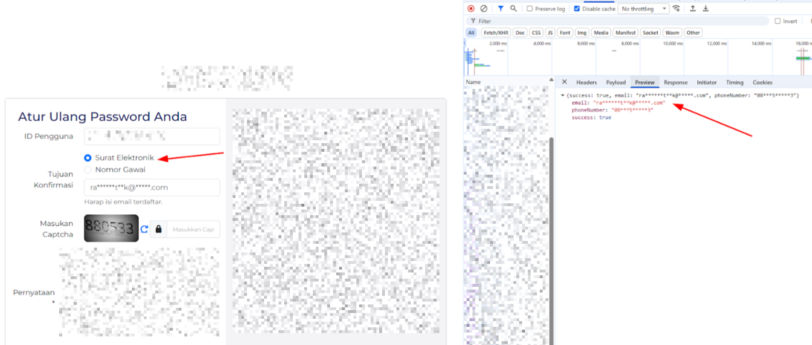
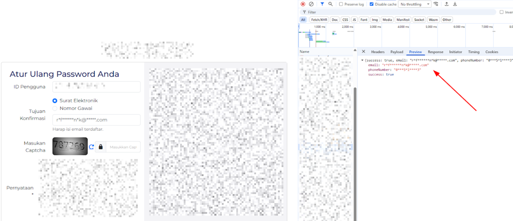
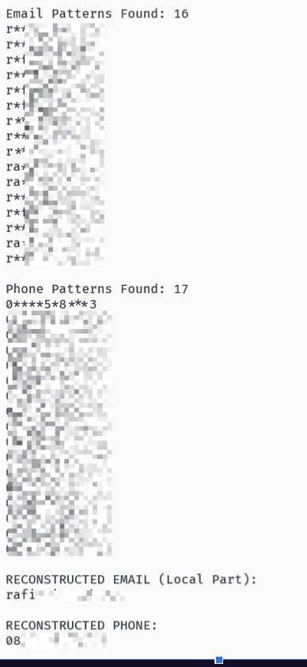

import Callout from "@/components/Callout.astro";

---

Beberapa waktu lalu, saat sedang membantu proses registrasi organisasi di sebuah Portal Administrasi Terintegrasi Baru skala nasional (kita sebut saja "Sistem-X"), saya menemukan sebuah perilaku aneh pada modul verifikasi identitasnya.

Sebagai orang yang terbiasa melihat request di balik layar, naluri _curiosity_ saya muncul ketika melihat bagaimana sistem ini menangani penyensoran (_masking_) data pribadi pengguna.

<Callout type="warning">
**DISCLAIMER**

Artikel ini ditulis murni untuk tujuan edukasi dan berbagi pengetahuan mengenai keamanan siber (_Cybersecurity Awareness_). Penulis telah melakukan upaya pelaporan kerentanan ini melalui kanal resmi instansi terkait (_Responsible Disclosure_) sebelum artikel ini diterbitkan. 

Seluruh data, nama sistem, dan cuplikan kode dalam tulisan ini telah disamarkan atau diubah menjadi data simulasi demi menjaga privasi dan keamanan pihak terkait. Penulis tidak bertanggung jawab atas penyalahgunaan informasi yang ada dalam artikel ini untuk tindakan ilegal.
</Callout>

## Target Overview
- **Platform:** _Web Based Application (Public Facing)_
- **Deskripsi:** Pendaftaran dan Verifikasi Identitas menggunakan NIK

## The "Aha!" Moment
Saat pengguna memasukkan NIK untuk verifikasi, sistem akan menampilkan data Email dan Nomor Handphone yang terdaftar dalam bentuk masked (sensor bintang).



Namun, keanehan muncul saat saya melakukan refresh halaman atau memicu ulang request API-nya. Ternyata, posisi karakter yang disensor bersifat acak pada setiap response.



## The Logic Bug
Masalah utamanya terletak pada backend yang mengirimkan data ke frontend dengan logika sensor yang tidak konsisten.
Seperti yang terlihat pada dua _screenshots_ di atas, terdapat perbedaan _masking_.

**Request Pertama:**
```
- Email: ra******t**k@*****.com
- Phone Number: 08***5*****3
```

**Request Kedua:**
```
- Email: r*f******n*k@*****.com
- Phone Number: 0***5*1****3
```

Secara logis, jika kita menggabungkan kedua response tersebut, kita bisa mendapatkan data lengkap:
```
- Email: raf*****tn*k@*****.com
- Phone Number: 08**551****3
```

## Proof of Concept
### Attack Vector
**Iterasi:** Penyerang dapat menggunakan skrip sederhana (Python/Intruder) untuk mengirimkan 10-20 request ke API verifikasi menggunakan NIK target.

**Reconstruction:** Mengumpulkan semua fragmen karakter yang tidak tersensor.

**Exploitation:** Data sensitif (Email & No HP asli) berhasil didapatkan secara utuh.

### Example PoC
Sebagai PoC, di sini saya mencoba melakukan iterasi menggunakan Python untuk merekontruksi Email dan Nomor HP:


## Impact
Mengingat aplikasi ini adalah sistem nasional yang menyimpan data jutaan warga negara, dampaknya sangat serius:
- Mass Harvesting: Penyerang dengan daftar NIK bisa melakukan scraping data kontak asli penduduk.
- Targeted Phishing: Email dan No HP yang bocor bisa digunakan untuk serangan penipuan yang sangat meyakinkan karena dikaitkan dengan data NIK resmi.

## Penutup
Laporan teknis lengkap sudah dikirimkan melalui jalur resmi instansi terkait pada tanggal 1 Desember 2025. Hingga tulisan ini dibuat, saya masih menunggu respon lebih lanjut. Tulisan ini dibuat murni untuk tujuan edukasi mengenai pentingnya Logic Testing pada aplikasi skala besar.

### Timeline

- 1 Desember 2025
  - Menemukan kerentanan dan melaporkannya ke pihak terkait
- 2 Desember 2025
  - Email dibalas oleh pihak terkait
  - Notifikasi penyampaian Apresiasi
- 3 Desember 2025
  - Notifikasi penyampaian Apresiasi (Ganti nomor)
- 10 Januari 2026
  - Vulnerability masih dapat di-_reproduce_.
- 23 Februari 2026
  - **Vulnerability Fixed**

### Update!
Setelah saya cek lagi, ternyata sudah di-_patching_/di-_fixing_ per tanggal 23 Februari 2026. Yah, meskipun email saya tidak terbalaskan lagi. Setidaknya udah _secure_ sekarang. 😁
